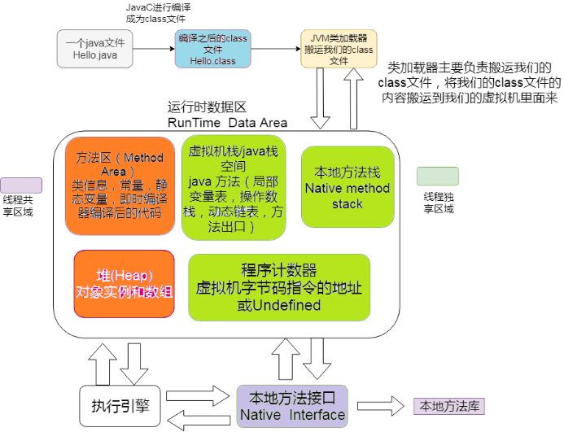
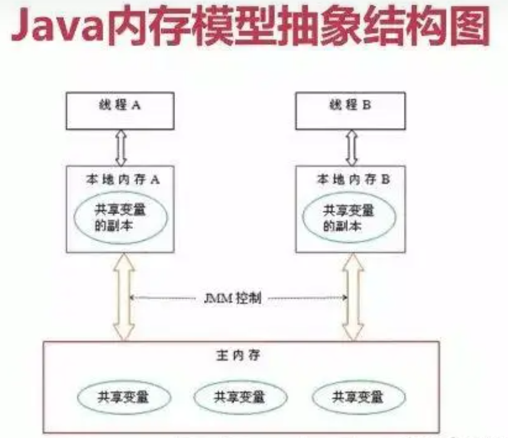

# java

# jvm

## 简介

JVM 是 Java Virtual Machine 的缩写，它是一个虚构出来的计算机，一种规范。通过在实际的计算机上仿真模拟各类计算机功能实现···

其实就类似于一台小电脑运行在 windows 或者 linux 这些操作系统环境下即可。它直接和操作系统进行交互，与硬件不直接交互，而操作系统可以帮我们完成和硬件进行交互的工作。


## Java 文件是如何被运行的

比如我们现在写了一个 HelloWorld.java 好了，那这个 HelloWorld.java 抛开所有东西不谈，那是不是就类似于一个文本文件，只是这个文本文件它写的都是英文，而且有一定的缩进而已。

那我们的 **JVM** 是不认识文本文件的，所以它需要一个 **编译** ，让其成为一个它会读二进制文件的 **HelloWorld.class**

### 类加载器

 如果 **JVM** 想要执行这个 **.class** 文件，我们需要将其装进一个 **类加载器** 中，它就像一个搬运工一样，会把所有的 **.class** 文件全部搬进 JVM 里面来。


### 方法区

**方法区** 是用于存放类似于元数据信息方面的数据的，比如类信息，常量，静态变量，编译后代码···等

类加载器将 .class 文件搬过来就是先丢到这一块上


### 堆

**堆** 主要放了一些存储的数据，比如对象实例，数组···等，它和方法区都同属于 **线程共享区域** 。也就是说它们都是 **线程不安全** 的


### 栈

**栈** 这是我们的代码运行空间。我们编写的每一个方法都会放到 **栈** 里面运行。

我们会听说过 本地方法栈 或者 本地方法接口 这两个名词，不过我们基本不会涉及这两块的内容，它俩底层是使用 C 来进行工作的，和 Java 没有太大的关系。


### 程序计数器

主要就是完成一个加载工作，类似于一个指针一样的，指向下一行我们需要执行的代码。和栈一样，都是 **线程独享** 的，就是说每一个线程都会有自己对应的一块区域而不会存在并发和多线程的问题。


### 总结

1. Java 文件经过编译后变成 .class 字节码文件
2. 字节码文件通过类加载器被搬运到 JVM 虚拟机中
3. 虚拟机主要的 5 大块：方法区，堆都为线程共享区域，有线程安全问题，栈和本地方法栈和计数器都是独享区域，不存在线程安全问题，而 JVM 的调优主要就是围绕堆，栈两大块进行

### 举例

一个学生类：


一个 main 方法：


执行 main 方法的步骤如下:

1. 编译好 App.java 后得到 App.class 后，执行 App.class，系统会启动一个 JVM 进程，从 classpath 路径中找到一个名为 App.class 的二进制文件，将 App 的类信息加载到运行时数据区的方法区内，这个过程叫做 App 类的加载
2. JVM 找到 App 的主程序入口，执行 main 方法
3. 这个 main 中的第一条语句为 Student student = new Student("tellUrDream") ，就是让 JVM 创建一个 Student 对象，但是这个时候方法区中是没有 Student 类的信息的，所以 JVM 马上加载 Student 类，把 Student 类的信息放到方法区中
4. 加载完 Student 类后，JVM 在堆中为一个新的 Student 实例分配内存，然后调用构造函数初始化 Student 实例，这个 Student 实例持有 **指向方法区中的 Student 类的类型信息** 的引用
5. 执行 student.sayName();时，JVM 根据 student 的引用找到 student 对象，然后根据 student 对象持有的引用定位到方法区中 student 类的类型信息的方法表，获得 sayName() 的字节码地址。
6. 执行 sayName()

其实也不用管太多，只需要知道对象实例初始化时会去方法区中找类信息，完成后再到栈那里去运行方法。找方法就在方法表中找。


## 类加载器的介绍

*负责加载.class 文件的，它们在文件开头会有特定的文件标示，将 class 文件字节码内容加载到内存中，并将这些内容转换成方法区中的运行时数据结构，并且 ClassLoader 只负责 class 文件的加载，而是否能够运行则由 Execution Engine 来决定*

### 类加载器的流程

从类被加载到虚拟机内存中开始，到释放内存总共有 7 个步骤：加载，验证，准备，解析，初始化，使用，卸载。其中**验证，准备，解析三个部分统称为连接**


#### 加载

1. 将 class 文件加载到内存
2. 将静态数据结构转化成方法区中运行时的数据结构
3. 在堆中生成一个代表这个类的 java.lang.Class 对象作为数据访问的入口


#### 链接

验证：确保加载的类符合 JVM 规范和安全，保证被校验类的方法在运行时不会做出危害虚拟机的事件，其实就是一个安全检查

准备：为 static 变量在方法区中分配内存空间，设置变量的初始值，例如 static int a = 3 （注意：准备阶段只设置类中的静态变量（方法区中），不包括实例变量（堆内存中），实例变量是对象初始化时赋值的）

解析：虚拟机将常量池内的符号引用替换为直接引用的过程（符号引用比如我现在 import java.util.ArrayList 这就算符号引用，直接引用就是指针或者对象地址，注意引用对象一定是在内存进行）


#### 初始化

初始化其实就是执行类构造器方法的`<clinit>()`的过程，而且要保证执行前父类的`<clinit>()`方法执行完毕。这个方法由编译器收集，顺序执行所有类变量（static 修饰的成员变量）显式初始化和静态代码块中语句。此时准备阶段时的那个 `static int a` 由默认初始化的 0 变成了显式初始化的 3。 由于执行顺序缘故，初始化阶段类变量如果在静态代码块中又进行了更改，会覆盖类变量的显式初始化，最终值会为静态代码块中的赋值。

> 注意：字节码文件中初始化方法有两种，非静态资源初始化的`<init>`和静态资源初始化的`<clinit>`，类构造器方法`<clinit>()`不同于类的构造器，这些方法都是字节码文件中只能给 JVM 识别的特殊方法。


#### 卸载

GC 将无用对象从内存中卸载


### 类加载器的加载顺序

加载一个 Class 类的顺序也是有优先级的，类加载器从最底层开始往上的顺序是这样的

1. BootStrap ClassLoader：rt.jar
2. Extension ClassLoader: 加载扩展的 jar 包
3. App ClassLoader：指定的 classpath 下面的 jar 包
4. Custom ClassLoader：自定义的类加载器


### 双亲委派机制

当一个类收到了加载请求时，它是不会先自己去尝试加载的，而是委派给父类去完成，比如我现在要 new 一个 Person，这个 Person 是我们自定义的类，如果我们要加载它，就会先委派 App ClassLoader ，只有当父类加载器都反馈自己无法完成这个请求（也就是父类加载器都没有找到加载所需的 Class）时，子类加载器才会自行尝试加载。

这样做的好处是，加载位于 rt.jar 包中的类时不管是哪个加载器加载，最终都会委托到 BootStrap ClassLoader 进行加载，这样保证了使用不同的类加载器得到的都是同一个结果。

其实这个也是一个隔离的作用，避免了我们的代码影响了 JDK 的代码，比如我现在自己定义一个 `java.lang.String`：

```java
package java.lang;
public class String {
    public static void main(String[] args) {
        System.out.println();
    }
}
```

尝试运行当前类的 `main` 函数的时候，我们的代码肯定会报错。这是因为在加载的时候其实是找到了 rt.jar 中的`java.lang.String`，然而发现这个里面并没有 `main` 方法。


## 运行时数据区


### 本地方法栈和程序计数器

比如说我们现在点开 Thread 类的源码，会看到它的 start0 方法带有一个 native 关键字修饰，而且不存在方法体，这种用 native 修饰的方法就是本地方法，这是使用 C 来实现的，然后一般这些方法都会放到一个叫做本地方法栈的区域。

程序计数器其实就是一个指针，它指向了我们程序中下一句需要执行的指令，它也是内存区域中唯一一个不会出现 OutOfMemoryError 的区域，而且占用内存空间小到基本可以忽略不计。这个内存仅代表当前线程所执行的字节码的行号指示器，字节码解析器通过改变这个计数器的值选取下一条需要执行的字节码指令。

如果执行的是 native 方法，那这个指针就不工作了。


### 方法区

方法区主要的作用是存放类的元数据信息，常量和静态变量···等。当它存储的信息过大时，会在无法满足内存分配时报错。


###  虚拟机栈和虚拟机堆

一句话便是：栈管运行，堆管存储。则虚拟机栈负责运行代码，而虚拟机堆负责存储数据。


#### 虚拟机栈的概念

它是 Java 方法执行的内存模型。里面会对局部变量，动态链表，方法出口，栈的操作（入栈和出栈）进行存储，且线程独享。同时如果我们听到局部变量表，那也是在说虚拟机栈

```java
public class Person{
    int a = 1;

    public void doSomething(){
        int b = 2;
    }
}

```

#### 虚拟机栈存在的异常

如果线程请求的栈的深度大于虚拟机栈的最大深度，就会报 **StackOverflowError** （这种错误经常出现在递归中）。Java 虚拟机也可以动态扩展，但随着扩展会不断地申请内存，当无法申请足够内存时就会报错 **OutOfMemoryError**。


####  虚拟机栈的生命周期

对于栈来说，不存在垃圾回收。只要程序运行结束，栈的空间自然就会释放了。栈的生命周期和所处的线程是一致的。

这里补充一句：8 种基本类型的变量+对象的引用变量+实例方法都是在栈里面分配内存。


####  虚拟机栈的执行

我们经常说的栈帧数据，说白了在 JVM 中叫栈帧，放到 Java 中其实就是方法，它也是存放在栈中的。

栈中的数据都是以栈帧的格式存在，它是一个关于方法和运行期数据的数据集。比如我们执行一个方法 a，就会对应产生一个栈帧 A1，然后 A1 会被压入栈中。同理方法 b 会有一个 B1，方法 c 会有一个 C1，等到这个线程执行完毕后，栈会先弹出 C1，后 B1,A1。它是一个先进后出，后进先出原则。


局部变量的复用

局部变量表用于存放方法参数和方法内部所定义的局部变量。它的容量是以 Slot 为最小单位，一个 slot 可以存放 32 位以内的数据类型。

虚拟机通过索引定位的方式使用局部变量表，范围为 `[0,局部变量表的 slot 的数量]`。方法中的参数就会按一定顺序排列在这个局部变量表中，至于怎么排的我们可以先不关心。而为了节省栈帧空间，这些 slot 是可以复用的，当方法执行位置超过了某个变量，那么这个变量的 slot 可以被其它变量复用。当然如果需要复用，那我们的垃圾回收自然就不会去动这些内存。


#### 虚拟机堆的概念

VM 内存会划分为堆内存和非堆内存，堆内存中也会划分为**年轻代**和**老年代**，而非堆内存则为**永久代**。年轻代又会分为**Eden**和**Survivor**区。Survivor 也会分为**FromPlace**和**ToPlace**，toPlace 的 survivor 区域是空的。Eden，FromPlace 和 ToPlace 的默认占比为 **8:1:1**。当然这个东西其实也可以通过一个 -XX:+UsePSAdaptiveSurvivorSizePolicy 参数来根据生成对象的速率动态调整

堆内存中存放的是对象，垃圾收集就是收集这些对象然后交给 GC 算法进行回收。非堆内存其实我们已经说过了，就是方法区。在 1.8 中已经移除永久代，替代品是一个元空间(MetaSpace)，最大区别是 metaSpace 是不存在于 JVM 中的，它使用的是本地内存。并有两个参数

```plain
MetaspaceSize：初始化元空间大小，控制发生GC
MaxMetaspaceSize：限制元空间大小上限，防止占用过多物理内存。
```

移除的原因可以大致了解一下：融合 HotSpot JVM 和 JRockit VM 而做出的改变，因为 JRockit 是没有永久代的，不过这也间接性地解决了永久代的 OOM 问题。


#### Eden 年轻代的介绍

当我们 new 一个对象后，会先放到 Eden 划分出来的一块作为存储空间的内存，但是我们知道对堆内存是线程共享的，所以有可能会出现两个对象共用一个内存的情况。这里 JVM 的处理是为每个线程都预先申请好一块连续的内存空间并规定了对象存放的位置，而如果空间不足会再申请多块内存空间。这个操作我们会称作 TLAB，有兴趣可以了解一下。

当 Eden 空间满了之后，会触发一个叫做 Minor GC（就是一个发生在年轻代的 GC）的操作，存活下来的对象移动到 Survivor0 区。此时还会把 from 和 to 两个指针交换，这样保证了一段时间内总有一个 survivor 区为空且 to 所指向的 survivor 区为空。经过多次的 Minor GC 后仍然存活的对象（**这里的存活判断是 15 次，对应到虚拟机参数为 -XX:MaxTenuringThreshold 。为什么是 15，因为 HotSpot 会在对象头中的标记字段里记录年龄，分配到的空间仅有 4 位，所以最多只能记录到 15**）会移动到老年代。

```tex
Eden 区内存空间满了的时候，就会触发 Minor GC，Survivor0 区满不会触发 Minor GC 。
那 Survivor0 区 的对象什么时候垃圾回收呢？
假设 Survivor0 区现在是满的，此时又触发了 Minor GC ，发现 Survivor0 区依旧是满的，存不下，此时会将 S0 区与 Eden 区的对象一起进行可达性分析，找出活跃的对象，将它复制到 S1 区并且将 S0 区域和 Eden 区的对象给清空，这样那些不可达的对象进行清除，并且将 S0 区 和 S1 区交换。
```


老年代是存储长期存活的对象的，占满时就会触发我们最常听说的 Full GC，期间会停止所有线程等待 GC 的完成。所以对于响应要求高的应用应该尽量去减少发生 Full GC 从而避免响应超时的问题。

而且当老年区执行了 full gc 之后仍然无法进行对象保存的操作，就会产生 OOM，这时候就是虚拟机中的堆内存不足，原因可能会是堆内存设置的大小过小，这个可以通过参数-Xms、-Xmx 来调整。也可能是代码中创建的对象大且多，而且它们一直在被引用从而长时间垃圾收集无法收集它们。


补充说明：关于-XX:TargetSurvivorRatio 参数的问题。其实也不一定是要满足-XX:MaxTenuringThreshold 才移动到老年代。可以举个例子：如对象年龄 5 的占 30%，年龄 6 的占 36%，年龄 7 的占 34%，加入某个年龄段（如例子中的年龄 6）后，总占用超过 Survivor 空间*TargetSurvivorRatio 的时候，从该年龄段开始及大于的年龄对象就要进入老年代（即例子中的年龄 6 对象，就是年龄 6 和年龄 7 晋升到老年代），这时候无需等到 MaxTenuringThreshold 中要求的 15


#### 如何判断一个对象需要被干掉



图中程序计数器、虚拟机栈、本地方法栈，3 个区域随着线程的生存而生存的。内存分配和回收都是确定的。随着线程的结束内存自然就被回收了，因此不需要考虑垃圾回收的问题。而 Java 堆和方法区则不一样，各线程共享，内存的分配和回收都是动态的。因此垃圾收集器所关注的都是堆和方法这部分内存。

在进行回收前就要判断哪些对象还存活，哪些已经死去。下面介绍两个基础的计算方法

1.**引用计数器计算**：给对象添加一个引用计数器，每次引用这个对象时计数器加一，引用失效时减一，计数器等于 0 时就是不会再次使用的。不过这个方法有一种情况就是出现对象的循环引用时 GC 没法回收。

2.**可达性分析计算**：这是一种类似于二叉树的实现，将一系列的 GC ROOTS 作为起始的存活对象集，从这个节点往下搜索，搜索所走过的路径成为引用链，把能被该集合引用到的对象加入到集合中。搜索当一个对象到 GC Roots 没有使用任何引用链时，则说明该对象是不可用的。主流的商用程序语言，例如 Java，C#等都是靠这招去判定对象是否存活的。


了解一下即可）在 Java 语言汇总能作为 GC Roots 的对象分为以下几种：

1. 虚拟机栈（栈帧中的本地方法表）中引用的对象（局部变量）
2. 方法区中静态变量所引用的对象（静态变量）
3. 方法区中常量引用的对象
4. 本地方法栈（即 native 修饰的方法）中 JNI 引用的对象（JNI 是 Java 虚拟机调用对应的 C 函数的方式，通过 JNI 函数也可以创建新的 Java 对象。且 JNI 对于对象的局部引用或者全局引用都会把它们指向的对象都标记为不可回收）
5. 已启动的且未终止的 Java 线程

这种方法的优点是能够解决循环引用的问题，可它的实现需要耗费大量资源和时间，也需要 GC（它的分析过程引用关系不能发生变化，所以需要停止所有进程）


#### 如何宣告一个对象的真正死亡

首先必须要提到的是一个名叫 **finalize()** 的方法

finalize()是 Object 类的一个方法、一个对象的 finalize()方法只会被系统自动调用一次，经过 finalize()方法逃脱死亡的对象，第二次不会再调用。

补充一句：并不提倡在程序中调用 finalize()来进行自救。建议忘掉 Java 程序中该方法的存在。因为它执行的时间不确定，甚至是否被执行也不确定（Java 程序的不正常退出），而且运行代价高昂，无法保证各个对象的调用顺序（甚至有不同线程中调用）。在 Java9 中已经被标记为 **deprecated** ，且 `java.lang.ref.Cleaner`（也就是强、软、弱、幻象引用的那一套）中已经逐步替换掉它，会比 `finalize` 来的更加的轻量及可靠。

判断一个对象的死亡至少需要两次标记

1. 如果对象进行可达性分析之后没发现与 GC Roots 相连的引用链，那它将会第一次标记并且进行一次筛选。判断的条件是决定这个对象是否有必要执行 finalize()方法。如果对象有必要执行 finalize()方法，则被放入 F-Queue 队列中。
2. GC 对 F-Queue 队列中的对象进行二次标记。如果对象在 finalize()方法中重新与引用链上的任何一个对象建立了关联，那么二次标记时则会将它移出“即将回收”集合。如果此时对象还没成功逃脱，那么只能被回收了。

如果确定对象已经死亡，我们又该如何回收这些垃圾呢


#### 垃圾回收算法


到 jdk8 为止，默认的垃圾收集器是 Parallel Scavenge 和 Parallel Old

从 jdk9 开始，G1 收集器成为默认的垃圾收集器
 目前来看，G1 回收器停顿时间最短而且没有明显缺点，非常适合 Web 应用。在 jdk8 中测试 Web 应用，堆内存 6G，新生代 4.5G 的情况下，Parallel Scavenge 回收新生代停顿长达 1.5 秒。G1 回收器回收同样大小的新生代只停顿 0.2 秒。


#### JVM 的常用参数

[JVM 的常用参数](https://javaguide.cn/java/jvm/jvm-intro.html#_3-6-了解-jvm-的常用参数)


###  JVM 调优的一些方面

[ JVM 调优的一些方面](https://javaguide.cn/java/jvm/jvm-intro.html#四、关于-jvm-调优的一些方面)

# 线程与进程

- **进程**：是指⼀个内存中运⾏的应⽤程序，每个进程都有⼀个独⽴的内存空间，⼀个应⽤程序可以同时运⾏多个进程；进程也是程序的⼀次执⾏过程，是系统运⾏程序的基本单位；系统运⾏⼀个程序即是 ⼀个进程从创建、运⾏到消亡的过程。
- **线程**：线程是进程中的⼀个执⾏单元，负责当前进程中程序的执⾏，⼀个进程中⾄少有⼀个线程。⼀个进程中是可以有多个线程的，这个应⽤程序也可以称之为多线程程序。


## 线程创建

- 方式一：继承于Thread类
- 方式二：实现Runnable接口
- 方式三：实现Callable接口
- 方式四：使用线程池
- 方式五：使用匿名类

### 继承于Thread类

*步骤：
1.创建一个继承于Thread类的子类
2.重写Thread类的run() --> 将此线程执行的操作声明在run()中
3.创建Thread类的子类的对象
4.通过此对象调用start()执行线程*


```java
package atguigu.java;

//1.创建一个继承于Thread类的子类
class MyThread extends Thread {
    //2.重写Thread类的run()
    @Override
    public void run() {
        for (int i = 0; i < 100; i++) {
            if (i % 2 == 0) {
                System.out.println(Thread.currentThread().getName() + ":" + i);
            }
        }
    }
}


public class ThreadTest {
    public static void main(String[] args) {
        //3.创建Thread类的子类的对象
        MyThread t1 = new MyThread();

        //4.通过此对象调用start():①启动当前线程 ② 调用当前线程的run()
        t1.start();

        /*问题一：我们不能通过直接调用run()的方式启动线程，
        这种方式只是简单调用方法，并未新开线程*/
        //t1.run();

        /*问题二：再启动一个线程，遍历100以内的偶数。
        不可以还让已经start()的线程去执行。会报IllegalThreadStateException*/
        //t1.start();

        //重新创建一个线程的对象
        MyThread t2 = new MyThread();
        t2.start();

        //如下操作仍然是在main线程中执行的。
        for (int i = 0; i < 100; i++) {
            if (i % 2 == 0) {
                System.out.println(Thread.currentThread().getName() + ":" + i + "***********main()************");
            }
        }
    }
}
```


### 实现Runnable接口

*步骤：
1.创建一个实现了Runnable接口的类
2.实现类去实现Runnable中的抽象方法：run()
3.创建实现类的对象
4.将此对象作为参数传递到Thread类的构造器中，创建Thread类的对象
5.通过Thread类的对象调用start()
① 启动线程
②调用当前线程的run()–>调用了Runnable类型的target的run()*


```java
package atguigu.java;

//1.创建一个实现了Runnable接口的类
class MThread implements Runnable {

    //2.实现类去实现Runnable中的抽象方法：run()
    @Override
    public void run() {
        for (int i = 0; i < 100; i++) {
            if (i % 2 == 0) {
                System.out.println(Thread.currentThread().getName() + ":" + i);
            }
        }
    }
}

public class ThreadTest1 {

    public static void main(String[] args) {
        //3.创建实现类的对象
        MThread mThread = new MThread();

        //4.将此对象作为参数传递到Thread类的构造器中，创建Thread类的对象
        Thread t1 = new Thread(mThread);
        t1.setName("线程1");

        //5.通过Thread类的对象调用start():① 启动线程 ②调用当前线程的run()-->调用了Runnable类型的target的run()
        t1.start();

        //再启动一个线程，遍历100以内的偶数
        Thread t2 = new Thread(mThread);
        t2.setName("线程2");
        t2.start();
    }

}
```

### 实现Callable接口

*步骤：
1.创建一个实现Callable的实现类
2.实现call方法，将此线程需要执行的操作声明在call()中
3.创建Callable接口实现类的对象
4.将此Callable接口实现类的对象作为传递到FutureTask构造器中，创建FutureTask的对象
5.将FutureTask的对象作为参数传递到Thread类的构造器中，创建Thread对象，并调用start()
6.获取Callable中call方法的返回值*


实现Callable接口的方式创建线程的强大之处

- call()可以有返回值的
- call()可以抛出异常，被外面的操作捕获，获取异常的信息
- Callable是支持泛型的


```java
package com.atguigu.java2;

import java.util.concurrent.Callable;
import java.util.concurrent.ExecutionException;
import java.util.concurrent.FutureTask;

//1.创建一个实现Callable的实现类
class NumThread implements Callable {
    //2.实现call方法，将此线程需要执行的操作声明在call()中
    @Override
    public Object call() throws Exception {
        int sum = 0;
        //把100以内的偶数相加
        for (int i = 1; i <= 100; i++) {
            if (i % 2 == 0) {
                System.out.println(i);
                sum += i;
            }
        }
        return sum;
    }
}

public class ThreadNew {
    public static void main(String[] args) {    
        //3.创建Callable接口实现类的对象
        NumThread numThread = new NumThread();

        //4.将此Callable接口实现类的对象作为传递到FutureTask构造器中，创建FutureTask的对象
        FutureTask futureTask = new FutureTask(numThread);

        //5.将FutureTask的对象作为参数传递到Thread类的构造器中，创建Thread对象，并调用start()
        new Thread(futureTask).start();

        try {
            //6.获取Callable中call方法的返回值
            //get()返回值即为FutureTask构造器参数Callable实现类重写的call()的返回值。
            Object sum = futureTask.get();
            System.out.println("总和为：" + sum);
        } catch (InterruptedException e) {
            e.printStackTrace();
        } catch (ExecutionException e) {
            e.printStackTrace();
        }
    }

}
```


### 使用线程池

*步骤：
1.以方式二或方式三创建好实现了Runnable接口的类或实现Callable的实现类
2.实现run或call方法
3.创建线程池
4.调用线程池的execute方法执行某个线程，参数是之前实现Runnable或Callable接口的对象*


*线程池好处：
1.提高响应速度（减少了创建新线程的时间）
2.降低资源消耗（重复利用线程池中线程，不需要每次都创建）
3.便于线程管理*


核心参数：

- corePoolSize：核心池的大小
- maximumPoolSize：最大线程数
- keepAliveTime：线程没有任务时最多保持多长时间后会终止


```java
package com.atguigu.java2;

import java.util.concurrent.ExecutorService;
import java.util.concurrent.Executors;
import java.util.concurrent.ThreadPoolExecutor;

class NumberThread implements Runnable {
    @Override
    public void run() {
        //遍历100以内的偶数
        for (int i = 0; i <= 100; i++) {
            if (i % 2 == 0) {
                System.out.println(Thread.currentThread().getName() + ": " + i);
            }
        }
    }
}

class NumberThread1 implements Runnable {
    @Override
    public void run() {
        //遍历100以内的奇数
        for (int i = 0; i <= 100; i++) {
            if (i % 2 != 0) {
                System.out.println(Thread.currentThread().getName() + ": " + i);
            }
        }
    }
}


public class ThreadPool {

    public static void main(String[] args) {
        //1. 提供指定线程数量的线程池
        ExecutorService service = Executors.newFixedThreadPool(10);

        //输出class java.util.concurrent.ThreadPoolExecutor
        System.out.println(service.getClass());

        ThreadPoolExecutor service1 = (ThreadPoolExecutor) service;
        //自定义线程池的属性
//        service1.setCorePoolSize(15);
//        service1.setKeepAliveTime();

        //2. 执行指定的线程的操作。需要提供实现Runnable接口或Callable接口实现类的对象
        service.execute(new NumberThread());//适用于Runnable
        service.execute(new NumberThread1());//适用于Runnable
//        service.submit(Callable callable);//适合使用于Callable

        //3. 关闭连接池
        service.shutdown();
    }

}
```

### 使用匿名类

```java
Thread thread = new Thread(new Runnable() {
	@Override
	public void run() {
		// 线程需要执行的任务代码
		System.out.println("子线程开始启动....");
		for (int i = 0; i < 30; i++) {
			System.out.println("run i:" + i);
		}
	}
});
thread.start();
```

或者

```java
new Thread(() -> {
	System.out.println(Thread.currentThread().getName() + "\t上完自习，离开教室");
}, "MyThread").start();
```

### 注意

**Thread 和 Runnable 的区别：**

*如果⼀个类继承 Thread ，则不适合资源共享。但是如果实现了 Runable 接⼝的话，则很容易的实现资源共享*

**总结：**

**实现** Runnable **接⼝⽐继承** Thread **类所具有的优势：**

1. 适合多个相同的程序代码的线程去共享同⼀个资源。
2. 可以避免 java 中的单继承的局限性。
3. 增加程序的健壮性，实现解耦操作，代码可以被多个线程共享，代码和线程独⽴。
4. 线程池只能放⼊实现 Runable 或 Callable 类线程，不能直接放⼊继承 Thread 的类。


*扩充：在 java 中，每次程序运⾏⾄少启动 2 个线程。⼀个是 main 线程，⼀个是垃圾收集（GC）线程。因为 每当使⽤ java 命令执⾏⼀个类的时候，实际上都会启动⼀个 JVM ，每⼀个 JVM 其实在就是在操作系 统中启动了⼀个进程。*


## 线程的生命周期

*当线程启动后（线程对象调用start方法），它不能一直"独占"着CPU独自运行，所以CPU需要在多条线程之间切换，于是线程状态也会多次在运行、阻塞之间切换*


*在线程的生命周期中：
它要经过新建（**New**）、就绪（**Runnable**）、运行（**Running**）、阻塞（**Blocked**）和死亡（**Dead**）五种状态。*


### 创建

```java
public class XThread extends Thread{
    @Override
        public void run() {
            
        }
}
//新建就是new出对象
XThread thread = new XThread();  //这就是新建
```

当程序使用new关键字创建了一个线程之后，该线程就处于一个新建状态（初始状态），此时它和其他Java对象一样，仅仅由Java虚拟机为其分配了内存，并初始化了其成员变量值。此时的线程对象没有表现出任何线程的动态特征，程序也不会执行线程的线程执行体


### 就绪

**当线程对象调用了Thread.start()方法之后，该线程处于就绪状态。**

Java虚拟机会为其创建方法调用栈和程序计数器，处于这个状态的线程并没有开始运行，它只是表示该线程可以运行了。从start()源码中看出，start后添加到了线程列表中，接着在native层添加到VM中，至于该线程何时开始运行，取决于JVM里线程调度器的调度(如果OS调度选中了，就会进入到运行状态)。


### 运行

**当线程对象调用了Thread.start()方法之后，该线程处于就绪状态。**

添加到了线程列表中，如果OS调度选中了，就会进入到运行状态


### 阻塞

阻塞状态是线程因为某种原因放弃CPU使用权，暂时停止运行。直到线程进入就绪状态，才有机会转到运行状态。阻塞的情况大概三种：

- 1、**等待阻塞**：运行的线程执行wait()方法，JVM会把该线程放入等待池中。(wait会释放持有的锁)
- 2、**同步阻塞**：运行的线程在获取对象的同步锁时，若该同步锁被别的线程占用，则JVM会把该线程放入锁池中。
- 3、**其他阻塞**：运行的线程执行sleep()或join()方法，或者发出了I/O请求时，JVM会把该线程置为阻塞状态。当sleep()状态超时、join()等待线程终止或者超时、或者I/O处理完毕时，线程重新转入就绪状态。（注意,sleep是不会释放持有的锁）。
- 线程睡眠：Thread.sleep(long millis)方法，使线程转到阻塞状态。millis参数设定睡眠的时间，以毫秒为单位。当睡眠结束后，就转为就绪（Runnable）状态。sleep()平台移植性好。
- 线程等待：Object类中的wait()方法，导致当前的线程等待，直到其他线程调用此对象的 notify() 方法或 notifyAll() 唤醒方法。这个两个唤醒方法也是Object类中的方法，行为等价于调用 wait(0) 一样。唤醒线程后，就转为就绪（Runnable）状态。
- 线程让步：Thread.yield() 方法，暂停当前正在执行的线程对象，把执行机会让给相同或者更高优先级的线程。
- 线程加入：join()方法，等待其他线程终止。在当前线程中调用另一个线程的join()方法，则当前线程转入阻塞状态，直到另一个进程运行结束，当前线程再由阻塞转为就绪状态。
- 线程I/O：线程执行某些IO操作，因为等待相关的资源而进入了阻塞状态。比如说监听system.in，但是尚且没有收到键盘的输入，则进入阻塞状态。
- 线程唤醒：Object类中的notify()方法，唤醒在此对象监视器上等待的单个线程。如果所有线程都在此对象上等待，则会选择唤醒其中一个线程，选择是任意性的，并在对实现做出决定时发生。类似的方法还有一个notifyAll()，唤醒在此对象监视器上等待的所有线程。


### 死亡

线程会以以下三种方式之一结束，结束后就处于死亡状态:

- run()方法执行完成，线程正常结束。
- 线程抛出一个未捕获的Exception或Error。
- 直接调用该线程的stop()方法来结束该线程——该方法容易导致死锁，通常不推荐使用。


## 线程安全和不安全

### 线程安全

*就是某个函数在并发环境中调用时，能够处理好多个线程之间的共享变量，是程序能够正确执行完毕。也就是说我们想要确保在多线程访问的时候，我们的程序还能够按照我们的预期的行为去执行，那么就是线程安全了。*


### 线程不安全

不安全代码：

```java
public class TestThread {

    private static class XRunnable implements Runnable{
        private int count;
        public void run(){
            for(int i= 0; i<5; i++){
                getCount();
            }
        }

        public void getCount(){
            count++;
            System.out.println(" "+count);
        }
    }

    public static void main(String[] args) {
        XRunnable runnable = new XRunnable();
        Thread t1 = new Thread(runnable);
        Thread t2 = new Thread(runnable);
        Thread t3 = new Thread(runnable);
        t1.start();
        t2.start();
        t3.start();
    }
}
结果：   
 2
 3
 2
 5
 4
 7
 6
 10
```


从代码上进行分析，当启动了三个线程，每个线程应该都是循环5次得出1到15的结果，但是从输出的结果，就可以看到有两个2输出，出现像这种情况表明这个方法根本就不是线程安全的。**我们可以这样理解**：在每个进程的内存空间中都会有一块特殊的公共区域，通常称为**堆（内存）**，之所以会输出两个2，是因为进程内的所有线程都可以访问到该区域，当第一个线程已经获得2这个数了，还没来得及输出，下一个线程在这段时间的空隙获得了2这个值，故输出时会输出2的值。


*要考虑线程安全问题，就需要先考虑**Java并发的三大基本特性**：**原子性**、**可见性**以及**有序性**。*


### 原子性


- 原子性是指在一个操作中就是cpu不可以在中途暂停然后再调度，即不被中断操作，要不全部执行完成，要不都不执行。就好比转账，从账户A向账户B转1000元，那么必然包括2个操作：从账户A减去1000元，往账户B加上1000元。2个操作必须全部完成。

  

- 那程序中原子性指的是最小的操作单元，比如自增操作，它本身其实并不是原子性操作，分了3步的，包括读取变量的原始值、进行加1操作、写入工作内存。所以在多线程中，有可能一个线程还没自增完，可能才执行到第二部，另一个线程就已经读取了值，导致结果错误。那如果我们能保证自增操作是一个原子性的操作，那么就能保证其他线程读取到的一定是自增后的数据。


### 可见性


-  当多个线程访问同一个变量时，一个线程修改了这个变量的值，其他线程能够立即看得到修改的值。


- 若两个线程在不同的cpu，那么线程1改变了i的值还没刷新到主存，线程2又使用了i，那么这个i值肯定还是之前的，线程1对变量的修改线程没看到这就是可见性问题。


### 有序性


程序执行的顺序按照代码的先后顺序执行，在多线程编程时就得考虑这个问题。


### 如何确保线程安全

解决办法：使用多线程之间使用**关键字synchronized**、或者使用**锁（lock）**，或者**volatile关键字**。

**①synchronized**（自动锁，锁的创建和释放都是自动的）；

**②lock 手动锁**（手动指定锁的创建和释放）。

**③volatile关键字**

为什么能解决？如果可能会发生数据冲突问题(线程不安全问题)，只能让当前一个线程进行执行。代码执行完成后释放锁，然后才能让其他线程进行执行。这样的话就可以解决线程不安全问题。


#### synchronized关键字

##### **同步代码块**

```java
synchronized(同一个锁){
  //可能会发生线程冲突问题
}
```

将可能会发生线程安全问题地代码，给包括起来，也称为**同步代码块**。**synchronized**使用的锁可以是对象锁也可以是静态资源，如×××.class，只有持有锁的线程才能执行同步代码块中的代码。没持有锁的线程即使获取cpu的执行权，也进不去。

**锁的释放**是在**synchronized**同步代码执行完毕后自动释放。


**同步的前提：**

1，必须要有两个或者两个以上的线程 ，如果小于2个线程，则没有用，且还会消耗性能(获取锁，释放锁)

2，必须是多个线程使用同一个锁


**弊端**：多个线程需要判断锁，较为消耗资源、抢锁的资源。

eg:

```java
public class ThreadSafeProblem {
    public static void main(String[] args) {
        Consumer abc = new Consumer();
        // 注意要使用同一个abc变量作为thread的参数，
        // 如果你使用了两个Consumer对象，那么就不会共享ticket了，就自然不会出现线程安全问题
        new Thread(abc,"窗口1").start();
        new Thread(abc,"窗口2").start();
    }
}
class Consumer implements Runnable{
    private int ticket = 100;
    @Override
    public void run() {
        while (ticket > 0) {
            synchronized (Consumer.class) {
                if (ticket > 0) {
                    System.out.println(Thread.currentThread().getName() + "售卖第" + (100-ticket+1) + "张票");
                    ticket--;
                }
            }
        }
    }
}
```


#####  同步函数

*就是将**synchronized**加在方法上。*

**分为两种：**

第一种是**非静态同步函数**，即方法是非静态的，使用的**this对象锁**，如下代码所示

```java
public synchronized void sale () {
        if (ticket > 0) {
            System.out.println(Thread.currentThread().getName() + "售卖第" + (100-ticket+1) + "张票");
            ticket--;
        }
    }
```

第二种是**静态同步函数**，即方法是用static修饰的，使用的锁是**当前类的class文件（xxx.class）**。


##### 多线程死锁线程


如下代码所示，

线程t1，运行后在同步代码块中需要oj对象锁，，运行到sale方法时需要this对象锁

线程t2，运行后需要调用sale方法，需要先获取this锁，再获取oj对象锁

那这样就会造成，两个线程相互等待对方释放锁。就造成了死锁情况。简单来说就是：

同步中嵌套同步,导致锁无法释放。

```java
class ThreadTrain3 implements Runnable {
    private static int count = 100;
    public boolean flag = true;
    private static Object oj = new Object();
    @Override
    public void run() {
        if (flag) {
            while (true) {
                synchronized (oj) {
                    sale();
                }
            }
 
        } else {
            while (true) {
                sale();
            }
        }
    }
 
    public static synchronized void sale() {
        // 前提 多线程进行使用、多个线程只能拿到一把锁。
        // 保证只能让一个线程 在执行 缺点效率降低
        synchronized (oj) {
            if (count > 0) {
                try {
                    Thread.sleep(50);
                } catch (Exception e) {
                    // TODO: handle exception
                }
                System.out.println(Thread.currentThread().getName() + ",出售第" + (100 - count + 1) + "票");
                count--;
            }
        }
    }
}
 
public class ThreadDemo3 {
    public static void main(String[] args) throws InterruptedException {
        ThreadTrain3 threadTrain1 = new ThreadTrain3();
        Thread t1 = new Thread(threadTrain1, "①号窗口");
        Thread t2 = new Thread(threadTrain1, "②号窗口");
        t1.start();
        Thread.sleep(40);
        threadTrain1.flag = false;
        t2.start();
    }
}
```

#### Lock


*可以视为**synchronized的增强版**，提供了更灵活的功能。该接口提供了限时锁等待、锁中断、锁尝试等功能。**synchronized**实现的同步代码块，它的锁是自动加的，且当执行完同步代码块或者抛出异常后，锁的释放也是自动的。*

```java
Lock l = ...;
 l.lock();
 try {
   // access the resource protected by this lock
 } finally {
   l.unlock();
 }
```

但是**Lock锁**是需要手动去加锁和释放锁，所以**Lock**相比于**synchronized**更加的灵活。且还提供了更多的功能比如说

**tryLock()方法**会尝试获取锁，如果锁不可用则返回false，如果锁是可以使用的，那么就直接获取锁且返回true，官方代码如下：

```java
Lock lock = ...;
 if (lock.tryLock()) {
   try {
     // manipulate protected state
   } finally {
     lock.unlock();
   }
 } else {
   // perform alternative actions
 }
```

eg:

```java
/*
 * 使用ReentrantLock类实现同步
 * */
class MyReenrantLock implements Runnable{
    //向上转型
    private Lock lock = new ReentrantLock();
    public void run() {
        //上锁
        lock.lock();
        for(int i = 0; i < 5; i++) {
            System.out.println("当前线程名： "+ Thread.currentThread().getName()+" ,i = "+i);
        }
        //释放锁
        lock.unlock();
    }
}
public class MyLock {
    public static void main(String[] args) {
        MyReenrantLock myReenrantLock =  new MyReenrantLock();
        Thread thread1 = new Thread(myReenrantLock);
        Thread thread2 = new Thread(myReenrantLock);
        Thread thread3 = new Thread(myReenrantLock);
        thread1.start();
        thread2.start();
        thread3.start();
    }
}
```

查看结果可发现，只有当当前线程打印完毕后，其他的线程才可继续打印，线程打印的数据是分组打印，因为当前线程持有锁，但线程之间的打印顺序是随机的。

即调用**lock.lock()** 代码的线程就持有了“对象监视器”，其他线程只有等待锁被释放再次争抢。

#### volatile关键字


错误示范：

```java
class ThreadVolatileDemo extends Thread {
    public boolean flag = true;
 
    @Override
    public void run() {
        System.out.println("子线程开始执行");
        while (flag) {
        }
        System.out.println("子线程执行结束...");
    }
    public void setFlag(boolean flag){
        this.flag=flag;
    }
 
}
 
public class ThreadVolatile {
    public static void main(String[] args) throws InterruptedException {
              ThreadVolatileDemo threadVolatileDemo = new ThreadVolatileDemo();
              threadVolatileDemo.start();
              Thread.sleep(3000);
              threadVolatileDemo.setFlag(false);
              System.out.println("flag已被修改为false!");
    }
}
```

结果：


虽然flag已被修改，但是子线程依然在执行，这里产生的原因就是**Java内存模型（JMM）** 导致的。

由于主线程休眠了3秒，所以子线程没有意外的话是一定会被执行run方法的。而当子线程由于调用start方法而执行run方法时，会将flag这个共享变量拷贝一份副本存到线程的本地内存中。此时线程中的flag为true，即使主线程在休眠后修改了flag值为false，子线程也不会知道，即不会修改自己副本的flag值。所以这就导致了该问题的出现。


**注意**：在测试时，一定要让主线程进行sleep或其他耗时操作，如果没有这步操作，很有可能在子线程执行run方法而拷贝共享变量到线程本地内存之前，主线程就已经修改了flag值。

##### Java内存模型

*在**Java内存模型**规定了所有的变量（这里的变量是指成员变量，静态字段等但是不包括局部变量和方法参数，因为这是线程私有的）都存储在**主内存**中，每条线程还有自己的**工作内存**，线程的工作内存中拷贝了该线程使用到的主内存中的变量（只是副本，从主内存中拷贝了一份，放到了线程的本地内存中），**线程对变量的所有操作都必须在工作内存中进行，而不能直接读写主内存。** 不同的线程之间也无法直接访问对方工作内存中的变量，**线程间变量的传递均需要自己的工作内存和主存之间进行数据同步进行**。*


而JMM就作用于工作内存和主存之间数据同步过程。他规定了如何做数据同步以及什么时候做数据同步。



**1. 首先要将共享变量从主内存拷贝到线程自己的工作内存空间，工作内存中存储着主内存中的变量副本拷贝；**

**2. 线程对副本变量进行操作，（不能直接操作主内存）；**

**3. 操作完成后通过JMM 将线程的共享变量副本与主内存进行数据的同步，将数据写入主内存中；**

**4. 不同的线程间无法访问对方的工作内存，线程间的通信(传值)必须通过主内存来完成。**


当多个线程同时访问一个数据的时候，可能本地内存没有及时刷新到主内存，所以就会发生线程安全问题

**JMM是在线程调run方法的时候才将共享变量写到自己的线程本地内存中去的，而不是在调用start方法的时候。**


##### 解决办法

当出现这种问题时，就可以使用**Volatile关键字**进行解决。

**Volatile 关键字的作用**是变量在多个线程之间可见。使用**Volatile关键字**将解决线程之间可见性，**强制线程每次读取该值的时候都去“主内存”中取值**。

只需要在flag属性上加上该关键字即可。

```
public volatile boolean flag = true;
```

子线程每次都不是读取的线程本地内存中的副本变量了，而是直接读取主内存中的属性值。

volatile虽然**具备可见性**，但是**不具备原子性**。


#### synchronized、volatile和Lock之间的区别

##### synochronizd和volatile关键字区别：

1）**volatile关键字**解决的是变量在多个线程之间的可见性；而**sychronized关键字**解决的是多个线程之间访问共享资源的同步性。

**tip：** final关键字也能实现可见性：被final修饰的字段在构造器中一旦初始化完成，并且构造器没有把 **“this”**的引用传递出去（this引用逃逸是一件很危险的事情，其它线程有可能通过这个引用访问到了"初始化一半"的对象），那在其他线程中就能看见final；

2）**volatile**只能用于修饰变量，而**synchronized**可以修饰方法，以及代码块。（**volatile**是线程同步的轻量级实现，所以**volatile**性能比**synchronized**要好，并且随着JDK新版本的发布，**sychronized关键字**在执行上得到很大的提升，在开发中使用**synchronized关键字**的比率还是比较大）；

3）多线程访问**volatile**不会发生阻塞，而**sychronized**会出现阻塞；

4）**volatile**能保证变量在多个线程之间的可见性，但不能保证原子性；而**sychronized**可以保证原子性，也可以间接保证可见性，因为它会将私有内存和公有内存中的数据做同步。

**线程安全**包含**原子性**和**可见性**两个方面。

对于用**volatile**修饰的变量，JVM虚拟机只是保证从主内存加载到线程工作内存的值是最新的。

**一句话说明volatile的作用**：实现变量在多个线程之间的可见性。


##### synchronized和lock区别：

1）**Lock**是一个接口，而**synchronized**是Java中的关键字，**synchronized**是内置的语言实现；

2）**synchronized**在发生异常时，会自动释放线程占有的锁，因此不会导致死锁现象发生；而**Lock**在发生异常时，如果没有主动通过**unLock()**去释放锁，则很可能造成死锁现象，因此使用**Lock**时需要在**finally**块中释放锁；

3）**Lock**可以让等待锁的线程响应中断，而**synchronized**却不行，使用**synchronized**时，等待的线程会一直等待下去，不能够响应中断；

4）通过**Lock**可以知道有没有成功获取锁，而**synchronized**却无法办到。

5）**Lock**可以提高多个线程进行读操作的效率（读写锁）。

**在性能上来说**，如果竞争资源不激烈，两者的性能是差不多的，而当竞争资源非常激烈时（即有大量线程同时竞争），此时**Lock**的性能要远远优于**synchronized**。所以说，在具体使用时要根据适当情况选择。


# 常见面试题总结

## %和/

>/：获取两数相处的商
>
>%：获取两数相处的余


## hashmap和currenthashmap

*HashMap和ConcurrentHashMap都是Java中常用的哈希表实现，它们在多线程环境下的行为和性能有所不同*

### HashMap

*HashMap是Java中最常用的哈希表实现，它采用数组加链表（或红黑树）的数据结构来存储键值对*

**特点**:

- 线程不安全：HashMap不是线程安全的，当多个线程同时对HashMap进行修改时可能会导致不一致的结果。
- 较好的性能：由于不涉及同步操作，HashMap在**单线程环境**下通常具有较好的性能。
- 适用场景：HashMap适用于单线程环境或者在多线程环境中，**只读操作多、写操作较少**的场景。


### ConcurrentHashMap

*ConcurrentHashMap是Java中专门为多线程环境设计的哈希表实现，它是对HashMap进行了改进和扩展*

**特点**:

- 线程安全：ConcurrentHashMap是线程安全的，多个线程可以同时读取和修改ConcurrentHashMap实例，而不会导致数据不一致的问题。
- 分段锁设计：ConcurrentHashMap内部使用了**分段锁（Segment）**的概念，将整个数据结构分成多个段，每个段都可以独立地加锁，不同的线程可以同时访问不同的段，从而提高并发性能。
- 较复杂的实现：ConcurrentHashMap的实现相对HashMap要复杂一些，涉及到分段锁的管理、添加/删除节点时的同步操作等。
- 适用场景：ConcurrentHashMap适用于**多线程环境下频繁读写的场景**，特别是在**写操作较多**的情况下，能够提供更好的并发性能。

[HashMap 和 currentHashMap 终于总结清楚了！-腾讯云开发者社区-腾讯云 (tencent.com)](https://cloud.tencent.com/developer/article/1581856)


## 为什么要重写 hashcode 和 equals 方法

[为什么要重写 hashcode 和 equals 方法？ (qq.com)](https://mp.weixin.qq.com/s?__biz=MzI3ODcxMzQzMw==&mid=2247491299&idx=2&sn=a0f523badfd3a1997bb89296cd78393d&chksm=eb539bd5dc2412c3304e7099328782529122564afff7ba22246df3b33aced5209de7c9df9305&scene=21#wechat_redirect)

hashcode:  对存入hashmap中的自定义对象利用hashCode方法计算它的hash值，随后把自定义对象放入hash值所指引的内存位置；不重写，调用的是Object父类的hashCode方法；获取的hash值是该自定义对象的内容地址

重写后可以自定义获取哪个字段的hash值；

equals：hashcode只是找到存放位置，但是可能不同的自定义对象的调用自定义的hashcode方法得到的hash值相同；导致一个hash值对应的位置上有多个对象，这个时候重新equals就可以再进行一次比较；就可以准确获取了；

**总结：在hashMap中，是在哈希表中进行添加，删除，查找等操作，而哈希表又是采用数组+链表+红黑树的方式（解决hash冲突）；hashcode方法获取存放地址，equals一个数组下标的链表上可能有多个key,equals再进行比较下**

## java的基本数据类型

基本数据类型共有8种，可以分为三类：

- 数值型：整数类型（byte、short、int、long）和浮点类型（float、double）
- 字符型：char
- 布尔型：boolean


注意一下几点：

- java八种基本数据类型的字节数:1字节(byte、boolean)、 2字节(short、char)、4字节(int、float)、8字节(long、double)
- 浮点数的默认类型为double（如果需要声明一个常量为float型，则必须要在末尾加上f或F）
- 整数的默认类型为int（声明Long型在末尾加上l或者L）
- 八种基本数据类型的包装类：除了char的是Character、int类型的是Integer，其他都是首字母大写
- char类型是无符号的，不能为负，所以是0开始的


## java中常见的引用数据类型

类、接口类型、数组类型、枚举类型、注解类型

```java
public enum AppHttpCodeEnum {

    SUCCESS(200,"操作成功"),
    NEED_LOGIN(1,"需要登录后操作");

    int code;
    String errorMessage;

    AppHttpCodeEnum(int code, String errorMessage){
        this.code = code;
        this.errorMessage = errorMessage;
    }

    public int getCode() {
        return code;
    }

    public String getErrorMessage() {
        return errorMessage;
    }
}
```


```java
@Target({ElementType.CONSTRUCTOR, ElementType.METHOD, ElementType.PARAMETER, ElementType.FIELD, ElementType.ANNOTATION_TYPE})
@Retention(RetentionPolicy.RUNTIME)
@Documented
public @interface Autowired {
    boolean required() default true;
}

```


## ==和Equals区别

（1） ==

如果比较的是基本数据类型，那么比较的是变量的值

如果比较的是引用数据类型，那么比较的是地址值（两个对象是否指向同一块内存）

（2）equals

如果没重写equals方法比较的是两个对象的地址值

如果重写了equals方法后我们往往比较的是对象中的属性的内容

equals()方法最初在Object类中定义的，默认的实现就是使用==


## 接口和抽象类有什么共同点和区别？

**共同点** ：

- 都不能被实例化。
- 都可以包含抽象方法。
- 都可以有默认实现的方法（Java 8 可以用 `default` 关键字在接口中定义默认方法）。

**区别** ：

- 接口主要用于对类的行为进行约束，你实现了某个接口就具有了对应的行为。抽象类主要用于代码复用，强调的是所属关系。
- 一个类只能继承一个类，但是可以实现多个接口。
- 接口中的成员变量只能是 `public static final` 类型的，不能被修改且必须有初始值，而抽象类的成员变量默认 default，可在子类中被重新定义，也可被重新赋值


```
public interface MyInterface{

	public static final int a=10;

    public abstract void methodA();
    
     void methodB();
}
```

```
public abstrace class MyClass{

	int a=10;
	
	public abstract void methodA();
	
	public void methodB(){
		.....
	}
		
}
```


## 重载与重写的区别

重载： 发生在同一个类中，方法名必须相同，参数类型不同.个数不同.顺序不同，方法返回 值和访问修饰符可以不同
重写： 发生在父子类中，方法名.参数列表必须相同，


## string，stringbuffer，stringbuilder 的区别

1.String的值是不可变的，每次对String的操作都会生成一个新的String对象，不仅效率低下，而且浪费大量内存空间，简单测试的可以直接String拼接。

2.StringBuffer是可变类，和线程安全的字符串操作类似，任何对它指向的字符串的操作都不会产生新的对象。每个StringBuffer对象都有一定的缓冲区容量，当字符串大小没有超过容量时，不会分配新的容量，当字符串大小超过容量时，会自动增加容量 ，多线程又要线程安全的选它。

3.StringBuilder是可变类，速度更快，线程不安全，单线程选它。


##  集合框架


- Java 容器分为 Collection 和 Map 两大类，Collection集合的子接口有Set、List、Queue三种子接口。我们比较常用的是Set、List，Map接口不是collection的子接口。
- Collection集合主要有List和Set两大接口
  - List：一个有序（元素存入集合的顺序和取出的顺序一致）容器，元素可以重复，可以插入多个null元素，元素都有索引。常用的实现类有 ArrayList、LinkedList 和 Vector。
  - Set：一个无序（存入和取出顺序有可能不一致）容器，不可以存储重复元素，只允许存入一个null元素，必须保证元素唯一性。Set 接口常用实现类是 HashSet、LinkedHashSet 以及 TreeSet。
- Map是一个键值对集合，存储键、值和之间的映射。 Key无序，唯一；value 不要求有序，允许重复。Map没有继承于Collection接口，从Map集合中检索元素时，只要给出键对象，就会返回对应的值对象。
  - Map 的常用实现类：HashMap、TreeMap、HashTable、LinkedHashMap、ConcurrentHashMap


## ArrayList与LinkedList的区别

（1）ArrayList是实现了基于动态数组的数据结构，LinkedList基于链表的数据结构。

（2）对于随机访问get和set，ArrayList绝对优于LinkedList，因为LinkedList要移动指针。

（3）对于插入和删除操作add和remove，LinkedList比较占优势，因为ArrayList每插入或删除一条数据，都要移动插入点或删除点及之后的所有数据。

补充：ArrayList 使用一个内置数组来存储元素，起始容量是 10，当数组需要扩容时，每次容量会增加 50%。这意味着如果包含大量元素，将会浪费很大的空间。这种浪费是由 ArrayList 本身决定的。


## HashMap的底层原理

JDK1.8之前采用的是拉链法。**拉链法**：将链表和数组相结合。也就是说创建一个链表数组，数组中每一格就是一个链表。若遇到哈希冲突，则将冲突的值加到链表中即可。


HashMap JDK1.8之后

- 相比于之前的版本，jdk1.8在解决哈希冲突时有了较大的变化，当链表长度大于阈值（默认为8）时，将链表转化为红黑树，以减少搜索时间。new HashMap()  map.put("name","dabao")  map.put("age",20) map.put("name","erbao")  Node n = new Node();


## HashMap的put方法的具体流程？


1. 判断键值对数组table[i]是否为空或为null，否则执行resize()进行扩容；
2. 根据键值key计算hash值得到插入的数组索引i，如果table[i]==null，直接新建节点添加，转向⑥，如果table[i]不为空，转向③；
3. 判断table[i]的首个元素是否和key一样，如果相同直接覆盖value，否则转向④，这里的相同指的是hashCode以及equals；
4. 判断table[i] 是否为treeNode，即table[i] 是否是红黑树，如果是红黑树，则直接在树中插入键值对，否则转向5；
5. 遍历table[i]，判断链表长度是否大于8，大于8的话把链表转换为红黑树，在红黑树中执行插入操作，否则进行链表的插入操作；遍历过程中若发现key已经存在直接覆盖value即可；
6. 插入成功后，判断实际存在的键值对数量size是否超多了最大容量threshold，如果超过，进行扩容。


## HashMap转红黑树的条件

1. 条件一
   数组 arr[i] 处存放的链表长度大于8；
2. 条件二
   数组长度大于等于64。

满足以上两个条件，数组 arr[i] 处的链表将自动转化为红黑树，其他位置如 arr[i+1] 处的数组元素仍为链表，不受影响


## HashMap和Hashtable区别

**1、线程安全性不同**

**HashMap是线程不安全的，Hashtable是线程安全的，其中的方法是Synchronized的，在多线程并发的情况下，可以直接使用Hashtable，但是使用HashMap时必须自己增加同步处理。**

**2、是否提供contains方法**

HashMap只有containsValue和containsKey方法；Hashtable有contains、containsKey和containsValue三个方法，其中contains和containsValue方法功能相同。

**3、key和value是否允许null值**

**Hashtable中，key和value都不允许出现null值。HashMap中，null可以作为键，这样的键只有一个；可以有一个或多个键所对应的值为null。**

**4、数组初始化和扩容机制**

Hashtable在不指定容量的情况下的默认容量为11，而HashMap为16，Hashtable不要求底层数组的容量一定要为2的整数次幂，而HashMap则要求一定为2的整数次幂。

Hashtable扩容时，将容量变为原来的2倍加1，而HashMap扩容时，将容量变为原来的2倍。


## 有没有线程安全的Map?concurrentHashmap底层原理?

**ConcurrentHashMap**使用synchronized锁定当前链表或红黑二叉树的首节点，这样只要hash不冲突，就不会产生并发，效率又提升N倍。

**HashMap**没有锁的机制因此是线程不安全的

**Hashtable** :使用 synchronized 来保证线程安全，效率非常低下。当一个线程访问同步方法时，其他线程也访问同步方法，可能会进入阻塞或轮询状态，如使用 put 添加元素，另一个线程不能使用 put 添加元素，也不能使用 get，竞争会越来越激烈效率越低。


## Object中有哪些方法

（1）protected Object clone()—>创建并返回此对象的一个副本。 
（2）boolean equals(Object obj)—>指示某个其他对象是否与此对象“相等”。 
（3）protected void finalize()—>当垃圾回收器确定不存在对该对象的更多引用时，由对象的垃圾回收器调用此方法。 
（4）Class<? extends Object> getClass()—>返回一个对象的运行时类。 
（5）int hashCode()—>返回该对象的哈希码值。 
（6）void notify()—>唤醒在此对象监视器上等待的单个线程。 
（7）void notifyAll()—>唤醒在此对象监视器上等待的所有线程。 
（8）String toString()—>返回该对象的字符串表示。 
（9）void wait()—>导致当前的线程等待，直到其他线程调用此对象的 notify() 方法或 notifyAll() 方法。 
    void wait(long timeout)—>导致当前的线程等待，直到其他线程调用此对象的 notify() 方法或 notifyAll()方法，或者超过指定的时间量。 
    void wait(long timeout, int nanos)—>导致当前的线程等待，直到其他线程调用此对象的 notify()


## for循环遍历list集合中的元素时,删除某一类符合条件的元素,会出现什么问题

http://www.imodou.com.cn/article/%E3%80%90%E5%8E%9F%E7%90%86%E6%8E%A2%E7%A9%B6%E3%80%91ArrayList%E9%81%8D%E5%8E%86%E6%97%B6%E5%88%A0%E9%99%A4%E5%85%83%E7%B4%A0%E7%9A%84%E6%AD%A3%E7%A1%AE%E5%A7%BF%E5%8A%BF%E6%98%AF%E4%BB%80%E4%B9%88%EF%BC%9F.html#arraylist%E9%81%8D%E5%8E%86%E6%97%B6%E5%88%A0%E9%99%A4%E5%85%83%E7%B4%A0%E7%9A%84%E5%87%A0%E7%A7%8D%E5%A7%BF%E5%8A%BF

第1种方法 - 普通for循环正序删除（结果：会漏掉元素判断）

第2种方法 - 普通for循环倒序删除（结果：正确删除）

第3种方法 - for-each循环删除（结果：抛出异常）

第4种方法 - Iterator遍历，使用ArrayList.remove()删除元素（结果：抛出异常）

第5种方法 - Iterator遍历，使用Iterator的remove删除元素（结果：正确删除）


## 创建线程的常用的几种方式：

1. 继承Thread类
2. 实现Runnable接口 （重写run方法，无返回值）
3. 实现Callable接口（ JDK1.5>=,重写call方法，可以自定义返回值 ）
4. 线程池方式创建


## 启动线程怎么启动?

start()方法被用来启动新创建的线程


## 线程池有哪些参数

ThreadPoolExecutor 最多包含以下七个参数：

1. corePoolSize：线程池中的核心线程数3
2. maximumPoolSize：线程池中最大线程数6
3. keepAliveTime：闲置超时时间
4. unit：keepAliveTime 超时时间的单位（时/分/秒等）
5. workQueue：线程池中的任务队列
6. threadFactory：为线程池提供创建新线程的线程工厂
7. rejectedExecutionHandler：线程池任务队列超过最大值之后的拒绝策略


## 线程池工作原理


1. 提交任务后，先判断当前池中线程数是否小于 corePoolSize，如果小于，则创建新线程执行这个任务。
2. 否则，判断线程池任务队列是否已满，如果没有满，则添加任务到任务队列。
3. 否则，判断当前池中线程数是否大于 maximumPoolSize，如果大于则执行预设拒绝策略。
4. 否则，创建一个线程执行该任务，直至线程数达到maximumPoolSize，达到后执行预设拒绝策略。


## 种常见的线程池

`Executors`类中提供的几个静态方法来创建线程池

**newCachedThreadPool**:

**newFixedThreadPool:**

**newSingleThreadExecutor:**

**newScheduledThreadPool:**

详细参考：http://www.imodou.com.cn/article/%E4%B8%80%E6%96%87%E5%BC%84%E6%87%82Java%E4%B8%AD%E7%BA%BF%E7%A8%8B%E6%B1%A0%E5%8E%9F%E7%90%86.html#%E5%9B%9B%E7%A7%8D%E5%B8%B8%E8%A7%81%E7%9A%84%E7%BA%BF%E7%A8%8B%E6%B1%A0

四种常见的线程池基本够我们使用了，但是《阿里巴巴开发手册》不建议我们直接使用Executors类中的线程池，而是通过`ThreadPoolExecutor`的方式，这样的处理方式让写的同学需要更加明确线程池的运行规则，规避资源耗尽的风险。


## synchronized与lock的区别？

1. 用法不同：synchronized 可以用来修饰普通方法、静态方法和代码块，而 ReentrantLock 只能用于代码块。
2. 获取锁和释放锁的机制不同：synchronized 是自动加锁和释放锁的，而 ReentrantLock 需要手动加锁和释放锁。
3. 锁类型不同：synchronized 是非公平锁，而 ReentrantLock 默认为非公平锁，也可以手动指定为公平锁。
4. 响应中断不同：ReentrantLock 可以响应中断，解决死锁的问题，而 synchronized 不能响应中断。
5. synchronized它是java的一个关键字，ReentrantLock 它是lock接口的一个实现类


## 什么是公平锁非公平锁

**公平锁：** 是指多个线程按照申请锁的顺序来获取锁，这里类似排队买票，先来的人先买，后来的人在队尾排队，这是公平的ReentrantLock reentrantLock = new ReentrantLock(true); true表示公平锁，先来先得

**非公平锁：** 是指多个线程获取锁的顺序并不是按照申请锁的顺序，有可能后申请的线程比先申请的线程有限获取锁，在高并发环境下，有可能造成优先级翻转或者饥饿的状态（某个线程一直得不到锁）


## sleep() 方法和 wait() 方法对比

**共同点** ：两者都可以暂停线程的执行。

**区别** ：

- `wait()` 通常被用于线程间交互/通信，`sleep()`通常被用于暂停执行。

- `wait()` 方法被调用后，线程不会自动苏醒，需要别的线程调用同一个对象上的 `notify()`或者 `notifyAll()` 方法。`sleep()`方法执行完成后，线程会自动苏醒，或者也可以使用 `wait(long timeout)` 超时后线程会自动苏醒。

- `sleep()` 是 `Thread` 类的静态本地方法，`wait()` 则是 `Object` 类的本地方法。

- sleep()使用时不用上锁，但wait()使用时必须上锁，**`sleep()` 方法没有释放锁，而 `wait()` 方法释放了锁** 。

  

## 线程之间的通信有几种方式,分别是怎么实现的?

**线程之间为什么要进行通信**

​            线程是操作系统调度的最小单位，有自己的栈（JVM中的虚拟机stack）空间，可以按照既定的代码逐步的执行，**但是如果每个线程间都孤立的运行，那就会造资源浪费**。所以在现实中，我们需要这些线程间可以按照指定的规则共同完成一件任务，所以这些线程之间就需要互相协调，这个过程被称为线程的通信。

- 多个线程并发执行时, 在默认情况下CPU是**随机切换线程**的，当我们需要多个线程来**共同完成**一件任务，并且我们希望他们**有规律**的执行, 那么多线程之间需要一些**协调通信**，以此来帮我们达到**多线程共同操作一份数据**。
- 当然如果我们没有使用线程通信来使用多线程共同操作同一份数据的话，虽然可以实现，但是在很大程度会造成多线程之间对同一共享变量的争夺，那样的话势必为造成很多错误和损失！
- 所以，我们才引出了线程之间的通信，`多线程之间的通信能够避免对同一共享变量的争夺。`

**线程的通信可以被定义为：线程通信就是当多个线程共同操作共享的资源时，互相告知自己的状态以避免资源争夺。**


**线程通信的方式**

线程通信主要可以分为三种方式，分别为**共享内存**、**消息传递（也叫等待-通知）**和**管道流**。每种方式有不同的方法来实现。在Java中线程之间的通信方式总共有8种，分别是：**volatile、synchronized、interrupt、wait、notify、notifyAll、join、管道输入/输出**

**共享内存**：线程之间**共享程序的公共状态**，线程之间通过 读-写 内存中的公共状态来隐式通信。比如 **volatile 保证内存的可见性。**

**消息传递**：线程之间**没有公共的状态**，线程之间**必须通过明确的发送信息来显示的进行通信**。比如 **wait/notify/notifyAll等待通知方式和join方式**。

多个线程在处理**同一个资源**，并且任务不同时，需要线程通信来帮助解决线程之间对同一个变量的**使用或操作**。 就是**多个线程在操作同一份数据时， 避免对同一共享变量的争夺**。于是我们引出了**等待唤醒机制**：（**wait()**、**notify()**）。**notifyAll**的使用情景是存在多个生产者和消费者。

等待通知机制是基于wait和notify方法来实现的，在一个线程内调用该线程锁对象的wait方法，线程将进入等待队列进行等待直到被通知或者被唤醒。

**管道流**：**管道流是是一种使用比较少的线程间通信方式，管道输入/输出流和普通文件输入/输出流或者网络输出/输出流不同之处在于，它主要用于线程之间的数据传输，传输的媒介为管道**。比如 **管道输入/输出**

**管道通信**就是使用java.io.PipedInputStream 和 java.io.PipedOutputStream进行通信。像消息传递机制，也就是说：**通过管道，将一个线程中的消息发送给另一个。**


## lock锁它是公平锁还是非公平的?

ReentrantLock reentrantLock = new ReentrantLock(true); true表示公平锁

ReentrantLock reentrantLock = new ReentrantLock(false)或默认是非分平锁


## 什么是线程死锁?如何避免死锁?

### 认识线程死锁

线程死锁描述的是这样一种情况：多个线程同时被阻塞，它们中的一个或者全部都在等待某个资源被释放。由于线程被无限期地阻塞a，因此程序不可能正常终止。

如下图所示，线程 A 持有资源 2，线程 B 持有资源 1，他们同时都想申请对方的资源，所以这两个线程就会互相等待而进入死锁状态。


下面通过一个例子来说明线程死锁,代码模拟了上图的死锁的情况 (代码来源于《并发编程之美》)：

```java
public class DeadLockDemo {
    private static Object resource1 = new Object();//资源 1
    private static Object resource2 = new Object();//资源 2

    public static void main(String[] args) {
        new Thread(() -> {
            synchronized (resource1) {
                System.out.println(Thread.currentThread() + "get resource1");
                try {
                    Thread.sleep(1000);
                } catch (InterruptedException e) {
                    e.printStackTrace();
                }
                System.out.println(Thread.currentThread() + "waiting get resource2");
                synchronized (resource2) {
                    System.out.println(Thread.currentThread() + "get resource2");
                }
            }
        }, "线程 1").start();

        new Thread(() -> {
            synchronized (resource2) {
                System.out.println(Thread.currentThread() + "get resource2");
                try {
                    Thread.sleep(1000);
                } catch (InterruptedException e) {
                    e.printStackTrace();
                }
                System.out.println(Thread.currentThread() + "waiting get resource1");
                synchronized (resource1) {
                    System.out.println(Thread.currentThread() + "get resource1");
                }
            }
        }, "线程 2").start();
    }
}
```

Output

```text
Thread[线程 1,5,main]get resource1
Thread[线程 2,5,main]get resource2
Thread[线程 1,5,main]waiting get resource2
Thread[线程 2,5,main]waiting get resource1
```

线程 A 通过 `synchronized (resource1)` 获得 `resource1` 的监视器锁，然后通过`Thread.sleep(1000);`让线程 A 休眠 1s 为的是让线程 B 得到执行然后获取到 resource2 的监视器锁。线程 A 和线程 B 休眠结束了都开始企图请求获取对方的资源，然后这两个线程就会陷入互相等待的状态，这也就产生了死锁。

上面的例子符合产生死锁的四个必要条件：

1. 互斥：该资源任意一个时刻只由一个线程占用。
2. 请求与保持条件：一个线程因请求资源而阻塞时，对已获得的资源保持不放。
3. 不剥夺条件:线程已获得的资源在未使用完之前不能被其他线程强行剥夺，只有自己使用完毕后才释放资源。
4. 循环等待条件:若干线程之间形成一种头尾相接的循环等待资源关系。

### 如何预防和避免线程死锁?

**如何预防死锁？** 破坏死锁的产生的必要条件即可：

1. **破坏请求与保持条件** ：一次性申请所有的资源。
2. **破坏不剥夺条件** ：占用部分资源的线程进一步申请其他资源时，如果申请不到，可以主动释放它占有的资源。
3. **破坏循环等待条件** ：靠按序申请资源来预防。按某一顺序申请资源，释放资源则反序释放。破坏循环等待条件。


## 什么是可重入锁?

什么是 “可重入”，可重入就是说某个线程已经获得某个锁，可以再次获取锁而不会出现[死锁](https://so.csdn.net/so/search?q=死锁&spm=1001.2101.3001.7020)。例如

```java
package com.test.reen;
 
// 演示可重入锁是什么意思，可重入，就是可以重复获取相同的锁，synchronized和ReentrantLock都是可重入的
// 可重入降低了编程复杂性
public class WhatReentrant {
	public static void main(String[] args) {
		new Thread(new Runnable() {
			@Override
			public void run() {
				synchronized (this) {
					System.out.println("第1次获取锁，这个锁是：" + this);
					int index = 1;
					while (true) {
						synchronized (this) {
							System.out.println("第" + (++index) + "次获取锁，这个锁是：" + this);
						}
						if (index == 10) {
							break;
						}
					}
				}
			}
		}).start();
	}
}
```

synchronized、ReentrantLock都是可重入锁


## jvm内存模型


**线程私有的：**

- 程序计数器
- 虚拟机栈
- 本地方法栈

**线程共享的：**

- 堆

- 方法区

  


## jvm垃圾回收算法

**标记-清除算法**

该算法分为“标记”和“清除”阶段：首先标记出所有不需要回收的对象，在标记完成后统一回收掉所有没有被标记的对象。它是最基础的收集算法，后续的算法都是对其不足进行改进得到。这种垃圾收集算法会带来两个明显的问题

1. **效率问题**
2. **空间问题（标记清除后会产生大量不连续的碎片）**


**标记-复制算法**

为了解决效率问题，“标记-复制”收集算法出现了。它可以将内存分为大小相同的两块，每次使用其中的一块。当这一块的内存使用完后，就将还存活的对象复制到另一块去，然后再把使用的空间一次清理掉。这样就使每次的内存回收都是对内存区间的一半进行回收。


**标记-整理算法**

根据老年代的特点提出的一种标记算法，标记过程仍然与“标记-清除”算法一样，但后续步骤不是直接对可回收对象回收，而是让所有存活的对象向一端移动，然后直接清理掉端边界以外的内存


**分代收集算法**

当前虚拟机的垃圾收集都采用分代收集算法，这种算法没有什么新的思想，只是根据对象存活周期的不同将内存分为几块。一般将 java 堆分为新生代和老年代，这样我们就可以根据各个年代的特点选择合适的垃圾收集算

http://www.imodou.com.cn/mianshi/java/jvm/java-jvm-01.html#%E6%96%B9%E6%B3%95%E5%8C%BA


## 什么情况下会导致内存溢出?

 **概念**

JVM内存不够了，，目前无法存放创建的对象

**原因**

- JVM分配的内存太小，也可能是服务器本身内存太小，也许是JVM分配的堆内存太小
- 某段代码死循环，导致疯狂创建对象，但又不会触发GC
- 创建的对象太大，导致新生代存不下，老年代也存不下，只能OOM了。

**解决**

- 增加服务器内存，设置合理的-Xms和-Xmx
- 通过线程dump和堆dump，分析出现问题的代码
- 增大JVM内存，及时GC'

**内存中加载的数据量过于庞大，如一次从数据库取出过多数据；集合类中有对对象的引用，使用完后未清空，使得JVM不能回收；代码中存在死循环或循环产生过多重复的对象实体；使用的第三方软件中的BUG；启动参数内存值设定的过小；**


## 什么是内存泄露？

**概念**

不会被使用的对象却不能被回收，就是内存泄露

**例子**

```java
public class Simple{
Object o1; 
public void method() {
   o1 = new Object();
   //...其他代码
}
}
在Simple实例被回收之前，o1都不会被回收，因为o1是全局变量
```

改进:

```java
public class Simple{
Object o1;
public void method() {
   o1 = new Object();
   //...其他代码
   o1 = null; //帮助GC
}
}
```


## Java线上故障排查

[吊打面试官之项目线上问题排查_经历过的项目,有没有遇到过什么线上问题-CSDN博客](https://blog.csdn.net/wtyicy/article/details/115292969)

### OOM  

[某团面试：如果线上遇到了OOM，你该如何排查？如何解决？哪些方案？-CSDN博客](https://blog.csdn.net/o9109003234/article/details/121917786)

[JVisualVM的使用教程_jvisualvm使用教程-CSDN博客](https://blog.csdn.net/DevelopmentStack/article/details/117385852)


## 谈谈你对反射的理解

**1、反射机制:**

所谓的反射机制就是java语言在运行时拥有一项自观的能力。通过这种能力可以彻底的了解自身的情况为下一步的动作做准备。

Java的反射机制的实现要借助于4个类：Class，Constructor，Field，Method;

其中Class代表的是类对 象，Constructor－类的构造器对象，Field－类的属性对象，Method－类的方法对象。通过这四个对象我们可以粗略的看到一个类的各个组成部分。

**2、Java反射的作用：**

在Java运行时环境中，对于任意一个类，可以知道这个类有哪些属性和方法。对于任意一个对象，可以调用它的任意一个方法。这种动态获取类的信息以及动态调用对象的方法的功能来自于Java 语言的反射（Reflection）机制。

**3、Java** **反射机制提供功能**

在运行时判断任意一个对象所属的类。

在运行时构造任意一个类的对象。

在运行时判断任意一个类所具有的成员变量和方法。

在运行时调用任意一个对象的方法


## Spring的两大核心

IOC：控制反转，是指将对象创建的权利交由Spring容器来管理，我们只需要从Spring容器获取对象即可。DI:依赖注入（setting注入，构造器注入，注解注入）

AOP：面向切面编程，是指在不改变原来代码的基础之上，动态的增强其功能。底层采用的是动态代理技术，动态代理包括JDK动态代理和CGLib动态代理两种，其中如果类有接口则采用JDK动态代理来实现，否则使用CGLIB来实现。


## Spring的作用域

默认是单例的(singleton)，通过scope属性可以设置为多例(prototype)。scope的取值还包括request、session、application等但不常用


## Bean的创建方式

有四种方式:

- 无参构造方法

- 静态工厂

- 实例工厂

- FactoryBean


##  Spring Bean 的生命周期


- 首先是实例化、属性赋值、初始化、销毁这 4 个大阶段；
- 如果Bean实现了Aware接口，则在初始化之前先调用Aware接口相关的实现方法
- 如果容器中存在BeanPostProcessor对象，则在初始化之前调用它的BeforeInitialization方法，初始化完后再调用它的AfterInitialization方法
- 判断Bean有没有实现DisposableBean接口，如果有实现则在销毁之前调用对应的实现方法


## Spring依赖注入有哪些方式?

有两种:

1、set注入

2、构造注入

2、注解注入


## Spring事务在哪些情况下会导致失效?

1、如果方法不是被public修饰的，此时事务控制会失效

2、同一个类中方法调用，导致@Transactional失效

比如有一个类Test，它的一个方法A，A再调用本类的方法B（不论方法B是用public还是private修饰），但方法A没有声明注解事务，而B方法有。则外部调用方法A之后，方法B的事务是不会起作用的。这也是经常犯错误的一个地方。

3、@Transactional 注解属性 rollbackFor 设置错误

`rollbackFor` 可以指定能够触发事务回滚的异常类型。Spring默认抛出了未检查`unchecked`异常（继承自 `RuntimeException` 的异常）或者 `Error`才回滚事务；其他异常不会触发回滚事务。如果在事务中抛出其他类型的异常，但却期望 Spring 能够回滚事务，就需要指定 **rollbackFor**属性。

4、事务传播行为设置出错

5、异常被try..catch吃掉

6、数据库引擎不支持事务


## mybatis中一级缓存和二级缓存的区别

1.一级缓存

一级缓存是SqlSession级别的缓存。在操作数据库时需要构造 sqlSession对象，在对象中有一个(内存区域)数据结构（HashMap）用于存储缓存数据。不同的sqlSession之间的缓存数据区域（HashMap）是互相不影响的。

Mybatis默认开启一级缓存。

一级缓存的作用域是同一个SqlSession，在同一个sqlSession中两次执行相同的sql语句，第一次执行完毕会将数据库中查询的数据写到缓存（内存），第二次会从缓存中获取数据将不再从数据库查询，从而提高查询效率。当一个sqlSession结束后该sqlSession中的一级缓存也就不存在了。

2.二级缓存 二级缓存介绍

二级缓存是mapper级别的缓存，多个SqlSession去操作同一个Mapper的sql语句，多个SqlSession去操作数据库得到数据会存在二级缓存区域，多个SqlSession可以共用二级缓存，二级缓存是多个SqlSession共享的。

UserMapper有一个二级缓存区域（按namespace分，如果namespace相同则使用同一个相同的二级缓存区），其它mapper也有自己的二级缓存区域（按namespace分）。也是就是说拥有相同的namespace的UserMapper共享一个二级缓存

二级缓存默认是关闭的，需要在mapper.xml文件中通过<cache/>标签来开启。


## MyBatis中#{}与${}

1）#{}是预编译处理，$ {}是字符串替换。

2）mybatis在处理#{}时，会将sql中的#{}替换为?号，调用PreparedStatement的set方法来赋值；mybatis在处理 $ { } 时，就是把 ${ } 替换成变量的值。

3）使用 #{} 可以有效的防止SQL注入，提高系统安全性。


## MyBatis动态SQL

1、<where>标签、<if>标签
当查询语句的查询条件由于输入参数的不同而无法确切定义时，可以使用<where>标签对来包裹需要动态指定的SQL查询条件，而在<where>标签对中，可以使用<if test="...">条件来分情况设置SQL查询条件。

2、<foreach>标签

<foreach>标签属性说明：

属性	说明
index	当迭代对象是数组，列表时，表示的是当前迭代的次数。
item	当迭代对象是数组，列表时，表示的是当前迭代的元素。
collection	当前遍历的对象。
open	遍历的SQL以什么开头。
close	遍历的SQL以什么结尾。
separator	遍历完一次后，在末尾添加的字符等。


## pringBoot的优点

- Spring Boot 主要有如下优点：
  1. 容易上手，提升开发效率，**具有自动装配的功能**，为 Spring 开发提供一个更快、更简单的开发框架。
  2. 开箱即用，远离繁琐的配置。
  3. 提供了一系列大型项目通用的非业务性功能，例如：内嵌服务器、安全管理、运行数据监控、运行状况检查和外部化配置等。
  4. SpringBoot总结就是使编码变简单、配置变简单、部署变简单、监控变简单等等
  5. **版本锁定**


## Springboot配置文件类型及加载顺序

Springboot的配置文件包括.properties、.yaml、yml三种

加载顺序：

.properties>.yml>.yaml


## Springboot热更新（dev-tools）

[IDEA + Spring Boot 的三种热加载方案，看完弄懂，不用加班~-腾讯云开发者社区-腾讯云 (tencent.com)](https://cloud.tencent.com/developer/article/1683029)

可快速启动，加快开发速度。


## Springboot自动装配原理

#### 从启动类开始看

说起SpringBoot中的自动装配，首先要从SpringBoot的启动类开始看。

```java
@SpringBootApplication
public class Application {

    public static void main(String[] args) {
        SpringApplication.run(Application.class, args);
    }

}
```

这是一个基本的SpringBoot启动类，我们主要看`SpringBootApplication`这个注解，点进去源码，看一下具体的实现。


根据图中的信息，我们完全可以看得出来，SpringBootApplication这个注解，是一个复合注解。

`SpringBootConfiguration`注解，可能会有些陌生，但是对于`@Configuration`注解的话，就一定不会了； `ComponentScan`也是我们在Spring项目中常常会用到的扫描注解。

主要还是来说一下`@EnableAutoConfiguration`注解，自动配置注解，也可以说自动装配，既然是要聊自动装配原理，那也就是聊一下`@EnableAutoConfiguration`注解的具体实现了，下面就来看一下吧。

#### 开启自动配置注解@EnableAutoConfiguration

看一下此注解的源码实现，如下图。


Import注解才是自动装配的核心，继续深入。

Import注解实现了`AutoConfigurationImportSelector`类，自动装配也是在这个类中进行了具体的实现。

`AutoConfigurationImportSelector`类中实现了诸多方法，自动装配的实现则是在selectImports方法中，如图所示。


从源码中读起来，有一个`getCandidateConfigurations`方法，进入看一下代码情况。


这里存在一个断言，意为无法正确的找到spring.factories文件，结果就很自然了，这个方法就是去加载了spring.factories文件，让我们去找一下这个文件里面具体是什么内容吧。

通过IDEA中的当前类定位按钮进行寻找，


在这里能找到文件，如图：


文件内容如图：


可以看出，通过selectImports方法，取到该文件下的一系列类名，随后将这些类自动加载至IOC容器中。

这些类都属于内部存在自动配置的类，同样可以发现这些类名都是以AutoConfiguration结尾的。

**总结**

自动装配原理就已经说完了，总结一下，就是通过@EnableAutoConfiguration注解，加载AutoConfigurationImportSelector类中的selectImports方法，进而扫描MATE-INF下的spring.factories文件下的自动配置类，并将其装配至IOC容器的过程。


## SpringCloud的五大组件

注册中心(nacos、eureka、consul)

配置中心：

Feign&ribbon：远程调用 

hystrix：微服务保护（熔断+降级）

gateway(网关):**路由**、限流（计数器、令牌桶）、鉴权


## SpringBoot与SpringCloud 区别

SpringBoot是快速开发的Spring框架，SpringCloud是完整的微服务框架，SpringCloud依赖于SpringBoot。


## 为什么使用Redis(Redis的优点)

Redis的速度⾮常的快，单机的Redis就可以⽀撑每秒十几万的并发，相对于MySQL来说，性能是MySQL的⼏⼗倍。速度快的原因主要有⼏点：

1. **完全基于内存操作**
2. 使⽤单线程，避免了线程切换和竞态产生的消耗
3. 基于⾮阻塞的IO多路复⽤机制
4. C语⾔实现，优化过的数据结构，基于⼏种基础的数据结构，redis做了⼤量的优化，性能极⾼


## Redis可以用来做什么？

1. 缓存

   这是Redis应用最广泛地方，基本所有的Web应用都会使用Redis作为缓存，来降低数据源压力，提高响应速度。 

2. 计数器 Redis天然支持计数功能，而且计数性能非常好，可以用来记录浏览量、点赞量等等。

3. 排行榜 Redis提供了列表和有序集合数据结构，合理地使用这些数据结构可以很方便地构建各种排行榜系统。

4. 社交网络 赞/踩、粉丝、共同好友/喜好、推送、下拉刷新。

5. 消息队列 Redis提供了发布订阅功能和阻塞队列的功能，可以满足一般消息队列功能。

6. 分布式锁 分布式环境下，利用Redis实现分布式锁，也是Redis常见的应用。

Redis的应用一般会结合项目去问，以一个电商项目的用户服务为例：

- Token存储：用户登录成功之后，使用Redis存储Token
- 登录失败次数计数：使用Redis计数，登录失败超过一定次数，锁定账号
- 地址缓存：对省市区数据的缓存
- 分布式锁：分布式环境下登录、注册等操作加分布式锁
- ……


## redis缓存常用的数据类型有几种，都有什么特点？

- **5 种基础数据结构** ：String（字符串）、List（列表）、Set（集合）、Hash（散列）、Zset（有序集合）。
- **3 种特殊数据结构** ：HyperLogLogs（基数统计）、Bitmap （位存储）、Geospatial (地理位置)。


**String**字符串最基础的数据结构。字符串类型的值实际可以是字符串（简单的字符串、复杂的字符串（例如JSON、XML））、数字 （整数、浮点数），甚至是二进制（图片、音频、视频），但是值最大不能超过512MB。

**Hash**哈希类型是指键值本身又是一个键值对结构。

**list**列表类型是用来存储多个有序的字符串。列表是一种比较灵活的数据结构，它可以充当栈和队列的角色

**set**集合类型也是用来保存多个的字符串元素，但和列表类型不一 样的是，集合中不允许有重复元素，并且集合中的元素是无序的

**Zset**有序集合中的元素可以排序。但是它和列表使用索引下标作为排序依据不同的是，它给每个元素设置一个权重（score）作为排序的依据


## Redis持久化方式有哪些？

Redis持久化⽅案分为RDB和AOF两种。

**RDB**

RDB持久化是把当前进程数据生成**快照**保存到硬盘的过程，触发RDB持久化过程分为手动触发和自动触发。

RDB⽂件是⼀个压缩的⼆进制⽂件，通过它可以还原某个时刻数据库的状态。由于RDB⽂件是保存在硬盘上的，所以即使Redis崩溃或者退出，只要RDB⽂件存在，就可以⽤它来恢复还原数据库的状态。

**AOF**

AOF（append only file）持久化：以独立日志的方式**记录每次写命令**， 重启时再重新执行AOF文件中的命令达到恢复数据的目的。AOF的主要作用是解决了数据持久化的实时性，目前已经是Redis持久化的主流方式。


## RDB 和 AOF 各自有什么优缺点？

**RDB | 优点**

1. 只有一个紧凑的二进制文件 `dump.rdb`，非常适合备份、全量复制的场景。
2. **容灾性好**，可以把RDB文件拷贝道远程机器或者文件系统张，用于容灾恢复。
3. **恢复速度快**，RDB恢复数据的速度远远快于AOF的方式

**RDB | 缺点**

1. **实时性低**，RDB 是间隔一段时间进行持久化，没法做到实时持久化/秒级持久化。如果在这一间隔事件发生故障，数据会丢失。
2. **存在兼容问题**，Redis演进过程存在多个格式的RDB版本，存在老版本Redis无法兼容新版本RDB的问题。

**AOF | 优点**

1. **实时性好**，aof 持久化可以配置 `appendfsync` 属性，有 `always`，每进行一次命令操作就记录到 aof 文件中一次。
2. 通过 append 模式写文件，即使中途服务器宕机，可以通过 redis-check-aof 工具解决数据一致性问题。

**AOF | 缺点**

1. AOF 文件比 RDB **文件大**，且 **恢复速度慢**。
2. **数据集大** 的时候，比 RDB **启动效率低**。


## Redis如何实现高可用？

Redis保证高可用主要有三种方式：主从、哨兵、集群。

主从结构：一主多从，主负责写，重负责读。不能实现故障转移


哨兵：在主从结构的基础上引入哨兵机制，对主从结构进行监听，当发现主宕机后自动实现故障转移。使用哨兵模式不能实现扩容


集群：集群中有多个主节点，每个主节点可以指定若干个从结点。在存储数据时采用分槽的思想来完成，默认可以分16384个槽。也就是说集群中最多可以容纳16384个主节点


## 什么是缓存击穿、缓存穿透、缓存雪崩？

#### 缓存击穿

一个并发访问量比较大的key在某个时间过期，导致所有的请求直接打在DB上。


解决⽅案：

1. 设置**互斥锁**更新，⽐如请求查询A，发现缓存中没有，对A这个key加锁，同时去数据库查询数据，写⼊缓存，再返回给⽤户，这样后⾯的请求就可以从缓存中拿到数据了。 

   伪代码：

   ```java
   public String get(key) {
   
         String value = redis.get(key);
         if (value == null) { //代表缓存值过期
             //设置3min的超时，防止del操作失败的时候，下次缓存过期一直不能load db
         if (redis.setnx(“mylock”, 1, 3 * 60) == 1) {  //代表设置成功
             value = db.get(key);
             redis.set(key, value, expire_secs);
             redis.del(“mylock”);
           } else {  //这个时候代表同时候的其他线程已经load db并回设到缓存了，这时候重试获取缓存值即可
   
             sleep(50);
             get(key);  //重试
   
            }
   
        } else {
                 return value;      
             }
   
    }
   ```

   

2. 将热点key过期时间设置长一些，或者设置不过期。

#### 缓存穿透

缓存穿透指的查询缓存和数据库中都不存在的数据，这样每次请求直接打到数据库，就好像缓存不存在一样。


缓存穿透将导致不存在的数据每次请求都要到存储层去查询，失去了缓存保护后端存储的意义。

缓存穿透可能会使后端存储负载加大，如果发现大量存储层空命中，可能就是出现了缓存穿透问题。

缓存穿透可能有两种原因：

1. 自身业务代码问题
2. 恶意攻击，爬虫造成空命中

它主要有两种解决办法：

- **缓存空值/默认值**

一种方式是在数据库不命中之后，把一个空对象或者默认值保存到缓存，之后再访问这个数据，就会从缓存中获取，这样就保护了数据库。


缓存空值有两大问题：

1. 空值做了缓存，意味着缓存层中存了更多的键，需要更多的内存空间（如果是攻击，问题更严重），比较有效的方法是针对这类数据设置一个较短的过期时间，让其自动剔除。
2. 缓存层和存储层的数据会有一段时间窗口的不一致，可能会对业务有一定影响。 例如过期时间设置为5分钟，如果此时存储层添加了这个数据，那此段时间就会出现缓存层和存储层数据的不一致。 这时候可以利用消息队列或者其它异步方式清理缓存中的空对象。

- **布隆过滤器** 除了缓存空对象，我们还可以在存储和缓存之前，加一个布隆过滤器，做一层过滤。

布隆过滤器里会保存数据是否存在，如果判断数据不不能再，就不会访问存储。


​                                                                                   


#### 缓存雪崩

某⼀时刻发⽣⼤规模的缓存失效的情况，例如缓存服务宕机、大量key在同一时间过期，这样的后果就是⼤量的请求进来直接打到DB上，可能导致整个系统的崩溃，称为雪崩。


缓存雪崩是三大缓存问题里最严重的一种，我们来看看怎么预防和处理。

- **提高缓存可用性**

1. 集群部署：通过集群来提升缓存的可用性，可以利用Redis本身的Redis Cluster或者第三方集群方案如Codis等。
2. 多级缓存：设置多级缓存，第一级缓存失效的基础上，访问二级缓存，每一级缓存的失效时间都不同。

- **过期时间**

1. 均匀过期：为了避免大量的缓存在同一时间过期，可以把不同的 key 过期时间随机生成，避免过期时间太过集中。
2. 热点数据永不过期。


## 能说说布隆过滤器吗？

布隆过滤器，它是一个连续的数据结构，每个存储位存储都是一个`bit`，即`0`或者`1`, 来标识数据是否存在。

存储数据的时时候，使用K个不同的哈希函数将这个变量映射为bit列表的的K个点，把它们置为1。

我们判断缓存key是否存在，同样，K个哈希函数，映射到bit列表上的K个点，判断是不是1：

- 如果全不是1，那么key不存在；
- 如果都是1，也只是表示key可能存在。

布隆过滤器也有一些缺点：

1. 它在判断元素是否在集合中时是有一定错误几率，因为哈希算法有一定的碰撞的概率。
2. 不支持删除元素。


## Redis实现分布式锁了解吗？

基于setnx，加过期时间；


## 如何保证Redis缓存和数据库数据的⼀致性？

**方式一：数据库订阅(canal)+消息队列保证key被删除** 

可以用一个服务（比如阿里的 canal）去监听数据库的binlog，获取需要操作的数据。

然后用一个公共的服务获取订阅程序传来的信息，进行缓存删除操作。  

这种方式降低了对业务的侵入，但其实整个系统的复杂度是提升的，适合基建完善的大厂。


**方式二：延时双删防止脏数据** 

简单说，就是在第一次删除缓存之后，过了一段时间之后，再次删除缓存。


这种方式的延时时间设置需要仔细考量和测试。

**设置缓存过期时间兜底**

这是一个朴素但是有用的办法，给缓存设置一个合理的过期时间，即使发生了缓存数据不一致的问题，它也不会永远不一致下去，缓存过期的时候，自然又会恢复一致。


## 在你的项目中，Redis是如何使用的？

电商项目：

使用Redis做购物车（hash类型）、分类缓存（String）、分布式锁防止超买超卖。

头条类项目：

存储热点新闻（String）、存储用户行为（hash）


## Redis的过期数据回收策略(删除策略)有哪些？

如果假设你设置了一批 key 只能存活 1 分钟，那么 1 分钟后，Redis 是怎么对这批 key 进行删除的呢？

常用的过期数据的删除策略就两个（重要！自己造缓存轮子的时候需要格外考虑的东西）：

1. **惰性删除** ：只会在取出 key 的时候才对数据进行过期检查。这样对 CPU 最友好，但是可能会造成太多过期 key 没有被删除。
2. **定期删除** ： 每隔一段时间抽取一批 key 执行删除过期 key 操作。并且，Redis 底层会通过限制删除操作执行的时长和频率来减少删除操作对 CPU 时间的影响。
3. 立即删除：数据到期立即删除，需要CPU实时监控对CPU不友好，但能节省内存

定期删除对内存更加友好，惰性删除对 CPU 更加友好。两者各有千秋，所以 Redis 采用的是 **定期删除+惰性/懒汉式删除** 。

## Redis 内存淘汰机制了解么？

> 相关问题：MySQL 里有 2000w 数据，Redis 中只存 20w 的数据，如何保证 Redis 中的数据都是热点数据?

Redis 提供 6 种数据淘汰策略：

1. volatile-lru：加入键的时候如果过限，首先从设置了过期时间的键集合中驱逐最久没有使用的键
2. volatile-random：加入键的时候如果过限，从过期键的集合中随机驱逐
3. volatile-lfu：从所有配置了过期时间的键中驱逐使用频率最少的键
4. volatile-ttl：从配置了过期时间的键中驱逐马上就要过期的键
5. allkeys-lru：加入键的时候，如果过限，首先通过LRU算法驱逐最久没有使用的键
6. allkeys-random：加入键的时候如果过限，从所有key随机删除
7. allkeys-lfu：从所有键中驱逐使用频率最少的键
8. noeviction：默认不删除当内存使用超过配置的时候会返回错误，不会驱逐任何键


## 假如Redis里面有1亿个key，其中有10w个key是以某个固定的已知的前缀开头的，如何将它们全部找出来？

使用 `keys` 指令可以扫出指定模式的 key 列表。但是要注意 keys 指令会导致线程阻塞一段时间，线上服务会停顿，直到指令执行完毕，服务才能恢复。这个时候可以使用 `scan` 指令，`scan` 指令可以无阻塞的提取出指定模式的 `key` 列表，但是会有一定的重复概率，在客户端做一次去重就可以了，但是整体所花费的时间会比直接用 `keys` 指令短。


## MQ的作用

异步处理 - 相比于传统的串行、并行方式，提高了系统吞吐量。

应用解耦 - 系统间通过消息通信，不用关心其他系统的处理。

流量削锋 - 可以通过消息队列长度控制请求量；可以缓解短时间内的高并发请求。


## 项目中为什么要用RabbitMQ(RabbitMQ的特点)

几种常见MQ的对比：

|            | **RabbitMQ**            | **ActiveMQ**                   | **RocketMQ** | **Kafka**  |
| ---------- | ----------------------- | ------------------------------ | ------------ | ---------- |
| 公司/社区  | Rabbit                  | Apache                         | 阿里         | Apache     |
| 开发语言   | Erlang                  | Java                           | Java         | Scala&Java |
| 协议支持   | AMQP，XMPP，SMTP，STOMP | OpenWire,STOMP，REST,XMPP,AMQP | 自定义协议   | 自定义协议 |
| 可用性     | 高                      | 一般                           | 高           | 高         |
| 单机吞吐量 | 一般                    | 差                             | 高           | 非常高     |
| 消息延迟   | 微秒级                  | 毫秒级                         | 毫秒级       | 毫秒以内   |
| 消息可靠性 | 高                      | 一般                           | 高           | 一般       |

追求可用性：Kafka、 RocketMQ 、RabbitMQ

追求可靠性：RabbitMQ、RocketMQ

追求吞吐能力：RocketMQ、Kafka

追求消息低延迟：RabbitMQ、Kafka


## RabbitMQ的消息模型？

基本队列

工作队列

广播模式（fanout）

路由模式（Direct）

主题模式（Topic）


## 如何保证RabbitMQ消息的可靠传输？

- 丢失又分为：生产者丢失消息、消息列表丢失消息、消费者丢失消息；

1. **生产者丢失消息**：从生产者弄丢数据这个角度来看，RabbitMQ采用了 publisher confirm机制来确保生产者不丢消息；

   publisher confirm机制确保发送消息时消息都将会被指派一个唯一的ID，一旦消息被投递到所有匹配的队列之后；

   rabbitMQ就会发送一个ACK给生产者（包含消息的唯一ID），这就使得生产者知道消息已经正确到达目的队列了；

   如果rabbitMQ没能处理该消息，则会发送一个Nack消息给你，你可以进行重试操作。

2. **消息队列丢数据**：消息持久化。

   生产者确认可以确保消息投递到RabbitMQ的中，但是消息发送到RabbitMQ以后，如果突然宕机，也可能导致消息丢失。

   要想确保消息在RabbitMQ中安全保存，必须开启消息持久化机制。

   - 交换机持久化
   - 队列持久化
   - 消息持久化

3. **消费者丢失消息**：

   RabbitMQ是通过消费者回执来确认消费者是否成功处理消息的：消费者获取消息后，应该向RabbitMQ发送ACK回执，表明自己已经处理消息。

​		而SpringAMQP则允许配置三种确认模式：

​		•manual：手动ack，需要在业务代码结束后，调用api发送ack。

​		•auto：自动ack，由spring监测listener代码是否出现异常，没有异常则返回ack；抛出异常则返回nack

​		•none：关闭ack，MQ假定消费者获取消息后会成功处理，因此消息投递后立即被删除

​		由此可知：	

​		•none模式下，消息投递是不可靠的，可能丢失

​		•auto模式类似事务机制，出现异常时返回nack，消息回滚到mq；没有异常，返回ack

​		•manual：自己根据业务情况，判断什么时候该ack

​		一般，我们都是使用默认的auto即可。


## RabbitMQ如何保证消息不被重复消费（幂等）？

一般来说消息重复消费都是在短暂的一瞬间消费多次，我们可以使用 redis 将消费过的消息唯一标识存储起来，然后在消费端业务执行之前判断 redis 中是否已经存在这个标识。如果已经存在代表处理过了。不存在就放进 redis 设置过期时间，执行业务

```java
    @RabbitListener(queues = "simple.queue")
    public void listenSimpleQueue(Message message){

        String messageId = message.getMessageProperties().getMessageId();
        if(redisTemplate.opsForValue().get(messageId)==null){
            //redis中不存在，说明没有消费过，此时执行业务正常消费

            //消费完成后，将messageId存储到redis中，注意设置过期时间
            redisTemplate.opsForValue().set(messageId,1,10, TimeUnit.SECONDS);
        }

    }
```

**另外也可以对数据库设置唯一约束，可以保证数据库数据不会插入重复的两条数据来进行兜底解决。**


## 如何解决消息积压的问题?

所谓消息积压一般是由于消费端消费的速度远小于生产者发消息的速度，导致大量消息在 RabbitMQ 的队列中无法消费。

其实这玩意我也不知道为什么面试这么喜欢问.....既然消费者速度跟不上生产者，那么提高消费者的速度就行了呀！个人认为有以下几种思路

- **对生产者发消息接口进行适当限流（不太推荐，影响用户体验）**
- **多部署几台消费者实例（推荐）**
- **如果单个消息消费时间很长，可以在消费端开启多个线程，来加快消费速度**
- **采用惰性队列**


## MQ集群（了解）

普通集群

镜像集群

仲裁队列


## ElasticSearch

### ElasticSearch为什么搜索速度快？

elasticsearch是基于倒排索引来实现快速搜索的，当往es中添加数据时会对文档内容进行分词形成词条，并根据这些词条构建索引。用户在查询某个关键词时是先在倒排索引中进行查询，然后再根据词条所对应的文档ID到ES库中找到对应的文档。


### ES名词解释

| **MySQL** | **Elasticsearch** | **说明**                                                     |
| --------- | ----------------- | ------------------------------------------------------------ |
| Table     | Index             | 索引(index)，就是文档的集合，类似数据库的表(table)           |
| Row       | Document          | 文档（Document），就是一条条的数据，类似数据库中的行（Row），文档都是JSON格式 |
| Column    | Field             | 字段（Field），就是JSON文档中的字段，类似数据库中的列（Column） |
| Schema    | Mapping           | Mapping（映射）是索引中文档的约束，例如字段类型约束。类似数据库的表结构（Schema） |
| SQL       | DSL               | DSL是elasticsearch提供的JSON风格的请求语句，用来操作elasticsearch，实现CRUD |


### 如何创建索引?


如果是电商网站，商品索引最基本的字段包括下面这些：

- 用于关键字全文检索的字段，比如All，里面包含name、brand、category信息
- 用于自动补全的字段，包括brand、category信息
- 分类
- 品牌
- 价格
- 销量
- id
- name(sku)
- 评价数量
- 图片


### ElasticSearch如何实现深度分页?

| 分页方式     | 性能 | 优点                                             | 缺点                                                         | 场景                                   |
| ------------ | ---- | ------------------------------------------------ | ------------------------------------------------------------ | -------------------------------------- |
| from + size  | 低   | 灵活性好，实现简单                               | 深度分页问题                                                 | 数据量比较小，能容忍深度分页问题       |
| scroll       | 中   | 解决了深度分页问题                               | 无法反应数据的实时性（快照版本）维护成本高，需要维护一个 scroll_id | 海量数据的导出需要查询海量结果集的数据 |
| search_after | 高   | 性能最好不存在深度分页问题能够反映数据的实时变更 | 实现复杂，需要有一个全局唯一的字段连续分页的实现会比较复杂，因为每一次查询都需要上次查询的结果，它不适用于大幅度跳页查询 | 海量数据的分页                         |

### Search After

`Search_after`是 ES 5 新引入的一种分页查询机制，其原理几乎就是和scroll一样，因此代码也几乎是一样的。

**「基本使用：」**

第一步：

```json
POST twitter/_search
{
    "size": 10,
    "query": {
        "match" : {
            "title" : "es"
        }
    },
    "sort": [
        {"date": "asc"},
        {"_id": "desc"}
    ]
}
```

返回出的结果信息 ：

```json
{
      "took" : 29,
      "timed_out" : false,
      "_shards" : {
        "total" : 1,
        "successful" : 1,
        "skipped" : 0,
        "failed" : 0
      },
      "hits" : {
        "total" : {
          "value" : 5,
          "relation" : "eq"
        },
        "max_score" : null,
        "hits" : [
          {
            ...
            },
            "sort" : [
              ...
            ]
          },
          {
            ...
            },
            "sort" : [
              124648691,
              "624812"
            ]
          }
        ]
      }
    }
```

上面的请求会为每一个文档返回一个包含sort排序值的数组。

这些sort排序值可以被用于`search_after`参数里以便抓取下一页的数据。

比如，我们可以使用最后的一个文档的sort排序值，将它传递给`search_after`参数：

```json
GET twitter/_search
{
    "size": 10,
    "query": {
        "match" : {
            "title" : "es"
        }
    },
    "search_after": [124648691, "624812"],
    "sort": [
        {"date": "asc"},
        {"_id": "desc"}
    ]
}
```

若我们想接着上次读取的结果进行读取下一页数据，第二次查询在第一次查询时的语句基础上添加`search_after`，并指明从哪个数据后开始读取。


### ES集群（ES是如何部署的）

**ES集群相关概念**

* 集群（cluster）：一组拥有共同的 cluster name 的 节点。

* <font color="red">节点（node)</font>   ：集群中的一个 Elasticearch 实例

* <font color="red">分片（shard）</font>：索引可以被拆分为不同的部分进行存储，称为分片。在集群环境下，一个索引的不同分片可以拆分到不同的节点中解决问题：数据量太大，单点存储量有限的问题。

* 主分片（Primary shard）：相对于副本分片的定义。

* 副本分片（Replica shard）每个主分片可以有一个或者多个副本，数据和主分片一样。


创建索引时进行分片：

```json
PUT /itcast
{
  "settings": {
    "number_of_shards": 3, // 分片数量
    "number_of_replicas": 1 // 副本数量
  },
  "mappings": {
    "properties": {
      // mapping映射定义 ...
        id:{
            type:int
        }
    }
  }
}
```


### ES新增和查询流程

在ES集群中，每个节点都有自己的角色，分别是协调节点、数据节点、master节点


### ES与MySQL同步

http://www.imodou.com.cn/article/MySQL%E5%A6%82%E4%BD%95%E5%AE%9E%E6%97%B6%E5%90%8C%E6%AD%A5%E6%95%B0%E6%8D%AE%E5%88%B0ES%EF%BC%9F%E8%AF%95%E8%AF%95%E8%BF%99%E6%AC%BE%E9%98%BF%E9%87%8C%E5%BC%80%E6%BA%90%E7%9A%84%E7%A5%9E%E5%99%A8%EF%BC%81.html


## MySQL存储引擎

常见的存储引擎就 、MyISAM、Memory、NDB。InnoDB 现在是 MySQL 默认的存储引擎，支持**事务、行级锁定和外键**

1. InnoDB 支持事务，MyISAM 不支持事务。这是 MySQL 将默认存储引擎从 MyISAM 变成 InnoDB 的重要原因之一；
2. InnoDB 支持外键，而 MyISAM 不支持。对一个包含外键的 InnoDB 表转为 MYISAM 会失败；
3. InnoDB 是聚簇索引，MyISAM 是非聚簇索引。聚簇索引的文件存放在主键索引的叶子节点上，因此 InnoDB 必须要有主键，通过主键索引效率很高。但是辅助索引需要两次查询，先查询到主键，然后再通过主键查询到数据。因此，主键不应该过大，因为主键太大，其他索引也都会很大。而 MyISAM 是非聚集索引，数据文件是分离的，索引保存的是数据文件的指针。主键索引和辅助索引是独立的。
4. InnoDB 不保存表的具体行数，执行` select count(*) from table` 时需要全表扫描。而 MyISAM 用一个变量保存了整个表的行数，执行上述语句时只需要读出该变量即可，速度很快；
5. InnoDB 最小的锁粒度是行锁，MyISAM 最小的锁粒度是表锁。一个更新语句会锁住整张表，导致其他查询和更新都会被阻塞，因此并发访问受限。这也是 MySQL 将默认存储引擎从 MyISAM 变成 InnoDB 的重要原因之一；


## CHAR 和 VARCHAR 的区别？

char（10）是固定长度，varchar(10)长度可变


## MySQL索引

### 分类

#### 数据结构角度

- B+树索引
- Hash索引

#### 从物理存储角度

- 聚集索引（clustered index）

- 非聚集索引（non-clustered index），也叫辅助索引（secondary index）

  聚集索引和非聚集索引都是B+树结构

#### 从逻辑角度

- 主键索引：主键索引是一种特殊的唯一索引，不允许有空值
- 普通索引或者单列索引：每个索引只包含单个列，一个表可以有多个单列索引
- 多列索引（复合索引、联合索引）：复合索引指多个字段上创建的索引，只有在查询条件中使用了创建索引时的第一个字段，索引才会被使用。使用复合索引时遵循最左前缀集合
- 唯一索引或者非唯一索引


### MySQL索引结构

##### B-Tree


##### B+Tree

B+Tree 是在 B-Tree 基础上的一种优化，使其更适合实现外存储索引结构，InnoDB 存储引擎就是用 B+Tree 实现其索引结构。


### 什么是回表操作？


### 什么是索引覆盖？

只需要在一棵索引树上就能获取SQL所需的所有列数据，无需回表，速度更快。常见的方法是：将被查询的字段，建立到联合索引里去。


### 什么时候创建索引?

**哪些情况需要创建索引**

1. 主键自动建立唯一索引
2. 频繁作为查询条件的字段
3. 单键/组合索引的选择问题，高并发下倾向创建组合索引
4. **查询中排序的字段，排序字段通过索引访问大幅提高排序速度**
5. 查询中统计或分组字段

**哪些情况不要创建索引**

1. **表记录太少**
2. **经常增删改的表**
3. **数据重复且分布均匀的表字段，只应该为最经常查询和最经常排序的数据列建立索引**（如果某个数据类包含太多的重复数据，建立索引没有太大意义）
4. **频繁更新的字段不适合创建索引（会加重IO负担）**
5. **where条件里用不到的字段不创建索引**


### 索引优化(避免索引失效)

1. 全值匹配我最爱

2. 最左前缀法则，比如建立了一个联合索引(a,b,c)，那么其实我们可利用的索引就有(a), (a,b), (a,b,c)

3. 不在索引列上做任何操作（计算、函数、(自动or手动)类型转换），会导致索引失效而转向全表扫描

4. 存储引擎不能使用索引中范围条件右边的列例如：金额查询，日期查询往往都是范围查询。应将查询条件放置 WHERE 语句最后。

   （创建的联合索引中，务必把范围涉及到的字段写在最后）

5. 尽量使用覆盖索引(只访问索引的查询(索引列和查询列一致))

6. is null ,is not null 也无法使用索引

7. like "xxxx%" 是可以用到索引的，like "%xxxx" 则不行(like "%xxx%" 同理)。like以通配符开头('%abc...')索引失效会变成全表扫描的操作，

8. 字符串不加单引号索引失效

9. 少用or，用它来连接时会索引失效

10. <，<=，=，>，>=，BETWEEN，IN 可用到索引，<>，not in ，!= 则不行，会导致全表扫描


### 百万级别或以上的数据如何删除

关于索引：由于索引需要额外的维护成本，因为索引文件是单独存在的文件,所以当我们对数据的增加,修改,删除,都会产生额外的对索引文件的操作,这些操作需要消耗额外的IO,会降低增/改/删的执行效率。所以，在我们删除数据库百万级别数据的时候，查询MySQL官方手册得知删除数据的速度和创建的索引数量是成正比的。

1. 所以我们想要删除百万数据的时候可以先删除索引（此时大概耗时三分多钟）
2. 然后删除其中无用数据（此过程需要不到两分钟）
3. 删除完成后重新创建索引(此时数据较少了)创建索引也非常快，约十分钟左右。
4. 与之前的直接删除绝对是要快速很多，更别说万一删除中断,一切删除会回滚。那更是坑了。

**如果是全表删除也可以使用truncat table**  


## 如何查找MySQL中查询慢的SQL语句

**1、开启慢日志，定位是哪条SQL语句执行慢**

Windows下开启MySQL慢查询

```ini
MySQL在Windows系统中的配置文件一般是是my.ini找到[mysqld]下面加上

log-slow-queries = F:/MySQL/log/mysqlslowquery.log
long_query_time = 2
```

**2、explain来了解SQL执行的状态**

```
explain select surname,first_name form a,b where a.id=b.id
```

**EXPLAIN列的解释**

table

显示这一行的数据是关于哪张表的

type

这是重要的列，显示连接使用了何种类型。从最好到最差的连接类型为const、eq_reg、ref、range、indexhe和ALL

possible_keys

显示可能应用在这张表中的索引。如果为空，没有可能的索引。可以为相关的域从WHERE语句中选择一个合适的语句

key

实际使用的索引。如果为NULL，则没有使用索引。很少的情况下，MYSQL会选择优化不足的索引。这种情况下，可以在SELECT语句 中使用USE INDEX（indexname）来强制使用一个索引或者用IGNORE INDEX（indexname）来强制MYSQL忽略索引

key_len

使用的索引的长度。在不损失精确性的情况下，长度越短越好

ref

显示索引的哪一列被使用了，如果可能的话，是一个常数

rows

MYSQL认为必须检查的用来返回请求数据的行数

Extra

关于MYSQL如何解析查询的额外信息。但这里可以看到的坏的例子是Using temporary和Using filesort，意思MYSQL根本不能使用索引，结果是检索会很慢


## MySQL事务的四大特性

- **A (Atomicity) 原子性**：整个事务中的所有操作，要么全部完成，要么全部不完成，不可能停滞在中间某个环节。事务在执行过程中发生错误，会被回滚（Rollback）到事务开始前的状态，就像这个事务从来没有执行过一样
- **C (Consistency) 一致性**：在事务开始之前和事务结束以后，数据库的完整性约束没有被破坏
- **I (Isolation)隔离性**：一个事务的执行不能其它事务干扰。即一个事务内部的操作及使用的数据对其它并发事务是隔离的，并发执行的各个事务之间不能互相干扰
- **D (Durability) 持久性**：在事务完成以后，该事务所对数据库所作的更改便持久的保存在数据库之中，并不会被回滚


## 事务隔离级别

数据库事务的隔离级别有4种，由低到高分别为

- **READ-UNCOMMITTED(读未提交)：** 最低的隔离级别，允许读取尚未提交的数据变更，**可能会导致脏读、幻读或不可重复读**。
- **READ-COMMITTED(读已提交)：** 允许读取并发事务已经提交的数据，**可以阻止脏读，但是幻读或不可重复读仍有可能发生**。
- **REPEATABLE-READ(可重复读)：** 对同一字段的多次读取结果都是一致的，除非数据是被本身事务自己所修改，**可以阻止脏读和不可重复读，但幻读仍有可能发生**。
- **SERIALIZABLE(可串行化)：** 最高的隔离级别，完全服从ACID的隔离级别。所有的事务依次逐个执行，这样事务之间就完全不可能产生干扰，也就是说，**该级别可以防止脏读、不可重复读以及幻读**。


## MySQL锁

### 乐观锁和悲观锁

**乐观锁：** 对于出现更新丢失的可能性比较乐观，先认为不会出现更新丢失，在最后更新数据时进行比较。

```sql
CREATE TABLE `t` (
  `id` int(11) NOT NULL,
  `value` int(11) DEFAULT NULL,
  `version` int(11) DEFAULT NULL,
  PRIMARY KEY (`id`)
) ENGINE=InnoDB ;

insert into t values(1,1,1);

select id,value,version from t where id=1;

update t set value=2,version=version+1 where id=1 and version=1;

```

**悲观锁： ** 对于出现更新丢失的可能性比较悲观，在查询时就加锁，保证不被其他事务操作；可通过select...fot update实现。

```sql
select * from t where id = 1 for update;
```


### 表级锁（表锁和MDL锁）

```
lock tables ... read;
lock tables ... write;
-- 解锁
unlock tables;
```


### 间隙锁

当我们用范围条件检索数据，并请求共享或排他锁时，InnoDB会给符合条件的已有数据记录的索引项加锁；对于键值在条件范围内但并不存在的记录，叫做"间隙(GAP)"。InnoDB也会对这个"间隙"加锁，这种锁机制就是所谓的间隙锁(Next-Key锁)。


## 高并发的解决方案

限流

缓存

削峰

集群

## 分布式调度中间件

java定时任务Quartz 

分布式调度 elastic job

zookeeper

# 面试准备

> 分为离职原因，面试自我介绍，项目和技术方面的面试题

## 离职原因

1. 个人原因 ：通勤太长
2. HR 您好!前公司管理比较扁平，虽然一直被领导重用，也负责过多个核心业务，但是职级几年来来一直没有变化。领导也争取过，但由于工作年限等原因，没能通过。我不想安于现状，想找一个更能发挥自己才能的平台

## 自我介绍

面试官你好，我叫郭长帅，大学毕业3年，虽然不是计算机专业，但是从大三开始就开始学习计算机的课程，并且毕业以后一直从事java开发的工作，之前做过的项目有仲利公司的小车业务系统，售后服务系统等，小车业务系统为一个汽车租赁方面的项目，目前是方便业务员为客户提供便捷的汽车融资租赁服务，该系统中存在以JBPM为工作流框架的一整套业务审核机制；售后服务系统为公司仲利来服务APP的后台管理系统；具有产品管理，系统管理等多个模块；创想天空公司的钢轨基础库系统 ，汇友相互保险；钢轨基础库系统是铁路集团的项目，主要目的方便工作人员对钢轨数据，例如焊缝，道岔等数据的管理，及时修复和替换有问题的耗材；汇友相互保险 是关于住建及工程领域的保险项目；在上一家公司的主要负责的工作为：需求整理，评审，代码开发，配合测试，然后上线，在项目协调上面，会和项目经理沟通进度，然后调整自己工作的计划。平时也会去一些博客如csdn，掘金等充实下自己的技术，因为it行业技术迭代也是比较快的；这是我大概的一个情况；

## 面试题(和项目联系在一起)

### 项目是否部署到云环境，及部署方式

#### 小车业务系统

1. 我们的项目是通过传统方式部署到 Linux 云服务器上的。具体流程是：我们本地构建好 JAR 包后，通过 SCP 上传到服务器，使用 nohup java -jar 启动后端应用，并配置 Nginx 进行反向代理。数据库使用 MySQL，日志会重定向到文件并定期清理。我们也会用 Shell 脚本进行一些自动化操作，比如重启服务和备份数据
2. 日志管理：使用 tail -f 监控日志
3. 服务监控：简单方式可以使用 ps -ef | grep java 查看进程状态
4. 部署命令有哪些
   1. 备份原来的jar包
   2. 停止运行tomcat
   3. 启动新的jar包并运行tomcats

#### 售后服务系统

1. 我们的项目部署在 阿里云 ECS 服务器 上，使用 Docker 容器 运行后端应用，并通过 Jenkins 进行 CI/CD 自动化部署。具体流程是，开发人员提交代码后，Jenkins 监听 Git 仓库的变更，自动拉取代码，执行代码检查和单元测试，然后构建 Docker 镜像 并推送到 阿里云 ACR。随后，Jenkins 通过 SSH 连接到服务器，拉取最新镜像并重启容器。应用的日志管理采用 ELK（Elasticsearch + Logstash + Kibana），后端 Spring Boot 服务的日志输出到 Docker 日志驱动，由 Logstash 采集和过滤，然后存储到 Elasticsearch，最后通过 Kibana 进行可视化分析。这样，我们可以方便地查询、分析日志，并通过告警机制（如 Prometheus + Grafana）监控系统状态，提高运维效率
2. elk
   1. 运行（部署）方式
      1. 使用docker-compose管理部署elk的
      2. 具体如何部署
         1. 描述docker-compose.yml的配置
            1. 
         2. Logstash 配置 logstash.conf 示例（监听 Docker 日志）：
            1. 
         3. Kibana 配置索引模式
            1. 设置 docker-logs-* 作为索引模式，进行日志查询和分析。
   2. 日志采集方式
      1. 直接从docker容器日志采集（docker logs）
   3. 运维和优化
      1. 日志清理策略：Elasticsearch 设置 index.lifecycle 规则，定期清理旧日志。     
      2. 性能优化：调整 heap size 限制，防止 Elasticsearch 内存溢出。
      3. 日志采集优化：使用 Filebeat 代替 Logstash，提高日志采集效率
      4. 告警监控：结合 Prometheus + Alertmanager，触发日志异常告警。

### 线程池

>[Java 多线程：彻底搞懂线程池_java线程池-CSDN博客](https://blog.csdn.net/u013541140/article/details/95225769)

- 小车项目：调用线程,生成租赁提车通知书 ：通过调用线程开启线程池进行任务的处理，再填入任务；模板填数据为docx，再转为pdf，最后放入附件信息表中

### stream流

### zookeeper

- 作用 ：作为注册中心
- 为什么要使用
- zookeeper相关的CAP
- 一致性算法
- 主从问题、分布式事务
- 强一致性
- 最终一致性
- 分布式事务的长事务问题、死锁问题

### 线上问题排查

- CPU标高问题
- 线上排查问题的思路
  - top、vmstat
  - 排查CPU和内存，网络、IO相关的问题思路
  - 看日志，使用[ES](https://zhida.zhihu.com/search?content_id=630656523&content_type=Answer&match_order=1&q=ES&zhida_source=entity)或者去机器上看
  - arthas
    - 经常在线上看[jvm](https://zhida.zhihu.com/search?content_id=630656523&content_type=Answer&match_order=1&q=jvm&zhida_source=entity)相关的东西，每天都有统计数据可以看到，对于看一些历史的慢请求还是很有帮助

### linux

- 挂载硬盘命令是什么

### spring cloud组件

- 概念，基本了解

### 负责的服务有多少个（微服务）

- 有两个，是按产品分配开发任务的

### Jvm调优参数

- 除本身的参数，项目中jvm其他的参数：添加额外GC参数，记录GC的详细日志
- 发生内存溢出的时候生成dump文件的参数加上

### redis 

- 集群还是单机
- 单机的redis 配置时会配置哪些参数
  - ip ，端口，数据库，最大连接数
  - 最大连接数为30个，为什么？参照拿着因素来确定的？
    - redis 的使用频率设置，对于该项目来说，对redis 的使用没有在一个高并发的情况下进行一个使用，我理解的话30个是足够了
- 数据结构
- 使用方式和原理
- 可以当成消息队列，为什么还要用kafka这个问题
  - 

### MySQL

- Mysql一般都是从索引开始，然后问隔离级别 进而问三大日志 mvcc等等
- Java服务连接MySQL是用的什么链接池
  - 阿里巴巴的durid
  - durid 有配什么参数吗：配置监控   可视化界面