# 面试准备

> 分为离职原因，面试自我介绍，项目和技术方面的面试题

## 离职原因

1. 个人原因 ：通勤太长
2. HR 您好!前公司管理比较扁平，虽然一直被领导重用，也负责过多个核心业务，但是职级几年来来一直没有变化。领导也争取过，但由于工作年限等原因，没能通过。我不想安于现状，想找一个更能发挥自己才能的平台。除此之外，通勤距离太长，不利于工作和生活的平衡。对于这次工作更趋向于稳定。
3. （外包）项目结束。

## 自我介绍

​       面试官你好，我叫郭长帅，大学毕业5年，毕业以后一直从事java开发的工作，之前做过的项目有仲利国际融资租赁公司的小车业务系统，售后服务系统等，小车业务系统为一个汽车租赁方面的项目，目地是方便业务员为客户提供便捷的汽车融资租赁服务，该系统是部署在 Linux 云服务器上。且存在以JBPM为工作流框架的一整套业务审核机制；售后服务系统为仲利来服务APP的后台管理系统；部署在 阿里云服务器 上。具有产品管理，系统管理等多个模块；北京创想天空公司的钢轨基础库系统 ，汇友相互保险系统；钢轨基础库系统是铁路集团的项目，主要目的方便工作人员对钢轨数据，例如焊缝，道岔等数据的管理，及时修复和替换有问题的耗材；汇友相互保险 是关于住建及工程领域的保险项目；在上一家公司主要负责的工作为：需求整理，评审，代码开发，配合测试，然后上线，在项目协调上面，会即使进行进度沟通，然后调整自己工作的计划。平时也会去一些博客如csdn，掘金等充实下自己的技术，因为it行业技术迭代也是比较快的；这是我大概的一个情况；

## 回答技巧

- [感谢数字马力收留，再也不想面试了！！像蚂蚁的“数字马力”、腾讯的“腾讯云智”，这些由大厂100%控股的子公司，就是典型的 - 掘金](https://juejin.cn/post/7527964861597368361)
- 面试过程中，问有没有面试其他公司？情况怎么样？
  - 贵公司是我面试的第二家公司。
  - 上一家面试聊的还可以，这一两天去复试
  - 问开多少薪资（还在谈，具体就不跟你透露了）

## 项目介绍

### 钢轨基础库管理系统

#### 介绍

该系统为中铁集团钢轨全生命周期管理的核心平台，聚焦钢轨关键数据（如焊缝参数、道岔状态）的采集、校验与流程协同。主要功能包括：多端数据协同：接收PC端、移动端（电子道尺）的实时数据，校验数据完整性（如阈值检测、逻辑冲突），保障钢轨运维业务合规性。业务闭环管理：覆盖数据采集→异常告警→工单派发→修复反馈全流程，确保铁路运维效率与安全性

### 汇友相互保险

#### 介绍

该平台为工程保险服务系统，包含前台投保系统（C端用户投保、险种选择、文件上传）、后台管理系统（险种配置、订单审核、会员管理）及第三方投保对接模块。系统日均处理投保请求 5万+笔，支撑 10万+注册用户的保险业务闭环管理，关键特性包括：多端协同：C端用户自主投保、后台人工审核、第三方平台（如银行/渠道）接口对接。自动化流程：OCR识别、消息触达、数据埋点分析，提升业务效率与用户体验

### 小车业务系统

#### 介绍

- 小车业务系统为分布式架构，使用spring+springmvc+hibernate作为框架作为开发的。以JBPM为工作流框架，redis用作缓存和分布式锁，git作为代码提交工具，oracle作为数据库，jsp用于前端页面开发，elk用于日志查询，排查线上问题。
- 面向汽车金融公司/银行/公司业务员。为客户提供线上化汽车融资租赁服务，涵盖租前-电催-核销-解约等完整租赁流程。支撑B端企业客户与C端个人用户的双端业务。累计投放金额超3000亿，累计服务客户约20万户，累计服务企业超7万。通过传统方式部署到 Linux 云服务器上的。
- redis用于：缓存用户登录数据，接口调用时候的密钥信息。页面查询结果，使用zset数据结构，用于还款计划到期提醒，逾期合同优先级队列
- 具体流程是：我们本地构建好 JAR 包后，通过 SCP 上传到服务器，使用 nohup java -jar 启动后端应用，并配置 Nginx 进行反向代理。数据库使用 oracle，我们也会用 Shell 脚本进行一些自动化操作，比如重启服务和备份数据。
- 日志管理：使用 tail -f 监控日志，或者配置日志切割
- 服务监控：简单方式可以使用 ps -ef | grep java 查看进程状态，或者 supervisor 进行管理。
- 安全管理：配置防火墙 iptables

#### 项目挑战

- 通过Quart，动态Cron与Redis ZSet管理逾期催收任务，使用Quart每天执行任务，筛选出在还款日前6/3/1天 案件，对客户进行短信提醒，并提醒业务员进行追踪。客户逾期时，立即向Redis ZSet插入任务，需要根据不同的逾期天数和不同的客户群体以及区分工作日和节假日来调整催收类型（短信，电话，邮件、法务）和催收频率,所以需要使用动态cron。且在每日凌晨用数据库数据重建ZSet，防止Redis数据丢失导致漏催。之所以选择redis中的zset是因为zset中的score可以用处存放时间错，而LIST不能按时间范围查询，STRING无法高效排序扫描。

- 难点：1.（渠道商）长流程（最终结算）的异步化与超时补偿，“最终结算”流程涉及外部系统调用等，可能造成：阻塞线程： 同步调用外部服务导致工作流线程长时间挂起，资源耗尽。超时失控： 外部服务响应慢或失败，缺乏有效超时和重试机制。采用了：异步服务任务 + 补偿事务 + 死信队列。在BPMN中配置服务任务为异步 (async="true")。jBPM将任务放入队列，由后台线程池执行，释放主线程。在超时处理节点 (handleTimeout) 中，调用补偿服务撤销已执行的操作。在服务任务上附加定时器边界事件，设定超时时间（如30分钟）。超时后触发补偿路径，在超时处理节点 (handleTimeout) 中，调用补偿服务撤销已执行的操作。2.业务流程与状态机的双重维护:资租赁业务本身有复杂的业务状态。引入jBPM后，流程状态与业务状态需要同步，容易导致：数据不一致风险.业务状态变更（DB事务）与事件发布在同一个本地事务中。在保障金融级业务一致性的前提下，实现了流程的灵活配置与高效运转（20%效率提升的关键支撑点），并为后续流程优化提供了可观测的基础。

- elk：[分布式日志处理：ELK+Kafka实现日志收集_elk+kafka收集日志的流程-CSDN博客](https://blog.csdn.net/qq_45542380/article/details/114397782)

  - [ElasticSearch篇——初始、认识、拿下ElasticSearch，一篇文章带你入门ES，涵盖ES概念，对比Solr，ES核心概念以及常见工具head、kibana安装和使用，保姆级教程！！！_es入门-CSDN博客](https://blog.csdn.net/CNpeaceful/article/details/134894253)

  - 海量异构日志的实时采集与解析：数据异构性，解析复杂度

  - 精准定位超时/异常根因（链路追踪与上下文关联）

  - 该系统的核心突破点在于：

  - 通过Kafka+Logstash多级管道，驯服了海量异构日志的实时处理；

  - 基于业务场景的索引治理（冷热分层、Mapping优化、预聚合），从根本上解决ES性能瓶颈；

  - 将业务语义注入日志（结构化输出 + TraceID透传），使日志从运维数据升级为业务洞察工具。

  - 教训：初期低估了金融业务日志的复杂性，后期通过强制日志规范和持续迭代解析插件才实现高精度提取。建议未来结合Flink实现实时日志风控（如检测异常还款模式）。

- 重构支付与风控模块:spring事务失效等，性能监控切面：SQL 耗时（慢sql），jvm参数调整

### 售后服务系统

#### 介绍

- 售后服务系统为仲利来服务app的后台管理系统，涵盖产品管理，系统管理，消息推送，用户管理，礼品积分商城等功能模块； 仲利来服务app旨在为融资后的客户提供发票查询，合同查询，结清证明等功能，方便客户及时掌握最新进展。

- 项目部署在 阿里云服务器 上，使用技术栈有：以K8s，docker，Jenkins ，用于项目部署，ELK，SkyWalking，Prometheus，用于性能监控，问题排查。以MongoDB作为数据库，vue2+element ui编写页面。

- redis用于缓存常用查询数据和用作分布式锁（虽然K8s本身已经提供了分布式环境，但K8s的资源对象比如ConfigMap、Secret这些都不适合做锁服务，。它们缺乏锁需要的基本特性：原子性、互斥性和超时释放机制。如果用K8s实现分布式锁反而会很复杂。），

- 相反，redis具有

  - 高性能： Redis 是内存数据库，读写速度极快，适合频繁获取/释放锁的场景。

  - 丰富的原子操作： SET key value NX PX milliseconds 命令是实现可靠分布式锁的基石。它原子性地完成了“不存在则设置”和“设置过期时间”两个关键操作。

  - 数据结构简单： 锁本质上就是一个 Key-Value 对，非常契合 Redis 的核心模型。

- 项目部署在 阿里云服务器 上，使用的是K8s，docker，Jenkins ，ELK，SkyWalking，Prometheus这样一个组合。在代码编写完成并测试没问题后，将代码通过git提交并推送到gitLab远程仓库中。Jenkins 监听到仓库的变更。打包生成可执行 JAR，执行 docker build 构建应用镜像 并推送到 阿里云 ACR，Jenkins Pipeline 通过 K8s 插件的Helm 插件，将新镜像部署到对应环境。应用的日志管理采用 ELK（Elasticsearch + Logstash + Kibana）方便地查询、分析日志，并通过告警机制（如 Prometheus + SkyWalking）监控系统状态，

#### 项目挑战

- 结合阿里云 OSS SDK，在 App 端实现文件分片上传，后台使用多线程合并，提升上传稳定性并支持断点续传

  - 每次分片上传调用OSS.listParts验证分片状态

  - 分片上传成功时返回ETag并持久化到Redis（设置24h过期）

  - 基于Redis分布式锁确保同一文件合并互斥

  - 使用线程池异步处理合并（避免阻塞HTTP线程）

  - 合并任务压入RabbitMQ延迟队列，失败自动重试

  - 客户端计算分片MD5并加入请求头

  - 服务端校验分片MD5与OSS返回ETag是否一致

  - 合并后触发阿里云内容安全API进行病毒扫描

  - 检测到风险文件时自动调用OSS.deleteObject删除

- K8s用于自动部署和管理容器化应用的开源系统

  - 了解K8s(概念和核心特性)[Kubernetes 文档 | Kubernetes](https://kubernetes.io/zh-cn/docs/home/)

- elk

  - 运行（部署）方式：使用docker-compose管理部署elk的

    - 具体如何部署

      - 简单描述docker-compose.yml的配置

      - Logstash 配置 logstash.conf 示例（监听 Docker 日志）：

      - Kibana 配置索引模式：设置 docker-logs-* 作为索引模式，进行日志查询和分析。

  - 日志采集方式：直接从docker容器日志采集（docker logs）

  - 如何优化日志管理
    - 日志清理策略（Elasticsearch 配置 ILM 进行索引生命周期管理）；    2.    使用 Filebeat/Fluentd 代替 Logstash，提升日志采集效率；    3.    结合 Prometheus + Alertmanager 实现日志告警。

  - 运维和优化：

    - 日志清理策略：Elasticsearch 设置 index.lifecycle 规则，定期清理旧日志。     

    -  性能优化：调整 heap size 限制，防止 Elasticsearch 内存溢出。    

    -  日志采集优化：使用 Filebeat 代替 Logstash，提高日志采集效率。

    - 告警监控：结合 Prometheus + Alertmanager，触发日志异常告警。

### 项目责任

#### 项目组情况

- 我们是有一个20个人的java开发团队，团队内又划分为多个小组，我们这几个人属于一个小组，对于小组组长而言：除了日常开发的任务之外，还需要参与需求的分析，编写需求文档。控制开发时间。代码复核。配合测试。上线。以及项目日常的优化（如删除冗余代码，提取重复代码，规范日志）
- 由于项目中成员的开发习惯没有一个统一标准，代码不规范。容易造成代码冗余的问题，后续基于安全性，代码规范性考虑选择SonarLint作为代码检查工具（可针对指定类或者对将要提交的代码进行扫描）

#### 职责

##### 系统性能优化

###### 删除冗余代码，代码命名规范，提取重复代码，规范日志

###### 已经出现内存溢出和泄露怎么处理

重启可以立即解决当前的报错（立即释放内存：重启JVM会清除所有堆内存，暂时解决OOM错误，快速恢复服务：对可用性要求高的系统是必要的止损手段）。但在重启前保存当前堆转储文件（JMAP）,保存线程快照(jstack ),记录JVM参数(jinfo ),保留GC日志(cp gc.log gc_oom.log)

###### jvm参数调整

- 通过对小车业务系统的jvm参数进行观察发现，新生代是40g（8：1：1）  采用ParNewGC 老年代为80g（1：2）采用CMS GC；经查看发现，新生代中的Eden 区使用率高达93，so,s1使用率低，说明大部分对象在 Eden 区已被 GC 回收。老年代已使用占比为29%,老年代空间充足，查看gc日志发现或者通过jstat -gc命令，看 YGC 次数和间隔。发现Eden 区出现频繁 GC，YGC 间隔时间过短，6秒触发一次，解决方案将将 Eden 区调大，减少填满速度。（从36g调整为了40）以及减少临时对象的创建，发现有用。


###### 接口超时

- Java 你在做过的这些工作中，哪个你印象最深刻，为什么，怎么处理的，从中又学到了什么
- 在售后服务系统中，观察监控系统发现，部分接口偶尔超时异常，而且时间不规律，几乎每天都有，失败策略为failFast，快速失败不会重试。Java 版本使用的是 JDK 8，都跑在 Docker 容器中 。
- 开始 以为只是简单的接口超时，着手排查。通过查看超过 300 毫秒耗时的接口打印日志，定位到具体接口，只有简单的数据库调用，封装参数返回。SQL 走了索引查询，没有发现慢 SQL，理应返回很快才是。（数据库内置工具：MySQL慢查询日志，MySQL SHOW PROCESSLIST 和 EXPLAIN）。
- 然后怀疑是获取数据库连接耗时，查看 Druid 连接池。数据库连接会在初始化使用时建立，而不是每次 SQL 查询再建立连接。Druid 配置的 initial-size（初始化链接数）是 5，max-active（最大连接池数量）是 50，但 min-idle（最小连接池数量）只有 1，猜测可能是连接长时间不被使用后都回收了，有新的请求进来后触发建立连接，耗时较长。因此调整 min-idle 为 10，并加上了 Druid 连接池的使用情况日志，每隔 3 秒打印连接池的活跃数等信息，重新观察。改动上线后，一切正常
- （还是有超时发生，超时发生时查看连接池日志，连接数正常，连接池连接数也没什么波动：可能是垃圾回收会导致短暂的应用停顿，无法响应请求。查看垃圾回收日志，GC log 打印了 GC 发生的时间，GC 的类型，以及 GC 耗费的时间等。由于应用是在 docker 环境，因此每次应用发布都会导致 GC 日志被清除，写了个上报程序，定时把 GC log 上报到 elk 平台，方便观察。可以看到，有次 GC 耗费的时间接近两秒，应用的停顿时间也接近两秒，而且此次的垃圾回收是 ParNew 算法，也就是发生在新生代。所以基本可以确定，是垃圾回收的停顿导致应用不可用，进而导致接口超时。通过观察监控平台，发现堆的利用率一直很低，GC 日志甚至没出现过一次 CMS GC，由此可以排除是堆大小不够用的问题。ParNew 采用标记-复制算法，把新生代分为 Eden 和 Survivor 区，Survivor 区分为 S0 和 S1，新的对象先被分配到 Eden 和 S0 区，都满了无法分配的时候把存活的对象复制到 S1 区，清除剩下的对象，腾出空间。比较耗时的操作有三个地方，找到并标记存活对象，回收对象，复制存活对象。找到并标记存活对象前 JVM 需要暂停所有线程，这一步需要等所有的线程都跑到安全点。JVM 有个参数可以打印所有安全点操作的耗时。从安全点日志可以看出，此处耗时极短，大部分时间都消耗在 vmop 操作，也就是到达安全点之后的操作时间，排除线程等待进入安全点耗时过长的可能。继续分析回收对象的耗时，发现FinalReference 的回收时间也极短。最后看复制存活对象的耗时，复制的时间主要由存活下来的对象大小决定，从 GC log 可以看到，每次新生代回收基本可以回收百分之九十以上的对象，存活对象极少。因此基本可以排除这种可能。
- 然后查看通过 jstack 命令打印线程堆栈查看GC 线程数，发现垃圾回收线程数有些问题，JVM 的 GC 线程数量是根据 CPU 的核数确定的，如果是八个核心以下，GC 线程数等于CPU 核心数，我们应用跑在 docker 容器，分配的核心是六核，但是新生代 GC 线程数却达到了 53个，这明显不正常。最后发现，这个问题是 JVM 在 docker 环境中，获取到的 CPU 信息是宿主机的（容器中 /proc目录并未做隔离，各容器共享，CPU信息保存在该目录下），并不是指定的六核心，宿主机是八十核心，因此创建的垃圾回收线程数远大于 docker 环境的 CPU 资源，导致每次新生代回收线程间竞争激烈，耗时增加。通过指定 JVM 垃圾回收线程数为 CPU 核心数，限制新生代垃圾回收线程，增加JVM参数，新生代垃圾回收时间基本降到 50 毫秒以下，成功解决垃圾回收耗时较长问题。）

###### 消息队列积压

- 线上监控系统告警，发现是因为消息队列积压了几万的消息，消息积压是指消息的消费速度跟不上生产的速度，
- 消息在消息队列中。第一反应是不是入口流量太大，处理消息的线程池核心线程数满了，任务都在排队，但是看了入口流量并没有尖刺。
- 然后立即开始问题排查，遇到线上问题，一定是保证最快速度止血，降低对业务的影响（对应用进行重启，对消息进行消费）。
- 然后查看elk消息日志：发现有很多网络接口超时的异常，得出原因是由于消息处理任务依赖下游系统接口，连接下游接口超时，连接下游接口设置的超时时间不算短。然后开始看下游的系统监控，发现相关的接口调用的单机耗时时间极不规律。
- 发现老年代 GC 次数暴涨，而且 GC 耗时都到了秒级别，1 分钟 5～10 秒的 stop the world。
- 把GC回收dump下来分析，使用mat查看，发现了一个大对象。用 MAT ，从 GC Roots 最短路径分析，查看谁引用了这个对象。
- 最后找到了出现问题的代码，该代码作用是统计接口每次的执行时间，内部有一个 跳跃表，存放时间戳和统计指标（耗时、调用次数）的键值对。设置的时间窗口是 1 分钟，也就是它会存放 1 分钟的统计数据在内存中。问题就出现在这，因为这个耗时统计的函数的 QPS 非常高，1 分钟有数据频繁产生的时候，会导致在一个时间窗口（1分钟），极速增长，导致内存占用快速增长，但是因为有，GC 的时候也不会把这个回收掉，所有才出现了上面的那个情况。

##### 监控平台搭建及使用

- [ELK、EFK、Prometheus、SkyWalking、K8s的排列组合-阿里云开发者社区](https://developer.aliyun.com/article/842224)
- SkyWalking + Prometheus。搭建 SkyWalking 与 Prometheus + Grafana 监控体系、具有监控接口耗时，cpu，磁盘等功能。结合 Spring Boot 应用埋点、JVM 指标采集与日志联动分析，有效提升系统可观测性和可运维性。
- 以上两种说明：
- 通过与Datadog APM，CAT等监控平台对比，因为SkyWalking + Prometheus免费开源，对 Java 支持好。存储灵活。CAT文档资料较少

- 通过Prometheus + Grafana 可以用于监控 JVM 和 GC；对jvm进行优化

##### 日志收集平台搭建

- 博瑞的优点：功能很全面，出现问题可以找厂商解决，减少时间成本，界面比较友好，国产UI，符合我们的使用习惯缺点：有些功能不是必须的，使用ELK可以节省成本
- 博瑞的优点： 中文菜单，更简洁直观，功能更全面，调用速率也更加全面，错误较慢很慢的调用都有详细显示，功能进行非常多的细分缺点：功能项太多，上手比较困难，没有ELK中KQL方便
- ELK：开源项目社区支持强大，拥有庞大的社区和丰富的插件生态，可以获取大量的资源和支持，便于根据自身需求进行定制和扩展。初次使用需要花费时间学习。博越日志监测平台:界面友好，操作简单，易于上手。但是定制化和灵活性不如 ELK，在一些特殊需求场景下可能无法满足用户的个性化要求。遇到问题时可能需要依赖厂商提供支持，自主解决问题的能力相对较弱。
- 基于以上原因选择elk
- 所有项目每天约产生500万条日志

##### 基于开源项目封装核心组件

##### 其他

- 从业务角度来说，之前业务员为客户填写完成资料时，点击提交，会调用征信接口，根据身份证号客户是否存在征信问题。这样也是可以的，但是如果征信不合格会浪费很多填写时间。后面调整为在用户输入身份证号后就通过异步请求的方式查询征信，且在征信无问题时回填姓名，年龄，籍贯等信息。从代码角度来说：
- 对于出现的线上问题，如接口超时，空指针等问题能快速找出问题并修复。通过kafka elk 搭建日志平台，存储多个项目的日志，方便问题排查 .(小车业务系统新生代大小调整，减少临时对象的创建（StringBuilder 代替String，基础类型数组优于装箱数组）)
- sql优化
  - sql150行左右，未优化前30秒，优化后：3.7秒；20000条数据
  - 方式：添加索引
    - 给sql中的两个字段添加索引，字段值唯一，重复数据少，多用于sql的筛选条件字段
  - 暂垫及最终结算案件明细：
  - 申请编号，渠道商简称，合同编号，客户名称，起租金额，暂垫产生日，暂垫时收车，暂垫当下本余，暂垫当下租金
  - ​       Sql长度269行，涉及到10张表，leftjoin 10次，嵌套子查询10次，使用到的函数有nvl(),COALESCE(),SUM()DECODE(),LEAST()

# 面试题
## 面试题-结合项目

### 项目是否部署到云环境，及部署方式

#### 小车业务系统

##### 介绍

1. 我们的项目是通过传统方式部署到 Linux 云服务器上的。具体流程是：我们本地构建好 JAR 包后，通过 SCP 上传到服务器，使用 nohup java -jar 启动后端应用，并配置 Nginx 进行反向代理。数据库使用 MySQL，日志会重定向到文件并定期清理。我们也会用 Shell 脚本进行一些自动化操作，比如重启服务和备份数据
2. 日志管理：使用 tail -f 监控日志
3. 服务监控：简单方式可以使用 ps -ef | grep java 查看进程状态
4. 部署命令有哪些
   1. 备份原来的jar包
   2. 停止运行tomcat
   3. 启动新的jar包并运行tomcats

#### 售后服务系统

#####    介绍

我们的项目部署在 阿里云 ECS 服务器 上，使用 Docker 容器 运行后端应用，并通过 Jenkins 进行 CI/CD 自动化部署。具体流程是，开发人员提交代码后，Jenkins 监听 Git 仓库的变更，自动拉取代码，执行代码检查和单元测试，然后构建 Docker 镜像 并推送到 阿里云 ACR。随后，Jenkins 通过 SSH 连接到服务器，拉取最新镜像并重启容器。应用的日志管理采用 ELK（Elasticsearch + Logstash + Kibana），后端 Spring Boot 服务的日志输出到 Docker 日志驱动，由 Logstash 采集和过滤，然后存储到 Elasticsearch，最后通过 Kibana 进行可视化分析。这样，我们可以方便地查询、分析日志，并通过告警机制（如 Prometheus + Grafana）监控系统状态，提高运维效率

##### elk

1. 运行（部署）方式
   1. 使用docker-compose管理部署elk的
   2. 具体如何部署
      1. 描述docker-compose.yml的配置
         1. 
      2. Logstash 配置 logstash.conf 示例（监听 Docker 日志）：
         1. 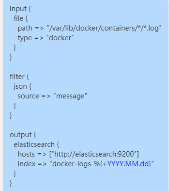
      3. Kibana 配置索引模式
         1. 设置 docker-logs-* 作为索引模式，进行日志查询和分析。
2. 日志采集方式
   1. 直接从docker容器日志采集（docker logs）
3. 运维和优化
   1. 日志清理策略：Elasticsearch 设置 index.lifecycle 规则，定期清理旧日志。     
   2. 性能优化：调整 heap size 限制，防止 Elasticsearch 内存溢出。
   3. 日志采集优化：使用 Filebeat 代替 Logstash，提高日志采集效率
   4. 告警监控：结合 Prometheus + Alertmanager，触发日志异常告警。

### 线程池

>[Java 多线程：彻底搞懂线程池_java线程池-CSDN博客](https://blog.csdn.net/u013541140/article/details/95225769)

#### 作用

- 重复利用线程：避免频繁创建和销毁线程，减少系统开销。
- 控制线程数量：限制线程的最大并发数，避免系统资源过度消耗。
- 提高响应速度：重用线程避免了线程创建的延迟。
- 提高线程的可管理性：统一管理，方便监控。

#### 与tomcat连接池区别

- 一个是作为服务端，一个作为客户端
- Tomcat连接池本质上是一种数据库连接池的实现，但它与 Tomcat 服务器的集成更为紧密，因此在 Tomcat 环境中使用时，可以更好地利用 Tomcat 提供的上下文和资源管理功能。

#### 在项目中举例

小车项目：调用线程,生成租赁提车通知书 ：通过调用线程开启线程池进行任务的处理，再填入任务；模板填数据为docx，再转为pdf，最后放入附件信息表中

#### 定义线程池用到的参数

- 最大线程数

- 核心线程数

#### 参数值根据什么因素设置

- 根据具体作用设置的，如果是网络下载这种大量的io操作，他的核心线程数为cpu的一个核数，如果为大量的计算，建议核心线程数为cpu核数乘以2，具我了解最大线程数和核心线程数保持一样就可以了

#### 为什么队列满了之后还可以新建线程

- 给队列一个最后的保障
- 常见的队列有？

#### 用在什么地方

#### 有界无界问题

### stream流

### zookeeper

- 为什么要使用（作用）
- 服务只能部署单数是为什么？
  - zookeeper的单数部署跟服务的部署不一样
- zookeeper相关的CAP
- 一致性算法
- 主从问题、[分布式事务](https://zhida.zhihu.com/search?content_id=630656523&content_type=Answer&match_order=1&q=分布式事务&zhida_source=entity)
- 强一致性
- 最终一致性
- 分布式事务的长事务问题、死锁问题

### 线上问题排查

- CPU标高问题
- 线上排查问题的思路
  - top、vmstat
  - 排查CPU和内存，网络、IO相关的问题思路
  - 看日志，使用[ES](https://zhida.zhihu.com/search?content_id=630656523&content_type=Answer&match_order=1&q=ES&zhida_source=entity)或者去机器上看
  - arthas
    - 经常在线上看[jvm](https://zhida.zhihu.com/search?content_id=630656523&content_type=Answer&match_order=1&q=jvm&zhida_source=entity)相关的东西，每天都有统计数据可以看到，对于看一些历史的慢请求还是很有帮助

### linux

- 挂载硬盘命令是什么

### spring cloud组件

- 概念，基本了解

### 负责的服务有多少个（微服务）

- 有两个，是按产品分配开发任务的

### Jvm调优参数

- 除本身的参数，项目中jvm其他的参数：添加额外GC参数，记录GC的详细日志
- 发生内存溢出的时候生成dump文件的参数加上

### redis 

- 集群还是单机
- 单机的redis 配置时会配置哪些参数
  - ip ，端口，数据库，最大连接数
  - 最大连接数为30个，为什么？参照拿着因素来确定的？
    - redis 的使用频率设置，对于该项目来说，对redis 的使用没有在一个高并发的情况下进行一个使用，我理解的话30个是足够了
- 数据结构
- 使用方式和原理
- 可以当成消息队列，为什么还要用kafka这个问题
  - 

### MySQL

- Mysql一般都是从索引开始，然后问隔离级别 进而问三大日志 mvcc等等
- Java服务连接MySQL是用的什么链接池
  - 阿里巴巴的durid
  - durid 有配什么参数吗：配置监控   可视化界面
- 存储引擎
- 范式
- 分页查询的性能问题
- 缓存优化、连接池资源紧张
- 用innodb 引擎，有哪几种索引共我们使用
  - 主键索引，聚簇索引，其他都是非聚簇索引
  - 唯一索引
  - 组合索引，组合索引包含全部字段也是非聚簇索引
  - 索引的数据结构
    - b➕树，详细介绍，数据结构？自平横的二叉树
    - 为什么用b➕
  - 换成红黑树的影响
    - 更新，查询排序方面
    - 和b➕数的优缺点
- 事务级别
  - 默认是
  - 可重复读如何实现的，怎么保证第二次读是一样的
- sql怎么优化的？
  - 关联查询的结果集尽可能小,查看结果集的大小：看执行计划（orcale和mysql的方式），sql count下表的数量
  - where条件字段和关联表字段添加索引
- MySQL本身有没有部署集群？
  - 主从节点？
- MySQL的索引
  - 索引是什么
  - 为什么要使用[B+树](https://zhida.zhihu.com/search?content_id=630656523&content_type=Answer&match_order=1&q=B树&zhida_source=entity),
    - 为了降低[IO](https://zhida.zhihu.com/search?content_id=630656523&content_type=Answer&match_order=1&q=IO&zhida_source=entity)次数,原理
- a、b两个字段联合索引
  - 查询的时候条件where条件b在前，a在后，索引生效
  - 只有条件a，索引失效

### 业务数据量级别

单表几十万的一个数据量

### XX-job 

用于定时任务jobhand，shell脚本

### rabbitMq

- 主要用于订单的处理，订单从pc端推到a，a把订单发送到消息队列中，加一个解耦的功能，

​        流量较大时，达到削峰的作用

- 放款，调pc端接口，pc调核心系统，40秒，姑通过消息队列的方式告诉信贷放款，达到异步的作用
- 系统方面，记录消息日志

### 设计模式

- 贷款产品，策略模式
  - 通过什么方式实现的-集合
    - 所有的策略都保存到了list泛型的集合中，项目启动时，会用application context 获取类型的bean加到list中
    - 通过入参，比如产品编码循环遍历来确定用哪个策略，为什么不用map直接判断，因为策略共有十几个，不大，循环遍历list也很快
- control service 命令模式
- 公共代码，抽象类的模版模式
  - 比如说抽象类里面的有个公共的方法，以我之前写过的为例，当时我是封装了一个抽象类的启动流程的方法，启动流程他有非常多的逻辑需要处理，比如说封装流程变量等，而具体需要哪些流程变量方法，需要交给子类来实现，所以会定义一个抽象的方法，让子类自己去实现他需要的逻辑，然后启动流程的话，他就会拿到具体的流程变量初始化来启动流程，所以所谓模板就是一个方法里面，他的步骤是固定的，只是说有一些方法是需要子类来实现的 ，这一块用的就是模板模式
- 如何实现一个单例(饿汉和懒汉)
  - 懒汉式
    - 私有化构造函数，防止外部通过 new 关键字创建实例
    - 在类中定义一个静态变量来保存单例实例。使用volatile关键字修饰，保证其他线程可见
    - 提供一个静态方法（如 getInstance()）来返回单例实例
    - 处理多线程安全问题，可以通过 synchronized 关键字、双重检查锁、静态内部类或枚举单例来实现。
    - 使用双重检查锁实现单例模式的代码如下
  - 饿汉式
    - 在类加载时直接创建对象，该对象私有且由static和final修饰
    - 私有构造函数，防止外部实例化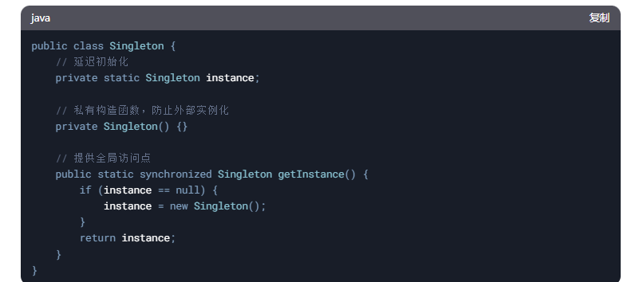

### synchronized  和 ReentrantLock 这两种锁的区别

#### synchronized

- 锁的获取和释放是隐式的，由 JVM 自动管理，不需要手动进行锁的获取和释放

- 不支持中断，线程在等待锁时无法被中断

- 不支持公平锁，锁的获取顺序是不确定的

- 不支持超时机制，线程会一直等待锁

- 通过 wait() 和 notify() 实现线程间的等待和通知。或者通过 Condition 实现线程间的等待和通知，支持多个条件变量。

- **适用低竞争场景 性能较好，因为 JVM 对其进行了优化**

- 具有**锁优化**的功能，当线程比较少的时候，为偏向锁，偏向某一个线程的锁，再升级为轻量锁，最后再升级为重量级锁，这个时候会申请内核进行加锁，会导致性能较差；为什么？因为内核是操作系统层面的，如果去操作操作系统的话，会通过java的一个**缓存一致性协议**来操作，操作系统属于内核态，Java的程序属于用户态，内核态切换为用户态比较耗时，怎么切的？通过哪些指令，Java内存和操内存之间有一个**内存屏障**

- 重量级锁 任何时候都比aqs(乐观锁)性能差？

  - 不一定
  - 重量级锁通过内核态加了一个锁
  - synchronized并发量不大，不会切换为重量锁，为轻量级锁，轻量级锁不会比ReentrantLock（底层也是aqs不过是悲观锁）性能更差

- 升级为重量级锁后不会降级

- 使用建议

  - 偏向锁：适合单线程或低竞争场景。

    - 实现原理：

      - JVM 会将锁偏向第一个获取它的线程，记录线程 ID。

      - 后续该线程进入同步代码块时，无需加锁和解锁，直接执行。

    - 优点：减少锁操作的开销。

    - 缺点：如果存在竞争，偏向锁需要撤销并升级为轻量级锁。

  - 轻量级锁：适合多线程交替访问的场景。多个线程交替访问同步代码块，但没有真正竞争

    - 使用 CAS（Compare-And-Swap）操作将对象的 Mark Word 替换为指向线程栈中锁记录的指针。

    - 如果 CAS 成功，线程获取锁；如果失败，说明有竞争，升级为重量级锁。

    - 优点：避免线程阻塞，减少上下文切换的开销

  - 重量级锁：适合高竞争场景。

    - 实现原理：

      - 使用操作系统的互斥量（Mutex）实现线程阻塞和唤醒。

      - 竞争失败的线程会被挂起，进入阻塞状态。

    - 优点：解决高竞争场景下的线程同步问题。

    - 缺点：性能开销较大，涉及用户态和内核态的切换

  - 锁消除和锁粗化：由 JVM 自动完成，无需手动干预。

  - 自旋锁：适合锁竞争时间较短的场景。

    - 实现原理：

      - 线程在竞争锁失败后，不会立即挂起，而是通过自旋（忙等待）尝试重新获取锁。

      - JVM 会根据历史性能数据动态调整自旋次数。

    - 优点：减少线程挂起和唤醒的开销。

    - 缺点：如果锁竞争时间较长，自旋会浪费 CPU 资源。

  - 图示

#### ReentrantLock

- 实际底层(guc底层的aqs自旋锁) 为一个悲观锁
- 优点
  - 锁的获取和释放是显式的，需要手动调用 lock() 和 unlock()。
  - 支持中断，线程在等待锁时可以被中断
  - 支持公平锁和非公平锁（默认是非公平锁）。公平锁可以按照线程等待的顺序分配锁。
  - 支持超时机制，可以设置等待锁的最大时间
  - **高竞争场景 性能较好，因为它提供了更细粒度的控制（如公平锁、可中断、超时等）**
- 缺点
  - 写法上的复杂度增加
  - 需要手动添加 和释放锁，如果忘记，导致严重后果

#### 这两个锁可以重入吗

- 可以的，都是可重入锁

### volatile关键字

- 保证线程可见，如单例模式中，用volatile关键字定义，如果有别的线程定义了这个对象，该线程可以知道
- 防止指令重排，cpu对指令有指令重排的功能
- 避免高速缓存失效，赋值的时候访问的时候可以保证是最新的值
- 指令重排是什么导致
- 出现场景

### jvm内存模型

- 共享和不共享

- 方法区存放啥

  - 如果是jdk比较前的版本，运行时常量池也会存在方法区中

  - 类加载器对象

- 虚拟机暂作用

  - 对方法进行执行的作用，随着方法的执行，他都有一个压栈的一个动作

- 直接指针和句柄此

- 垃圾回收器

  - jdk1.8中默认用哪一种，是哪一种算法，标记复制算法？

- 双亲委派机制

### spring框架

- 事务注解@trantion,有几种事务传播机制说两到3个和级别

- 哪几种情况会导致事务失效

  - 方法不是public

  - 类没有被spring代理

  - 代码中，异常被try,catch吃掉了，没抛出去

  - 直接用this去调本类中另外一个存在事务方法

  - 注解中low back for会定义异常的范围，如果抛出的异常不属于定义的异常范围，也会失效

  - 数据库本身不支持事务，用的存储殷勤

- 事务基本什么实现的

  - aop

- 方法上添加事务后，事务的sqlsession 未提交之前存放在什么地方，

  - 定义在代理对象的threadlocal中

- threadlocal是一个什么样的数据结构，有什么特点

  - 每一个片层去读取threaglocal，都是自己线程存的一个数据，不会读取到其他线程的数据。避免局部参数的传参，单次会话的数据可以存放到这里，如cookie，session，内存模型，kv结构，和线程关键的

  - 处理不当，内存泄露，原因？
    - 弱引用，垃圾回收掉，解决，定义为static，强引用

- 实现一个自定义注解，完成Aop操作，怎么实现

  - 自定义一个用在方法上的注解

  - 声明一个切面

- springbean的生命周期

### NIO使用的是哪种网络编程模式

- NIO不是同步非阻塞的网络模型

### tcp三次握手四次握手

### 反射机制

- 动态特性,jdk动态代理和ASM动态代理
- 项目中哪里用到,有没有做过验证

### JDK源码

- 并发包
- synchronized的原理
- 自旋锁
- 内存屏障问题
- 类加载器、双亲委派机制和[SPI](https://zhida.zhihu.com/search?content_id=630656523&content_type=Answer&match_order=1&q=SPI&zhida_source=entity)、动态代理

### excel数据导入

- 技术原型rabbitmq redis 进行异步导入
- 数据量超过rabbitmq 的一个上限怎么办
  - 首先解释未遇见数据量超过rabbitmq上限的情况，据我了解，如果超过，可以……
- 文件作为消息队列的参数直接发出去？
  - 不，是将他先导入redis ，通过set这个数据结构把文件中客户相关的信息进行一个过滤，去重，再通过redis导入到mq 中，再通过mq 入库

### 微服务部分，遇到过分布式事务问题没？怎么解决的

excel上传2次，redis 分布式锁

### 是否有写过多线程

用到什么类

### 工作流

- bdmn
- 策略器编写：实现IDistributeAdapter类，其中的流程变量获取可以通过BpmUtils.java类中的方法进行转换获取，流程分配策略适配器类中，主要是针对对象DistributeCandidate的参数赋值，适配器类最终将返回赋值后的DistributeCandidate对象，即根据不同的业务逻辑需要，set不同参数，调整不同分配模式，赋值个人或是群组。
- 在流程的发起或提交时流程变量作为参数传递
- 在调用流程发起或提交方法的时候，需要注意流程变量对象的定义以及相应参数的赋值，如果参数在4.7所在路径逻辑中参与判断，会影响待办的路径。


## 基础面试题

### 网站

- [Java面试题及答案整理（2025年金三银四最新版，持续更新） - 知乎](https://zhuanlan.zhihu.com/p/28608174812)

### %和/

>/：获取两数相处的商
>
>%：获取两数相处的余


### hashmap和currenthashmap

*HashMap和ConcurrentHashMap都是Java中常用的哈希表实现，它们在多线程环境下的行为和性能有所不同*

#### HashMap

*HashMap是Java中最常用的哈希表实现，它采用数组加链表（或红黑树）的数据结构来存储键值对*

**特点**:

- 线程不安全：HashMap不是线程安全的，当多个线程同时对HashMap进行修改时可能会导致不一致的结果。
- 较好的性能：由于不涉及同步操作，HashMap在**单线程环境**下通常具有较好的性能。
- 适用场景：HashMap适用于单线程环境或者在多线程环境中，**只读操作多、写操作较少**的场景。


#### ConcurrentHashMap

*ConcurrentHashMap是Java中专门为多线程环境设计的哈希表实现，它是对HashMap进行了改进和扩展*

**特点**:

- 线程安全：ConcurrentHashMap是线程安全的，多个线程可以同时读取和修改ConcurrentHashMap实例，而不会导致数据不一致的问题。
- 分段锁设计：ConcurrentHashMap内部使用了**分段锁（Segment）**的概念，将整个数据结构分成多个段，每个段都可以独立地加锁，不同的线程可以同时访问不同的段，从而提高并发性能。
- 较复杂的实现：ConcurrentHashMap的实现相对HashMap要复杂一些，涉及到分段锁的管理、添加/删除节点时的同步操作等。
- 适用场景：ConcurrentHashMap适用于**多线程环境下频繁读写的场景**，特别是在**写操作较多**的情况下，能够提供更好的并发性能。

[HashMap 和 currentHashMap 终于总结清楚了！-腾讯云开发者社区-腾讯云 (tencent.com)](https://cloud.tencent.com/developer/article/1581856)


### 为什么要重写 hashcode 和 equals 方法

[为什么要重写 hashcode 和 equals 方法？ (qq.com)](https://mp.weixin.qq.com/s?__biz=MzI3ODcxMzQzMw==&mid=2247491299&idx=2&sn=a0f523badfd3a1997bb89296cd78393d&chksm=eb539bd5dc2412c3304e7099328782529122564afff7ba22246df3b33aced5209de7c9df9305&scene=21#wechat_redirect)

hashcode:  对存入hashmap中的自定义对象利用hashCode方法计算它的hash值，随后把自定义对象放入hash值所指引的内存位置；不重写，调用的是Object父类的hashCode方法；获取的hash值是该自定义对象的内容地址

重写后可以自定义获取哪个字段的hash值；

equals：hashcode只是找到存放位置，但是可能不同的自定义对象的调用自定义的hashcode方法得到的hash值相同；导致一个hash值对应的位置上有多个对象，这个时候重新equals就可以再进行一次比较；就可以准确获取了；

**总结：在hashMap中，是在哈希表中进行添加，删除，查找等操作，而哈希表又是采用数组+链表+红黑树的方式（解决hash冲突）；hashcode方法获取存放地址，equals一个数组下标的链表上可能有多个key,equals再进行比较下**

### java的基本数据类型

基本数据类型共有8种，可以分为三类：

- 数值型：整数类型（byte、short、int、long）和浮点类型（float、double）
- 字符型：char
- 布尔型：boolean


注意一下几点：

- java八种基本数据类型的字节数:1字节(byte、boolean)、 2字节(short、char)、4字节(int、float)、8字节(long、double)
- 浮点数的默认类型为double（如果需要声明一个常量为float型，则必须要在末尾加上f或F）
- 整数的默认类型为int（声明Long型在末尾加上l或者L）
- 八种基本数据类型的包装类：除了char的是Character、int类型的是Integer，其他都是首字母大写
- char类型是无符号的，不能为负，所以是0开始的


### java中常见的引用数据类型

类、接口类型、数组类型、枚举类型、注解类型

```java
public enum AppHttpCodeEnum {

    SUCCESS(200,"操作成功"),
    NEED_LOGIN(1,"需要登录后操作");

    int code;
    String errorMessage;

    AppHttpCodeEnum(int code, String errorMessage){
        this.code = code;
        this.errorMessage = errorMessage;
    }

    public int getCode() {
        return code;
    }

    public String getErrorMessage() {
        return errorMessage;
    }
}
```


```java
@Target({ElementType.CONSTRUCTOR, ElementType.METHOD, ElementType.PARAMETER, ElementType.FIELD, ElementType.ANNOTATION_TYPE})
@Retention(RetentionPolicy.RUNTIME)
@Documented
public @interface Autowired {
    boolean required() default true;
}

```


### ==和Equals区别

（1） ==

如果比较的是基本数据类型，那么比较的是变量的值

如果比较的是引用数据类型，那么比较的是地址值（两个对象是否指向同一块内存）

（2）equals

如果没重写equals方法比较的是两个对象的地址值

如果重写了equals方法后我们往往比较的是对象中的属性的内容

equals()方法最初在Object类中定义的，默认的实现就是使用==


### 接口和抽象类有什么共同点和区别？

**共同点** ：

- 都不能被实例化。
- 都可以包含抽象方法。
- 都可以有默认实现的方法（Java 8 可以用 `default` 关键字在接口中定义默认方法）。

**区别** ：

- 接口主要用于对类的行为进行约束，你实现了某个接口就具有了对应的行为。抽象类主要用于代码复用，强调的是所属关系。
- 一个类只能继承一个类，但是可以实现多个接口。
- 接口中的成员变量只能是 `public static final` 类型的，不能被修改且必须有初始值，而抽象类的成员变量默认 default，可在子类中被重新定义，也可被重新赋值


```
public interface MyInterface{

	public static final int a=10;

    public abstract void methodA();
    
     void methodB();
}
```

```
public abstrace class MyClass{

	int a=10;
	
	public abstract void methodA();
	
	public void methodB(){
		.....
	}
		
}
```


### 重载与重写的区别

重载： 发生在同一个类中，方法名必须相同，参数类型不同.个数不同.顺序不同，方法返回 值和访问修饰符可以不同
重写： 发生在父子类中，方法名.参数列表必须相同，


### string，stringbuffer，stringbuilder 的区别

1.String的值是不可变的，每次对String的操作都会生成一个新的String对象，不仅效率低下，而且浪费大量内存空间，简单测试的可以直接String拼接。

2.StringBuffer是可变类，和线程安全的字符串操作类似，任何对它指向的字符串的操作都不会产生新的对象。每个StringBuffer对象都有一定的缓冲区容量，当字符串大小没有超过容量时，不会分配新的容量，当字符串大小超过容量时，会自动增加容量 ，多线程又要线程安全的选它。

3.StringBuilder是可变类，速度更快，线程不安全，单线程选它。


###  集合框架

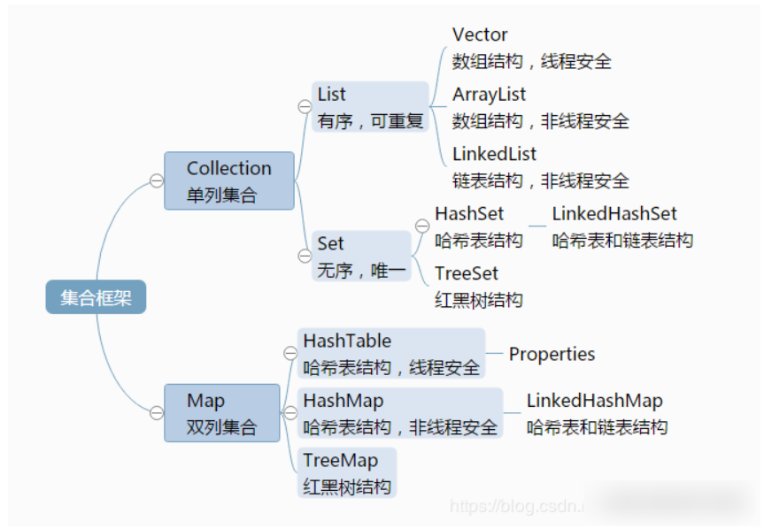


- Java 容器分为 Collection 和 Map 两大类，Collection集合的子接口有Set、List、Queue三种子接口。我们比较常用的是Set、List，Map接口不是collection的子接口。
- Collection集合主要有List和Set两大接口
  - List：一个有序（元素存入集合的顺序和取出的顺序一致）容器，元素可以重复，可以插入多个null元素，元素都有索引。常用的实现类有 ArrayList、LinkedList 和 Vector。
  - Set：一个无序（存入和取出顺序有可能不一致）容器，不可以存储重复元素，只允许存入一个null元素，必须保证元素唯一性。Set 接口常用实现类是 HashSet、LinkedHashSet 以及 TreeSet。
- Map是一个键值对集合，存储键、值和之间的映射。 Key无序，唯一；value 不要求有序，允许重复。Map没有继承于Collection接口，从Map集合中检索元素时，只要给出键对象，就会返回对应的值对象。
  - Map 的常用实现类：HashMap、TreeMap、HashTable、LinkedHashMap、ConcurrentHashMap


### ArrayList与LinkedList的区别

（1）ArrayList是实现了基于动态数组的数据结构，LinkedList基于链表的数据结构。

（2）对于随机访问get和set，ArrayList绝对优于LinkedList，因为LinkedList要移动指针。

（3）对于插入和删除操作add和remove，LinkedList比较占优势，因为ArrayList每插入或删除一条数据，都要移动插入点或删除点及之后的所有数据。

补充：ArrayList 使用一个内置数组来存储元素，起始容量是 10，当数组需要扩容时，每次容量会增加 50%。这意味着如果包含大量元素，将会浪费很大的空间。这种浪费是由 ArrayList 本身决定的。


### HashMap的底层原理

JDK1.8之前采用的是拉链法。**拉链法**：将链表和数组相结合。也就是说创建一个链表数组，数组中每一格就是一个链表。若遇到哈希冲突，则将冲突的值加到链表中即可。


HashMap JDK1.8之后

- 相比于之前的版本，jdk1.8在解决哈希冲突时有了较大的变化，当链表长度大于阈值（默认为8）时，将链表转化为红黑树，以减少搜索时间。new HashMap()  map.put("name","dabao")  map.put("age",20) map.put("name","erbao")  Node n = new Node();


### HashMap的put方法的具体流程？

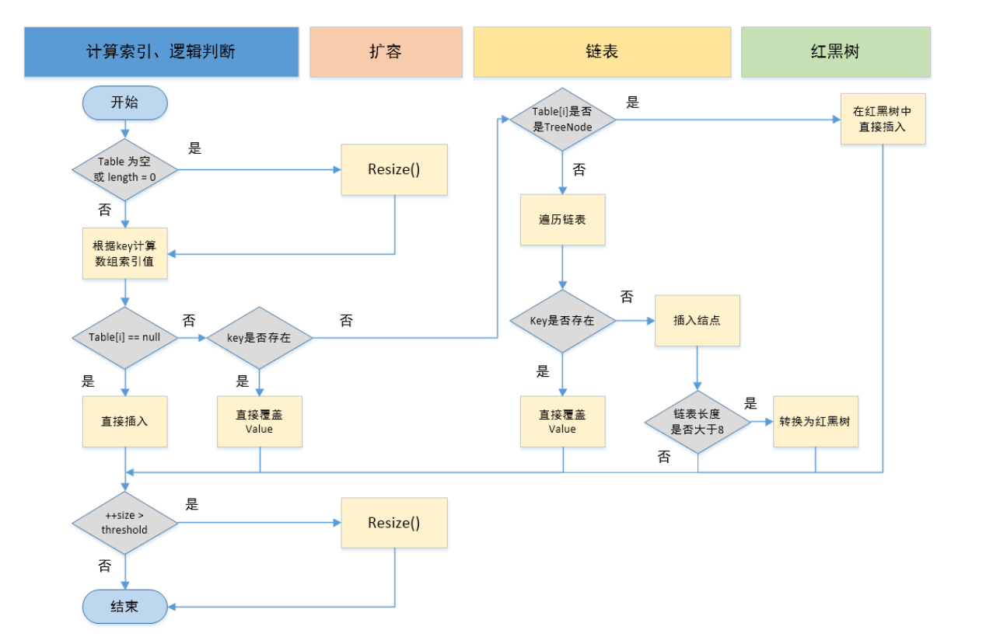

1. 判断键值对数组table[i]是否为空或为null，否则执行resize()进行扩容；
2. 根据键值key计算hash值得到插入的数组索引i，如果table[i]==null，直接新建节点添加，转向⑥，如果table[i]不为空，转向③；
3. 判断table[i]的首个元素是否和key一样，如果相同直接覆盖value，否则转向④，这里的相同指的是hashCode以及equals；
4. 判断table[i] 是否为treeNode，即table[i] 是否是红黑树，如果是红黑树，则直接在树中插入键值对，否则转向5；
5. 遍历table[i]，判断链表长度是否大于8，大于8的话把链表转换为红黑树，在红黑树中执行插入操作，否则进行链表的插入操作；遍历过程中若发现key已经存在直接覆盖value即可；
6. 插入成功后，判断实际存在的键值对数量size是否超多了最大容量threshold，如果超过，进行扩容。


### HashMap转红黑树的条件

1. 条件一
   数组 arr[i] 处存放的链表长度大于8；
2. 条件二
   数组长度大于等于64。

满足以上两个条件，数组 arr[i] 处的链表将自动转化为红黑树，其他位置如 arr[i+1] 处的数组元素仍为链表，不受影响


### HashMap和Hashtable区别

**1、线程安全性不同**

**HashMap是线程不安全的，Hashtable是线程安全的，其中的方法是Synchronized的，在多线程并发的情况下，可以直接使用Hashtable，但是使用HashMap时必须自己增加同步处理。**

**2、是否提供contains方法**

HashMap只有containsValue和containsKey方法；Hashtable有contains、containsKey和containsValue三个方法，其中contains和containsValue方法功能相同。

**3、key和value是否允许null值**

**Hashtable中，key和value都不允许出现null值。HashMap中，null可以作为键，这样的键只有一个；可以有一个或多个键所对应的值为null。**

**4、数组初始化和扩容机制**

Hashtable在不指定容量的情况下的默认容量为11，而HashMap为16，Hashtable不要求底层数组的容量一定要为2的整数次幂，而HashMap则要求一定为2的整数次幂。

Hashtable扩容时，将容量变为原来的2倍加1，而HashMap扩容时，将容量变为原来的2倍。


### 有没有线程安全的Map?concurrentHashmap底层原理?

**ConcurrentHashMap**使用synchronized锁定当前链表或红黑二叉树的首节点，这样只要hash不冲突，就不会产生并发，效率又提升N倍。

**HashMap**没有锁的机制因此是线程不安全的

**Hashtable** :使用 synchronized 来保证线程安全，效率非常低下。当一个线程访问同步方法时，其他线程也访问同步方法，可能会进入阻塞或轮询状态，如使用 put 添加元素，另一个线程不能使用 put 添加元素，也不能使用 get，竞争会越来越激烈效率越低。


### Object中有哪些方法

（1）protected Object clone()—>创建并返回此对象的一个副本。 
（2）boolean equals(Object obj)—>指示某个其他对象是否与此对象“相等”。 
（3）protected void finalize()—>当垃圾回收器确定不存在对该对象的更多引用时，由对象的垃圾回收器调用此方法。 
（4）Class<? extends Object> getClass()—>返回一个对象的运行时类。 
（5）int hashCode()—>返回该对象的哈希码值。 
（6）void notify()—>唤醒在此对象监视器上等待的单个线程。 
（7）void notifyAll()—>唤醒在此对象监视器上等待的所有线程。 
（8）String toString()—>返回该对象的字符串表示。 
（9）void wait()—>导致当前的线程等待，直到其他线程调用此对象的 notify() 方法或 notifyAll() 方法。 
    void wait(long timeout)—>导致当前的线程等待，直到其他线程调用此对象的 notify() 方法或 notifyAll()方法，或者超过指定的时间量。 
    void wait(long timeout, int nanos)—>导致当前的线程等待，直到其他线程调用此对象的 notify()


### for循环遍历list集合中的元素时,删除某一类符合条件的元素,会出现什么问题

http://www.imodou.com.cn/article/%E3%80%90%E5%8E%9F%E7%90%86%E6%8E%A2%E7%A9%B6%E3%80%91ArrayList%E9%81%8D%E5%8E%86%E6%97%B6%E5%88%A0%E9%99%A4%E5%85%83%E7%B4%A0%E7%9A%84%E6%AD%A3%E7%A1%AE%E5%A7%BF%E5%8A%BF%E6%98%AF%E4%BB%80%E4%B9%88%EF%BC%9F.html#arraylist%E9%81%8D%E5%8E%86%E6%97%B6%E5%88%A0%E9%99%A4%E5%85%83%E7%B4%A0%E7%9A%84%E5%87%A0%E7%A7%8D%E5%A7%BF%E5%8A%BF

第1种方法 - 普通for循环正序删除（结果：会漏掉元素判断）

第2种方法 - 普通for循环倒序删除（结果：正确删除）

第3种方法 - for-each循环删除（结果：抛出异常）

第4种方法 - Iterator遍历，使用ArrayList.remove()删除元素（结果：抛出异常）

第5种方法 - Iterator遍历，使用Iterator的remove删除元素（结果：正确删除）


### 创建线程的常用的几种方式：

1. 继承Thread类
2. 实现Runnable接口 （重写run方法，无返回值）
3. 实现Callable接口（ JDK1.5>=,重写call方法，可以自定义返回值 ）
4. 线程池方式创建


### 启动线程怎么启动?

start()方法被用来启动新创建的线程


### 线程池有哪些参数

ThreadPoolExecutor 最多包含以下七个参数：

1. corePoolSize：线程池中的核心线程数3
2. maximumPoolSize：线程池中最大线程数6
3. keepAliveTime：闲置超时时间
4. unit：keepAliveTime 超时时间的单位（时/分/秒等）
5. workQueue：线程池中的任务队列
6. threadFactory：为线程池提供创建新线程的线程工厂
7. rejectedExecutionHandler：线程池任务队列超过最大值之后的拒绝策略


### 线程池工作原理


1. 提交任务后，先判断当前池中线程数是否小于 corePoolSize，如果小于，则创建新线程执行这个任务。
2. 否则，判断线程池任务队列是否已满，如果没有满，则添加任务到任务队列。
3. 否则，判断当前池中线程数是否大于 maximumPoolSize，如果大于则执行预设拒绝策略。
4. 否则，创建一个线程执行该任务，直至线程数达到maximumPoolSize，达到后执行预设拒绝策略。


### 种常见的线程池

`Executors`类中提供的几个静态方法来创建线程池

**newCachedThreadPool**:

**newFixedThreadPool:**

**newSingleThreadExecutor:**

**newScheduledThreadPool:**

详细参考：http://www.imodou.com.cn/article/%E4%B8%80%E6%96%87%E5%BC%84%E6%87%82Java%E4%B8%AD%E7%BA%BF%E7%A8%8B%E6%B1%A0%E5%8E%9F%E7%90%86.html#%E5%9B%9B%E7%A7%8D%E5%B8%B8%E8%A7%81%E7%9A%84%E7%BA%BF%E7%A8%8B%E6%B1%A0

四种常见的线程池基本够我们使用了，但是《阿里巴巴开发手册》不建议我们直接使用Executors类中的线程池，而是通过`ThreadPoolExecutor`的方式，这样的处理方式让写的同学需要更加明确线程池的运行规则，规避资源耗尽的风险。


### synchronized与lock的区别？

1. 用法不同：synchronized 可以用来修饰普通方法、静态方法和代码块，而 ReentrantLock 只能用于代码块。
2. 获取锁和释放锁的机制不同：synchronized 是自动加锁和释放锁的，而 ReentrantLock 需要手动加锁和释放锁。
3. 锁类型不同：synchronized 是非公平锁，而 ReentrantLock 默认为非公平锁，也可以手动指定为公平锁。
4. 响应中断不同：ReentrantLock 可以响应中断，解决死锁的问题，而 synchronized 不能响应中断。
5. synchronized它是java的一个关键字，ReentrantLock 它是lock接口的一个实现类


### 什么是公平锁非公平锁

**公平锁：** 是指多个线程按照申请锁的顺序来获取锁，这里类似排队买票，先来的人先买，后来的人在队尾排队，这是公平的ReentrantLock reentrantLock = new ReentrantLock(true); true表示公平锁，先来先得

**非公平锁：** 是指多个线程获取锁的顺序并不是按照申请锁的顺序，有可能后申请的线程比先申请的线程有限获取锁，在高并发环境下，有可能造成优先级翻转或者饥饿的状态（某个线程一直得不到锁）


### sleep() 方法和 wait() 方法对比

**共同点** ：两者都可以暂停线程的执行。

**区别** ：

- `wait()` 通常被用于线程间交互/通信，`sleep()`通常被用于暂停执行。

- `wait()` 方法被调用后，线程不会自动苏醒，需要别的线程调用同一个对象上的 `notify()`或者 `notifyAll()` 方法。`sleep()`方法执行完成后，线程会自动苏醒，或者也可以使用 `wait(long timeout)` 超时后线程会自动苏醒。

- `sleep()` 是 `Thread` 类的静态本地方法，`wait()` 则是 `Object` 类的本地方法。

- sleep()使用时不用上锁，但wait()使用时必须上锁，**`sleep()` 方法没有释放锁，而 `wait()` 方法释放了锁** 。

  

### 线程之间的通信有几种方式,分别是怎么实现的?

**线程之间为什么要进行通信**

​            线程是操作系统调度的最小单位，有自己的栈（JVM中的虚拟机stack）空间，可以按照既定的代码逐步的执行，**但是如果每个线程间都孤立的运行，那就会造资源浪费**。所以在现实中，我们需要这些线程间可以按照指定的规则共同完成一件任务，所以这些线程之间就需要互相协调，这个过程被称为线程的通信。

- 多个线程并发执行时, 在默认情况下CPU是**随机切换线程**的，当我们需要多个线程来**共同完成**一件任务，并且我们希望他们**有规律**的执行, 那么多线程之间需要一些**协调通信**，以此来帮我们达到**多线程共同操作一份数据**。
- 当然如果我们没有使用线程通信来使用多线程共同操作同一份数据的话，虽然可以实现，但是在很大程度会造成多线程之间对同一共享变量的争夺，那样的话势必为造成很多错误和损失！
- 所以，我们才引出了线程之间的通信，`多线程之间的通信能够避免对同一共享变量的争夺。`

**线程的通信可以被定义为：线程通信就是当多个线程共同操作共享的资源时，互相告知自己的状态以避免资源争夺。**


**线程通信的方式**

线程通信主要可以分为三种方式，分别为**共享内存**、**消息传递（也叫等待-通知）**和**管道流**。每种方式有不同的方法来实现。在Java中线程之间的通信方式总共有8种，分别是：**volatile、synchronized、interrupt、wait、notify、notifyAll、join、管道输入/输出**

**共享内存**：线程之间**共享程序的公共状态**，线程之间通过 读-写 内存中的公共状态来隐式通信。比如 **volatile 保证内存的可见性。**

**消息传递**：线程之间**没有公共的状态**，线程之间**必须通过明确的发送信息来显示的进行通信**。比如 **wait/notify/notifyAll等待通知方式和join方式**。

多个线程在处理**同一个资源**，并且任务不同时，需要线程通信来帮助解决线程之间对同一个变量的**使用或操作**。 就是**多个线程在操作同一份数据时， 避免对同一共享变量的争夺**。于是我们引出了**等待唤醒机制**：（**wait()**、**notify()**）。**notifyAll**的使用情景是存在多个生产者和消费者。

等待通知机制是基于wait和notify方法来实现的，在一个线程内调用该线程锁对象的wait方法，线程将进入等待队列进行等待直到被通知或者被唤醒。

**管道流**：**管道流是是一种使用比较少的线程间通信方式，管道输入/输出流和普通文件输入/输出流或者网络输出/输出流不同之处在于，它主要用于线程之间的数据传输，传输的媒介为管道**。比如 **管道输入/输出**

**管道通信**就是使用java.io.PipedInputStream 和 java.io.PipedOutputStream进行通信。像消息传递机制，也就是说：**通过管道，将一个线程中的消息发送给另一个。**


### lock锁它是公平锁还是非公平的?

ReentrantLock reentrantLock = new ReentrantLock(true); true表示公平锁

ReentrantLock reentrantLock = new ReentrantLock(false)或默认是非分平锁


### 什么是线程死锁?如何避免死锁?

#### 认识线程死锁

线程死锁描述的是这样一种情况：多个线程同时被阻塞，它们中的一个或者全部都在等待某个资源被释放。由于线程被无限期地阻塞a，因此程序不可能正常终止。

如下图所示，线程 A 持有资源 2，线程 B 持有资源 1，他们同时都想申请对方的资源，所以这两个线程就会互相等待而进入死锁状态。


下面通过一个例子来说明线程死锁,代码模拟了上图的死锁的情况 (代码来源于《并发编程之美》)：

```java
public class DeadLockDemo {
    private static Object resource1 = new Object();//资源 1
    private static Object resource2 = new Object();//资源 2

    public static void main(String[] args) {
        new Thread(() -> {
            synchronized (resource1) {
                System.out.println(Thread.currentThread() + "get resource1");
                try {
                    Thread.sleep(1000);
                } catch (InterruptedException e) {
                    e.printStackTrace();
                }
                System.out.println(Thread.currentThread() + "waiting get resource2");
                synchronized (resource2) {
                    System.out.println(Thread.currentThread() + "get resource2");
                }
            }
        }, "线程 1").start();

        new Thread(() -> {
            synchronized (resource2) {
                System.out.println(Thread.currentThread() + "get resource2");
                try {
                    Thread.sleep(1000);
                } catch (InterruptedException e) {
                    e.printStackTrace();
                }
                System.out.println(Thread.currentThread() + "waiting get resource1");
                synchronized (resource1) {
                    System.out.println(Thread.currentThread() + "get resource1");
                }
            }
        }, "线程 2").start();
    }
}
```

Output

```text
Thread[线程 1,5,main]get resource1
Thread[线程 2,5,main]get resource2
Thread[线程 1,5,main]waiting get resource2
Thread[线程 2,5,main]waiting get resource1
```

线程 A 通过 `synchronized (resource1)` 获得 `resource1` 的监视器锁，然后通过`Thread.sleep(1000);`让线程 A 休眠 1s 为的是让线程 B 得到执行然后获取到 resource2 的监视器锁。线程 A 和线程 B 休眠结束了都开始企图请求获取对方的资源，然后这两个线程就会陷入互相等待的状态，这也就产生了死锁。

上面的例子符合产生死锁的四个必要条件：

1. 互斥：该资源任意一个时刻只由一个线程占用。
2. 请求与保持条件：一个线程因请求资源而阻塞时，对已获得的资源保持不放。
3. 不剥夺条件:线程已获得的资源在未使用完之前不能被其他线程强行剥夺，只有自己使用完毕后才释放资源。
4. 循环等待条件:若干线程之间形成一种头尾相接的循环等待资源关系。

#### 如何预防和避免线程死锁?

**如何预防死锁？** 破坏死锁的产生的必要条件即可：

1. **破坏请求与保持条件** ：一次性申请所有的资源。
2. **破坏不剥夺条件** ：占用部分资源的线程进一步申请其他资源时，如果申请不到，可以主动释放它占有的资源。
3. **破坏循环等待条件** ：靠按序申请资源来预防。按某一顺序申请资源，释放资源则反序释放。破坏循环等待条件。


### 什么是可重入锁?

什么是 “可重入”，可重入就是说某个线程已经获得某个锁，可以再次获取锁而不会出现[死锁](https://so.csdn.net/so/search?q=死锁&spm=1001.2101.3001.7020)。例如

```java
package com.test.reen;
 
// 演示可重入锁是什么意思，可重入，就是可以重复获取相同的锁，synchronized和ReentrantLock都是可重入的
// 可重入降低了编程复杂性
public class WhatReentrant {
	public static void main(String[] args) {
		new Thread(new Runnable() {
			@Override
			public void run() {
				synchronized (this) {
					System.out.println("第1次获取锁，这个锁是：" + this);
					int index = 1;
					while (true) {
						synchronized (this) {
							System.out.println("第" + (++index) + "次获取锁，这个锁是：" + this);
						}
						if (index == 10) {
							break;
						}
					}
				}
			}
		}).start();
	}
}
```

synchronized、ReentrantLock都是可重入锁


### jvm内存模型


**线程私有的：**

- 程序计数器
- 虚拟机栈
- 本地方法栈

**线程共享的：**

- 堆

- 方法区

  


### jvm垃圾回收算法

**标记-清除算法**

该算法分为“标记”和“清除”阶段：首先标记出所有不需要回收的对象，在标记完成后统一回收掉所有没有被标记的对象。它是最基础的收集算法，后续的算法都是对其不足进行改进得到。这种垃圾收集算法会带来两个明显的问题

1. **效率问题**
2. **空间问题（标记清除后会产生大量不连续的碎片）**


**标记-复制算法**

为了解决效率问题，“标记-复制”收集算法出现了。它可以将内存分为大小相同的两块，每次使用其中的一块。当这一块的内存使用完后，就将还存活的对象复制到另一块去，然后再把使用的空间一次清理掉。这样就使每次的内存回收都是对内存区间的一半进行回收。


**标记-整理算法**

根据老年代的特点提出的一种标记算法，标记过程仍然与“标记-清除”算法一样，但后续步骤不是直接对可回收对象回收，而是让所有存活的对象向一端移动，然后直接清理掉端边界以外的内存


**分代收集算法**

当前虚拟机的垃圾收集都采用分代收集算法，这种算法没有什么新的思想，只是根据对象存活周期的不同将内存分为几块。一般将 java 堆分为新生代和老年代，这样我们就可以根据各个年代的特点选择合适的垃圾收集算

http://www.imodou.com.cn/mianshi/java/jvm/java-jvm-01.html#%E6%96%B9%E6%B3%95%E5%8C%BA

**GC**

JVM 的 GC 线程数量是根据 CPU 的核数确定的

### 什么情况下会导致内存溢出?

 **概念**

JVM内存不够了，，目前无法存放创建的对象

**原因**

- JVM分配的内存太小，也可能是服务器本身内存太小，也许是JVM分配的堆内存太小
- 某段代码死循环，导致疯狂创建对象，但又不会触发GC
- 创建的对象太大，导致新生代存不下，老年代也存不下，只能OOM了。

**解决**

- 增加服务器内存，设置合理的-Xms和-Xmx
- 通过线程dump和堆dump，分析出现问题的代码
- 增大JVM内存，及时GC'

**内存中加载的数据量过于庞大，如一次从数据库取出过多数据；集合类中有对对象的引用，使用完后未清空，使得JVM不能回收；代码中存在死循环或循环产生过多重复的对象实体；使用的第三方软件中的BUG；启动参数内存值设定的过小；**


### 什么是内存泄露？

**概念**

不会被使用的对象却不能被回收，就是内存泄露

**例子**

```java
public class Simple{
Object o1; 
public void method() {
   o1 = new Object();
   //...其他代码
}
}
在Simple实例被回收之前，o1都不会被回收，因为o1是全局变量
```

改进:

```java
public class Simple{
Object o1;
public void method() {
   o1 = new Object();
   //...其他代码
   o1 = null; //帮助GC
}
}
```


### Java线上故障排查

[吊打面试官之项目线上问题排查_经历过的项目,有没有遇到过什么线上问题-CSDN博客](https://blog.csdn.net/wtyicy/article/details/115292969)

#### OOM  

[某团面试：如果线上遇到了OOM，你该如何排查？如何解决？哪些方案？-CSDN博客](https://blog.csdn.net/o9109003234/article/details/121917786)

[JVisualVM的使用教程_jvisualvm使用教程-CSDN博客](https://blog.csdn.net/DevelopmentStack/article/details/117385852)


### 谈谈你对反射的理解

**1、反射机制:**

所谓的反射机制就是java语言在运行时拥有一项自观的能力。通过这种能力可以彻底的了解自身的情况为下一步的动作做准备。

Java的反射机制的实现要借助于4个类：Class，Constructor，Field，Method;

其中Class代表的是类对 象，Constructor－类的构造器对象，Field－类的属性对象，Method－类的方法对象。通过这四个对象我们可以粗略的看到一个类的各个组成部分。

**2、Java反射的作用：**

在Java运行时环境中，对于任意一个类，可以知道这个类有哪些属性和方法。对于任意一个对象，可以调用它的任意一个方法。这种动态获取类的信息以及动态调用对象的方法的功能来自于Java 语言的反射（Reflection）机制。

**3、Java** **反射机制提供功能**

在运行时判断任意一个对象所属的类。

在运行时构造任意一个类的对象。

在运行时判断任意一个类所具有的成员变量和方法。

在运行时调用任意一个对象的方法


### Spring的两大核心

IOC：控制反转，是指将对象创建的权利交由Spring容器来管理，我们只需要从Spring容器获取对象即可。DI:依赖注入（setting注入，构造器注入，注解注入）

AOP：面向切面编程，是指在不改变原来代码的基础之上，动态的增强其功能。底层采用的是动态代理技术，动态代理包括JDK动态代理和CGLib动态代理两种，其中如果类有接口则采用JDK动态代理来实现，否则使用CGLIB来实现。


### Spring的作用域

默认是单例的(singleton)，通过scope属性可以设置为多例(prototype)。scope的取值还包括request、session、application等但不常用


### Bean的创建方式

有四种方式:

- 无参构造方法

- 静态工厂

- 实例工厂

- FactoryBean


###  Spring Bean 的生命周期

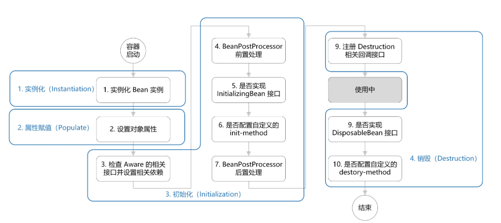

- 首先是实例化、属性赋值、初始化、销毁这 4 个大阶段；
- 如果Bean实现了Aware接口，则在初始化之前先调用Aware接口相关的实现方法
- 如果容器中存在BeanPostProcessor对象，则在初始化之前调用它的BeforeInitialization方法，初始化完后再调用它的AfterInitialization方法
- 判断Bean有没有实现DisposableBean接口，如果有实现则在销毁之前调用对应的实现方法


### Spring依赖注入有哪些方式?

有两种:

1、set注入

2、构造注入

2、注解注入


### Spring事务在哪些情况下会导致失效?

1、如果方法不是被public修饰的，此时事务控制会失效

2、同一个类中方法调用，导致@Transactional失效

比如有一个类Test，它的一个方法A，A再调用本类的方法B（不论方法B是用public还是private修饰），但方法A没有声明注解事务，而B方法有。则外部调用方法A之后，方法B的事务是不会起作用的。这也是经常犯错误的一个地方。

3、@Transactional 注解属性 rollbackFor 设置错误

`rollbackFor` 可以指定能够触发事务回滚的异常类型。Spring默认抛出了未检查`unchecked`异常（继承自 `RuntimeException` 的异常）或者 `Error`才回滚事务；其他异常不会触发回滚事务。如果在事务中抛出其他类型的异常，但却期望 Spring 能够回滚事务，就需要指定 **rollbackFor**属性。

4、事务传播行为设置出错

5、异常被try..catch吃掉

6、数据库引擎不支持事务


### mybatis中一级缓存和二级缓存的区别

1.一级缓存

一级缓存是SqlSession级别的缓存。在操作数据库时需要构造 sqlSession对象，在对象中有一个(内存区域)数据结构（HashMap）用于存储缓存数据。不同的sqlSession之间的缓存数据区域（HashMap）是互相不影响的。

Mybatis默认开启一级缓存。

一级缓存的作用域是同一个SqlSession，在同一个sqlSession中两次执行相同的sql语句，第一次执行完毕会将数据库中查询的数据写到缓存（内存），第二次会从缓存中获取数据将不再从数据库查询，从而提高查询效率。当一个sqlSession结束后该sqlSession中的一级缓存也就不存在了。

2.二级缓存 二级缓存介绍

二级缓存是mapper级别的缓存，多个SqlSession去操作同一个Mapper的sql语句，多个SqlSession去操作数据库得到数据会存在二级缓存区域，多个SqlSession可以共用二级缓存，二级缓存是多个SqlSession共享的。

UserMapper有一个二级缓存区域（按namespace分，如果namespace相同则使用同一个相同的二级缓存区），其它mapper也有自己的二级缓存区域（按namespace分）。也是就是说拥有相同的namespace的UserMapper共享一个二级缓存

二级缓存默认是关闭的，需要在mapper.xml文件中通过<cache/>标签来开启。


### MyBatis中#{}与${}

1）#{}是预编译处理，$ {}是字符串替换。

2）mybatis在处理#{}时，会将sql中的#{}替换为?号，调用PreparedStatement的set方法来赋值；mybatis在处理 $ { } 时，就是把 ${ } 替换成变量的值。

3）使用 #{} 可以有效的防止SQL注入，提高系统安全性。


### MyBatis动态SQL

1、<where>标签、<if>标签
当查询语句的查询条件由于输入参数的不同而无法确切定义时，可以使用<where>标签对来包裹需要动态指定的SQL查询条件，而在<where>标签对中，可以使用<if test="...">条件来分情况设置SQL查询条件。

2、<foreach>标签

<foreach>标签属性说明：

属性	说明
index	当迭代对象是数组，列表时，表示的是当前迭代的次数。
item	当迭代对象是数组，列表时，表示的是当前迭代的元素。
collection	当前遍历的对象。
open	遍历的SQL以什么开头。
close	遍历的SQL以什么结尾。
separator	遍历完一次后，在末尾添加的字符等。


### pringBoot的优点

- Spring Boot 主要有如下优点：
  1. 容易上手，提升开发效率，**具有自动装配的功能**，为 Spring 开发提供一个更快、更简单的开发框架。
  2. 开箱即用，远离繁琐的配置。
  3. 提供了一系列大型项目通用的非业务性功能，例如：内嵌服务器、安全管理、运行数据监控、运行状况检查和外部化配置等。
  4. SpringBoot总结就是使编码变简单、配置变简单、部署变简单、监控变简单等等
  5. **版本锁定**


### Springboot配置文件类型及加载顺序

Springboot的配置文件包括.properties、.yaml、yml三种

加载顺序：

.properties>.yml>.yaml


### Springboot热更新（dev-tools）

[IDEA + Spring Boot 的三种热加载方案，看完弄懂，不用加班~-腾讯云开发者社区-腾讯云 (tencent.com)](https://cloud.tencent.com/developer/article/1683029)

可快速启动，加快开发速度。


### Springboot自动装配原理

##### 从启动类开始看

说起SpringBoot中的自动装配，首先要从SpringBoot的启动类开始看。

```java
@SpringBootApplication
public class Application {

    public static void main(String[] args) {
        SpringApplication.run(Application.class, args);
    }

}
```

这是一个基本的SpringBoot启动类，我们主要看`SpringBootApplication`这个注解，点进去源码，看一下具体的实现。

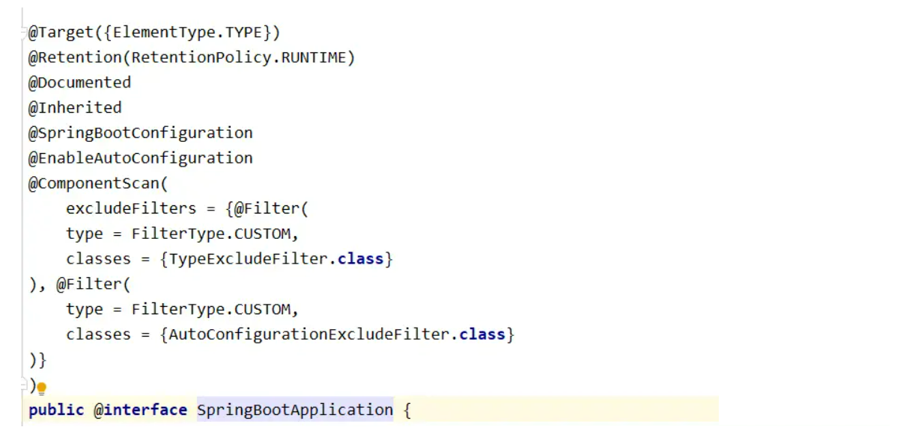

根据图中的信息，我们完全可以看得出来，SpringBootApplication这个注解，是一个复合注解。

`SpringBootConfiguration`注解，可能会有些陌生，但是对于`@Configuration`注解的话，就一定不会了； `ComponentScan`也是我们在Spring项目中常常会用到的扫描注解。

主要还是来说一下`@EnableAutoConfiguration`注解，自动配置注解，也可以说自动装配，既然是要聊自动装配原理，那也就是聊一下`@EnableAutoConfiguration`注解的具体实现了，下面就来看一下吧。

##### 开启自动配置注解@EnableAutoConfiguration

看一下此注解的源码实现，如下图。

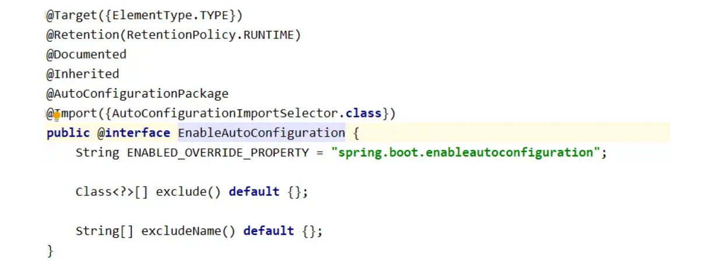

Import注解才是自动装配的核心，继续深入。

Import注解实现了`AutoConfigurationImportSelector`类，自动装配也是在这个类中进行了具体的实现。

`AutoConfigurationImportSelector`类中实现了诸多方法，自动装配的实现则是在selectImports方法中，如图所示。


从源码中读起来，有一个`getCandidateConfigurations`方法，进入看一下代码情况。


这里存在一个断言，意为无法正确的找到spring.factories文件，结果就很自然了，这个方法就是去加载了spring.factories文件，让我们去找一下这个文件里面具体是什么内容吧。

通过IDEA中的当前类定位按钮进行寻找，


在这里能找到文件，如图：


文件内容如图：


可以看出，通过selectImports方法，取到该文件下的一系列类名，随后将这些类自动加载至IOC容器中。

这些类都属于内部存在自动配置的类，同样可以发现这些类名都是以AutoConfiguration结尾的。

**总结**

自动装配原理就已经说完了，总结一下，就是通过@EnableAutoConfiguration注解，加载AutoConfigurationImportSelector类中的selectImports方法，进而扫描MATE-INF下的spring.factories文件下的自动配置类，并将其装配至IOC容器的过程。


### SpringCloud的五大组件

注册中心(nacos、eureka、consul)

配置中心：

Feign&ribbon：远程调用 

hystrix：微服务保护（熔断+降级）

gateway(网关):**路由**、限流（计数器、令牌桶）、鉴权


### SpringBoot与SpringCloud 区别

SpringBoot是快速开发的Spring框架，SpringCloud是完整的微服务框架，SpringCloud依赖于SpringBoot。


### 为什么使用Redis(Redis的优点)

Redis的速度⾮常的快，单机的Redis就可以⽀撑每秒十几万的并发，相对于MySQL来说，性能是MySQL的⼏⼗倍。速度快的原因主要有⼏点：

1. **完全基于内存操作**
2. 使⽤单线程，避免了线程切换和竞态产生的消耗
3. 基于⾮阻塞的IO多路复⽤机制
4. C语⾔实现，优化过的数据结构，基于⼏种基础的数据结构，redis做了⼤量的优化，性能极⾼


### Redis可以用来做什么？

1. 缓存

   这是Redis应用最广泛地方，基本所有的Web应用都会使用Redis作为缓存，来降低数据源压力，提高响应速度。 

2. 计数器 Redis天然支持计数功能，而且计数性能非常好，可以用来记录浏览量、点赞量等等。

3. 排行榜 Redis提供了列表和有序集合数据结构，合理地使用这些数据结构可以很方便地构建各种排行榜系统。

4. 社交网络 赞/踩、粉丝、共同好友/喜好、推送、下拉刷新。

5. 消息队列 Redis提供了发布订阅功能和阻塞队列的功能，可以满足一般消息队列功能。

6. 分布式锁 分布式环境下，利用Redis实现分布式锁，也是Redis常见的应用。

Redis的应用一般会结合项目去问，以一个电商项目的用户服务为例：

- Token存储：用户登录成功之后，使用Redis存储Token
- 登录失败次数计数：使用Redis计数，登录失败超过一定次数，锁定账号
- 地址缓存：对省市区数据的缓存
- 分布式锁：分布式环境下登录、注册等操作加分布式锁
- ……


### redis缓存常用的数据类型有几种，都有什么特点？

- **5 种基础数据结构** ：String（字符串）、List（列表）、Set（集合）、Hash（散列）、Zset（有序集合）。
- **3 种特殊数据结构** ：HyperLogLogs（基数统计）、Bitmap （位存储）、Geospatial (地理位置)。


**String**字符串最基础的数据结构。字符串类型的值实际可以是字符串（简单的字符串、复杂的字符串（例如JSON、XML））、数字 （整数、浮点数），甚至是二进制（图片、音频、视频），但是值最大不能超过512MB。

**Hash**哈希类型是指键值本身又是一个键值对结构。

**list**列表类型是用来存储多个有序的字符串。列表是一种比较灵活的数据结构，它可以充当栈和队列的角色

**set**集合类型也是用来保存多个的字符串元素，但和列表类型不一 样的是，集合中不允许有重复元素，并且集合中的元素是无序的

**Zset**有序集合中的元素可以排序。但是它和列表使用索引下标作为排序依据不同的是，它给每个元素设置一个权重（score）作为排序的依据


### Redis持久化方式有哪些？

Redis持久化⽅案分为RDB和AOF两种。

**RDB**

RDB持久化是把当前进程数据生成**快照**保存到硬盘的过程，触发RDB持久化过程分为手动触发和自动触发。

RDB⽂件是⼀个压缩的⼆进制⽂件，通过它可以还原某个时刻数据库的状态。由于RDB⽂件是保存在硬盘上的，所以即使Redis崩溃或者退出，只要RDB⽂件存在，就可以⽤它来恢复还原数据库的状态。

**AOF**

AOF（append only file）持久化：以独立日志的方式**记录每次写命令**， 重启时再重新执行AOF文件中的命令达到恢复数据的目的。AOF的主要作用是解决了数据持久化的实时性，目前已经是Redis持久化的主流方式。


### RDB 和 AOF 各自有什么优缺点？

**RDB | 优点**

1. 只有一个紧凑的二进制文件 `dump.rdb`，非常适合备份、全量复制的场景。
2. **容灾性好**，可以把RDB文件拷贝道远程机器或者文件系统张，用于容灾恢复。
3. **恢复速度快**，RDB恢复数据的速度远远快于AOF的方式

**RDB | 缺点**

1. **实时性低**，RDB 是间隔一段时间进行持久化，没法做到实时持久化/秒级持久化。如果在这一间隔事件发生故障，数据会丢失。
2. **存在兼容问题**，Redis演进过程存在多个格式的RDB版本，存在老版本Redis无法兼容新版本RDB的问题。

**AOF | 优点**

1. **实时性好**，aof 持久化可以配置 `appendfsync` 属性，有 `always`，每进行一次命令操作就记录到 aof 文件中一次。
2. 通过 append 模式写文件，即使中途服务器宕机，可以通过 redis-check-aof 工具解决数据一致性问题。

**AOF | 缺点**

1. AOF 文件比 RDB **文件大**，且 **恢复速度慢**。
2. **数据集大** 的时候，比 RDB **启动效率低**。


### Redis如何实现高可用？

Redis保证高可用主要有三种方式：主从、哨兵、集群。

主从结构：一主多从，主负责写，重负责读。不能实现故障转移


哨兵：在主从结构的基础上引入哨兵机制，对主从结构进行监听，当发现主宕机后自动实现故障转移。使用哨兵模式不能实现扩容


集群：集群中有多个主节点，每个主节点可以指定若干个从结点。在存储数据时采用分槽的思想来完成，默认可以分16384个槽。也就是说集群中最多可以容纳16384个主节点


### 什么是缓存击穿、缓存穿透、缓存雪崩？

##### 缓存击穿

一个并发访问量比较大的key在某个时间过期，导致所有的请求直接打在DB上。


解决⽅案：

1. 设置**互斥锁**更新，⽐如请求查询A，发现缓存中没有，对A这个key加锁，同时去数据库查询数据，写⼊缓存，再返回给⽤户，这样后⾯的请求就可以从缓存中拿到数据了。 

   伪代码：

   ```java
   public String get(key) {
   
         String value = redis.get(key);
         if (value == null) { //代表缓存值过期
             //设置3min的超时，防止del操作失败的时候，下次缓存过期一直不能load db
         if (redis.setnx(“mylock”, 1, 3 * 60) == 1) {  //代表设置成功
             value = db.get(key);
             redis.set(key, value, expire_secs);
             redis.del(“mylock”);
           } else {  //这个时候代表同时候的其他线程已经load db并回设到缓存了，这时候重试获取缓存值即可
   
             sleep(50);
             get(key);  //重试
   
            }
   
        } else {
                 return value;      
             }
   
    }
   ```

   

2. 将热点key过期时间设置长一些，或者设置不过期。

##### 缓存穿透

缓存穿透指的查询缓存和数据库中都不存在的数据，这样每次请求直接打到数据库，就好像缓存不存在一样。


缓存穿透将导致不存在的数据每次请求都要到存储层去查询，失去了缓存保护后端存储的意义。

缓存穿透可能会使后端存储负载加大，如果发现大量存储层空命中，可能就是出现了缓存穿透问题。

缓存穿透可能有两种原因：

1. 自身业务代码问题
2. 恶意攻击，爬虫造成空命中

它主要有两种解决办法：

- **缓存空值/默认值**

一种方式是在数据库不命中之后，把一个空对象或者默认值保存到缓存，之后再访问这个数据，就会从缓存中获取，这样就保护了数据库。


缓存空值有两大问题：

1. 空值做了缓存，意味着缓存层中存了更多的键，需要更多的内存空间（如果是攻击，问题更严重），比较有效的方法是针对这类数据设置一个较短的过期时间，让其自动剔除。
2. 缓存层和存储层的数据会有一段时间窗口的不一致，可能会对业务有一定影响。 例如过期时间设置为5分钟，如果此时存储层添加了这个数据，那此段时间就会出现缓存层和存储层数据的不一致。 这时候可以利用消息队列或者其它异步方式清理缓存中的空对象。

- **布隆过滤器** 除了缓存空对象，我们还可以在存储和缓存之前，加一个布隆过滤器，做一层过滤。

布隆过滤器里会保存数据是否存在，如果判断数据不不能再，就不会访问存储。


​                                                                                   


##### 缓存雪崩

某⼀时刻发⽣⼤规模的缓存失效的情况，例如缓存服务宕机、大量key在同一时间过期，这样的后果就是⼤量的请求进来直接打到DB上，可能导致整个系统的崩溃，称为雪崩。


缓存雪崩是三大缓存问题里最严重的一种，我们来看看怎么预防和处理。

- **提高缓存可用性**

1. 集群部署：通过集群来提升缓存的可用性，可以利用Redis本身的Redis Cluster或者第三方集群方案如Codis等。
2. 多级缓存：设置多级缓存，第一级缓存失效的基础上，访问二级缓存，每一级缓存的失效时间都不同。

- **过期时间**

1. 均匀过期：为了避免大量的缓存在同一时间过期，可以把不同的 key 过期时间随机生成，避免过期时间太过集中。
2. 热点数据永不过期。


### 能说说布隆过滤器吗？

布隆过滤器，它是一个连续的数据结构，每个存储位存储都是一个`bit`，即`0`或者`1`, 来标识数据是否存在。

存储数据的时时候，使用K个不同的哈希函数将这个变量映射为bit列表的的K个点，把它们置为1。

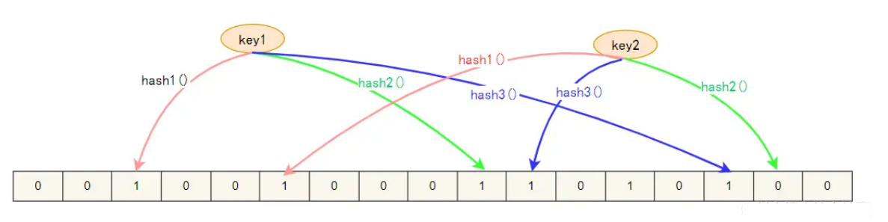我们判断缓存key是否存在，同样，K个哈希函数，映射到bit列表上的K个点，判断是不是1：

- 如果全不是1，那么key不存在；
- 如果都是1，也只是表示key可能存在。

布隆过滤器也有一些缺点：

1. 它在判断元素是否在集合中时是有一定错误几率，因为哈希算法有一定的碰撞的概率。
2. 不支持删除元素。


### Redis实现分布式锁了解吗？

基于setnx，加过期时间；


### 如何保证Redis缓存和数据库数据的⼀致性？

**方式一：数据库订阅(canal)+消息队列保证key被删除** 

可以用一个服务（比如阿里的 canal）去监听数据库的binlog，获取需要操作的数据。

然后用一个公共的服务获取订阅程序传来的信息，进行缓存删除操作。  

这种方式降低了对业务的侵入，但其实整个系统的复杂度是提升的，适合基建完善的大厂。


**方式二：延时双删防止脏数据** 

简单说，就是在第一次删除缓存之后，过了一段时间之后，再次删除缓存。


这种方式的延时时间设置需要仔细考量和测试。

**设置缓存过期时间兜底**

这是一个朴素但是有用的办法，给缓存设置一个合理的过期时间，即使发生了缓存数据不一致的问题，它也不会永远不一致下去，缓存过期的时候，自然又会恢复一致。


### 在你的项目中，Redis是如何使用的？

电商项目：

使用Redis做购物车（hash类型）、分类缓存（String）、分布式锁防止超买超卖。

头条类项目：

存储热点新闻（String）、存储用户行为（hash）


### Redis的过期数据回收策略(删除策略)有哪些？

如果假设你设置了一批 key 只能存活 1 分钟，那么 1 分钟后，Redis 是怎么对这批 key 进行删除的呢？

常用的过期数据的删除策略就两个（重要！自己造缓存轮子的时候需要格外考虑的东西）：

1. **惰性删除** ：只会在取出 key 的时候才对数据进行过期检查。这样对 CPU 最友好，但是可能会造成太多过期 key 没有被删除。
2. **定期删除** ： 每隔一段时间抽取一批 key 执行删除过期 key 操作。并且，Redis 底层会通过限制删除操作执行的时长和频率来减少删除操作对 CPU 时间的影响。
3. 立即删除：数据到期立即删除，需要CPU实时监控对CPU不友好，但能节省内存

定期删除对内存更加友好，惰性删除对 CPU 更加友好。两者各有千秋，所以 Redis 采用的是 **定期删除+惰性/懒汉式删除** 。

### Redis 内存淘汰机制了解么？

> 相关问题：MySQL 里有 2000w 数据，Redis 中只存 20w 的数据，如何保证 Redis 中的数据都是热点数据?

Redis 提供 6 种数据淘汰策略：

1. volatile-lru：加入键的时候如果过限，首先从设置了过期时间的键集合中驱逐最久没有使用的键
2. volatile-random：加入键的时候如果过限，从过期键的集合中随机驱逐
3. volatile-lfu：从所有配置了过期时间的键中驱逐使用频率最少的键
4. volatile-ttl：从配置了过期时间的键中驱逐马上就要过期的键
5. allkeys-lru：加入键的时候，如果过限，首先通过LRU算法驱逐最久没有使用的键
6. allkeys-random：加入键的时候如果过限，从所有key随机删除
7. allkeys-lfu：从所有键中驱逐使用频率最少的键
8. noeviction：默认不删除当内存使用超过配置的时候会返回错误，不会驱逐任何键


### 假如Redis里面有1亿个key，其中有10w个key是以某个固定的已知的前缀开头的，如何将它们全部找出来？

使用 `keys` 指令可以扫出指定模式的 key 列表。但是要注意 keys 指令会导致线程阻塞一段时间，线上服务会停顿，直到指令执行完毕，服务才能恢复。这个时候可以使用 `scan` 指令，`scan` 指令可以无阻塞的提取出指定模式的 `key` 列表，但是会有一定的重复概率，在客户端做一次去重就可以了，但是整体所花费的时间会比直接用 `keys` 指令短。


### MQ的作用

异步处理 - 相比于传统的串行、并行方式，提高了系统吞吐量。

应用解耦 - 系统间通过消息通信，不用关心其他系统的处理。

流量削锋 - 可以通过消息队列长度控制请求量；可以缓解短时间内的高并发请求。


### 项目中为什么要用RabbitMQ(RabbitMQ的特点)

几种常见MQ的对比：

|            | **RabbitMQ**            | **ActiveMQ**                   | **RocketMQ** | **Kafka**  |
| ---------- | ----------------------- | ------------------------------ | ------------ | ---------- |
| 公司/社区  | Rabbit                  | Apache                         | 阿里         | Apache     |
| 开发语言   | Erlang                  | Java                           | Java         | Scala&Java |
| 协议支持   | AMQP，XMPP，SMTP，STOMP | OpenWire,STOMP，REST,XMPP,AMQP | 自定义协议   | 自定义协议 |
| 可用性     | 高                      | 一般                           | 高           | 高         |
| 单机吞吐量 | 一般                    | 差                             | 高           | 非常高     |
| 消息延迟   | 微秒级                  | 毫秒级                         | 毫秒级       | 毫秒以内   |
| 消息可靠性 | 高                      | 一般                           | 高           | 一般       |

追求可用性：Kafka、 RocketMQ 、RabbitMQ

追求可靠性：RabbitMQ、RocketMQ

追求吞吐能力：RocketMQ、Kafka

追求消息低延迟：RabbitMQ、Kafka


### RabbitMQ的消息模型？

基本队列

工作队列

广播模式（fanout）

路由模式（Direct）

主题模式（Topic）


### 如何保证RabbitMQ消息的可靠传输？

- 丢失又分为：生产者丢失消息、消息列表丢失消息、消费者丢失消息；

1. **生产者丢失消息**：从生产者弄丢数据这个角度来看，RabbitMQ采用了 publisher confirm机制来确保生产者不丢消息；

   publisher confirm机制确保发送消息时消息都将会被指派一个唯一的ID，一旦消息被投递到所有匹配的队列之后；

   rabbitMQ就会发送一个ACK给生产者（包含消息的唯一ID），这就使得生产者知道消息已经正确到达目的队列了；

   如果rabbitMQ没能处理该消息，则会发送一个Nack消息给你，你可以进行重试操作。

2. **消息队列丢数据**：消息持久化。

   生产者确认可以确保消息投递到RabbitMQ的中，但是消息发送到RabbitMQ以后，如果突然宕机，也可能导致消息丢失。

   要想确保消息在RabbitMQ中安全保存，必须开启消息持久化机制。

   - 交换机持久化
   - 队列持久化
   - 消息持久化

3. **消费者丢失消息**：

   RabbitMQ是通过消费者回执来确认消费者是否成功处理消息的：消费者获取消息后，应该向RabbitMQ发送ACK回执，表明自己已经处理消息。

​		而SpringAMQP则允许配置三种确认模式：

​		•manual：手动ack，需要在业务代码结束后，调用api发送ack。

​		•auto：自动ack，由spring监测listener代码是否出现异常，没有异常则返回ack；抛出异常则返回nack

​		•none：关闭ack，MQ假定消费者获取消息后会成功处理，因此消息投递后立即被删除

​		由此可知：	

​		•none模式下，消息投递是不可靠的，可能丢失

​		•auto模式类似事务机制，出现异常时返回nack，消息回滚到mq；没有异常，返回ack

​		•manual：自己根据业务情况，判断什么时候该ack

​		一般，我们都是使用默认的auto即可。


### RabbitMQ如何保证消息不被重复消费（幂等）？

一般来说消息重复消费都是在短暂的一瞬间消费多次，我们可以使用 redis 将消费过的消息唯一标识存储起来，然后在消费端业务执行之前判断 redis 中是否已经存在这个标识。如果已经存在代表处理过了。不存在就放进 redis 设置过期时间，执行业务

```java
    @RabbitListener(queues = "simple.queue")
    public void listenSimpleQueue(Message message){

        String messageId = message.getMessageProperties().getMessageId();
        if(redisTemplate.opsForValue().get(messageId)==null){
            //redis中不存在，说明没有消费过，此时执行业务正常消费

            //消费完成后，将messageId存储到redis中，注意设置过期时间
            redisTemplate.opsForValue().set(messageId,1,10, TimeUnit.SECONDS);
        }

    }
```

**另外也可以对数据库设置唯一约束，可以保证数据库数据不会插入重复的两条数据来进行兜底解决。**


### 如何解决消息积压的问题?

所谓消息积压一般是由于消费端消费的速度远小于生产者发消息的速度，导致大量消息在 RabbitMQ 的队列中无法消费。

其实这玩意我也不知道为什么面试这么喜欢问.....既然消费者速度跟不上生产者，那么提高消费者的速度就行了呀！个人认为有以下几种思路

- **对生产者发消息接口进行适当限流（不太推荐，影响用户体验）**
- **多部署几台消费者实例（推荐）**
- **如果单个消息消费时间很长，可以在消费端开启多个线程，来加快消费速度**
- **采用惰性队列**


### MQ集群（了解）

普通集群

镜像集群

仲裁队列


### ElasticSearch

#### ElasticSearch为什么搜索速度快？

elasticsearch是基于倒排索引来实现快速搜索的，当往es中添加数据时会对文档内容进行分词形成词条，并根据这些词条构建索引。用户在查询某个关键词时是先在倒排索引中进行查询，然后再根据词条所对应的文档ID到ES库中找到对应的文档。


#### ES名词解释

| **MySQL** | **Elasticsearch** | **说明**                                                     |
| --------- | ----------------- | ------------------------------------------------------------ |
| Table     | Index             | 索引(index)，就是文档的集合，类似数据库的表(table)           |
| Row       | Document          | 文档（Document），就是一条条的数据，类似数据库中的行（Row），文档都是JSON格式 |
| Column    | Field             | 字段（Field），就是JSON文档中的字段，类似数据库中的列（Column） |
| Schema    | Mapping           | Mapping（映射）是索引中文档的约束，例如字段类型约束。类似数据库的表结构（Schema） |
| SQL       | DSL               | DSL是elasticsearch提供的JSON风格的请求语句，用来操作elasticsearch，实现CRUD |


#### 如何创建索引?


如果是电商网站，商品索引最基本的字段包括下面这些：

- 用于关键字全文检索的字段，比如All，里面包含name、brand、category信息
- 用于自动补全的字段，包括brand、category信息
- 分类
- 品牌
- 价格
- 销量
- id
- name(sku)
- 评价数量
- 图片


#### ElasticSearch如何实现深度分页?

| 分页方式     | 性能 | 优点                                             | 缺点                                                         | 场景                                   |
| ------------ | ---- | ------------------------------------------------ | ------------------------------------------------------------ | -------------------------------------- |
| from + size  | 低   | 灵活性好，实现简单                               | 深度分页问题                                                 | 数据量比较小，能容忍深度分页问题       |
| scroll       | 中   | 解决了深度分页问题                               | 无法反应数据的实时性（快照版本）维护成本高，需要维护一个 scroll_id | 海量数据的导出需要查询海量结果集的数据 |
| search_after | 高   | 性能最好不存在深度分页问题能够反映数据的实时变更 | 实现复杂，需要有一个全局唯一的字段连续分页的实现会比较复杂，因为每一次查询都需要上次查询的结果，它不适用于大幅度跳页查询 | 海量数据的分页                         |

#### Search After

`Search_after`是 ES 5 新引入的一种分页查询机制，其原理几乎就是和scroll一样，因此代码也几乎是一样的。

**「基本使用：」**

第一步：

```json
POST twitter/_search
{
    "size": 10,
    "query": {
        "match" : {
            "title" : "es"
        }
    },
    "sort": [
        {"date": "asc"},
        {"_id": "desc"}
    ]
}
```

返回出的结果信息 ：

```json
{
      "took" : 29,
      "timed_out" : false,
      "_shards" : {
        "total" : 1,
        "successful" : 1,
        "skipped" : 0,
        "failed" : 0
      },
      "hits" : {
        "total" : {
          "value" : 5,
          "relation" : "eq"
        },
        "max_score" : null,
        "hits" : [
          {
            ...
            },
            "sort" : [
              ...
            ]
          },
          {
            ...
            },
            "sort" : [
              124648691,
              "624812"
            ]
          }
        ]
      }
    }
```

上面的请求会为每一个文档返回一个包含sort排序值的数组。

这些sort排序值可以被用于`search_after`参数里以便抓取下一页的数据。

比如，我们可以使用最后的一个文档的sort排序值，将它传递给`search_after`参数：

```json
GET twitter/_search
{
    "size": 10,
    "query": {
        "match" : {
            "title" : "es"
        }
    },
    "search_after": [124648691, "624812"],
    "sort": [
        {"date": "asc"},
        {"_id": "desc"}
    ]
}
```

若我们想接着上次读取的结果进行读取下一页数据，第二次查询在第一次查询时的语句基础上添加`search_after`，并指明从哪个数据后开始读取。


#### ES集群（ES是如何部署的）

**ES集群相关概念**

* 集群（cluster）：一组拥有共同的 cluster name 的 节点。

* <font color="red">节点（node)</font>   ：集群中的一个 Elasticearch 实例

* <font color="red">分片（shard）</font>：索引可以被拆分为不同的部分进行存储，称为分片。在集群环境下，一个索引的不同分片可以拆分到不同的节点中解决问题：数据量太大，单点存储量有限的问题。

* 主分片（Primary shard）：相对于副本分片的定义。

* 副本分片（Replica shard）每个主分片可以有一个或者多个副本，数据和主分片一样。


创建索引时进行分片：

```json
PUT /itcast
{
  "settings": {
    "number_of_shards": 3, // 分片数量
    "number_of_replicas": 1 // 副本数量
  },
  "mappings": {
    "properties": {
      // mapping映射定义 ...
        id:{
            type:int
        }
    }
  }
}
```


#### ES新增和查询流程

在ES集群中，每个节点都有自己的角色，分别是协调节点、数据节点、master节点


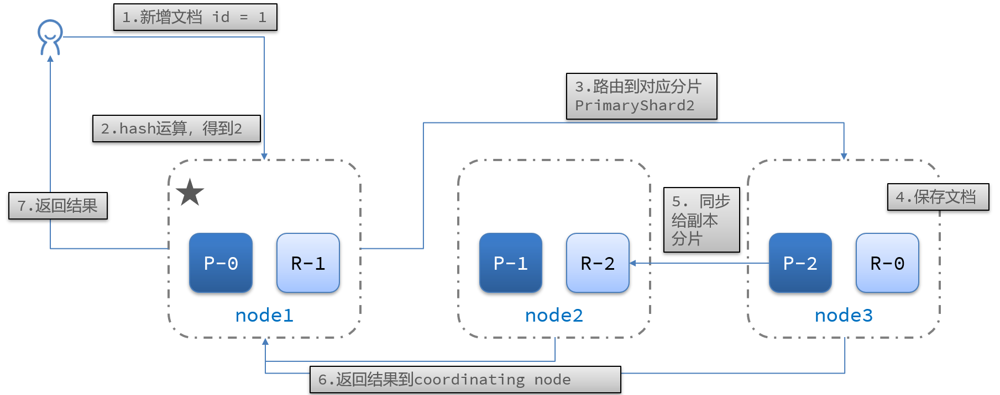


#### ES与MySQL同步

http://www.imodou.com.cn/article/MySQL%E5%A6%82%E4%BD%95%E5%AE%9E%E6%97%B6%E5%90%8C%E6%AD%A5%E6%95%B0%E6%8D%AE%E5%88%B0ES%EF%BC%9F%E8%AF%95%E8%AF%95%E8%BF%99%E6%AC%BE%E9%98%BF%E9%87%8C%E5%BC%80%E6%BA%90%E7%9A%84%E7%A5%9E%E5%99%A8%EF%BC%81.html


### MySQL存储引擎

常见的存储引擎就 、MyISAM、Memory、NDB。InnoDB 现在是 MySQL 默认的存储引擎，支持**事务、行级锁定和外键**

1. InnoDB 支持事务，MyISAM 不支持事务。这是 MySQL 将默认存储引擎从 MyISAM 变成 InnoDB 的重要原因之一；
2. InnoDB 支持外键，而 MyISAM 不支持。对一个包含外键的 InnoDB 表转为 MYISAM 会失败；
3. InnoDB 是聚簇索引，MyISAM 是非聚簇索引。聚簇索引的文件存放在主键索引的叶子节点上，因此 InnoDB 必须要有主键，通过主键索引效率很高。但是辅助索引需要两次查询，先查询到主键，然后再通过主键查询到数据。因此，主键不应该过大，因为主键太大，其他索引也都会很大。而 MyISAM 是非聚集索引，数据文件是分离的，索引保存的是数据文件的指针。主键索引和辅助索引是独立的。
4. InnoDB 不保存表的具体行数，执行` select count(*) from table` 时需要全表扫描。而 MyISAM 用一个变量保存了整个表的行数，执行上述语句时只需要读出该变量即可，速度很快；
5. InnoDB 最小的锁粒度是行锁，MyISAM 最小的锁粒度是表锁。一个更新语句会锁住整张表，导致其他查询和更新都会被阻塞，因此并发访问受限。这也是 MySQL 将默认存储引擎从 MyISAM 变成 InnoDB 的重要原因之一；


### CHAR 和 VARCHAR 的区别？

char（10）是固定长度，varchar(10)长度可变


### MySQL索引

#### 分类

##### 数据结构角度

- B+树索引
- Hash索引

##### 从物理存储角度

- 聚集索引（clustered index）

- 非聚集索引（non-clustered index），也叫辅助索引（secondary index）

  聚集索引和非聚集索引都是B+树结构

##### 从逻辑角度

- 主键索引：主键索引是一种特殊的唯一索引，不允许有空值
- 普通索引或者单列索引：每个索引只包含单个列，一个表可以有多个单列索引
- 多列索引（复合索引、联合索引）：复合索引指多个字段上创建的索引，只有在查询条件中使用了创建索引时的第一个字段，索引才会被使用。使用复合索引时遵循最左前缀集合
- 唯一索引或者非唯一索引


#### MySQL索引结构

###### B-Tree

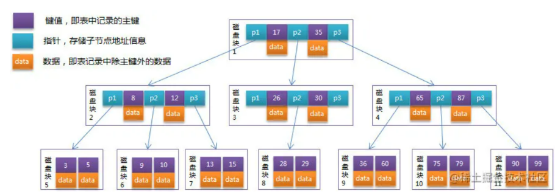

###### B+Tree

B+Tree 是在 B-Tree 基础上的一种优化，使其更适合实现外存储索引结构，InnoDB 存储引擎就是用 B+Tree 实现其索引结构。

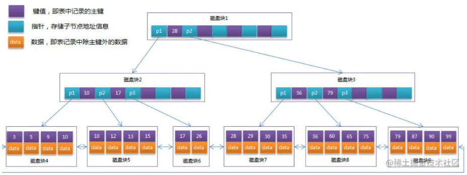


#### 什么是回表操作？


#### 什么是索引覆盖？

只需要在一棵索引树上就能获取SQL所需的所有列数据，无需回表，速度更快。常见的方法是：将被查询的字段，建立到联合索引里去。


#### 什么时候创建索引?

**哪些情况需要创建索引**

1. 主键自动建立唯一索引
2. 频繁作为查询条件的字段
3. 单键/组合索引的选择问题，高并发下倾向创建组合索引
4. **查询中排序的字段，排序字段通过索引访问大幅提高排序速度**
5. 查询中统计或分组字段

**哪些情况不要创建索引**

1. **表记录太少**
2. **经常增删改的表**
3. **数据重复且分布均匀的表字段，只应该为最经常查询和最经常排序的数据列建立索引**（如果某个数据类包含太多的重复数据，建立索引没有太大意义）
4. **频繁更新的字段不适合创建索引（会加重IO负担）**
5. **where条件里用不到的字段不创建索引**


#### 索引优化(避免索引失效)

1. 全值匹配我最爱

2. 最左前缀法则，比如建立了一个联合索引(a,b,c)，那么其实我们可利用的索引就有(a), (a,b), (a,b,c)

3. 不在索引列上做任何操作（计算、函数、(自动or手动)类型转换），会导致索引失效而转向全表扫描

4. 存储引擎不能使用索引中范围条件右边的列例如：金额查询，日期查询往往都是范围查询。应将查询条件放置 WHERE 语句最后。

   （创建的联合索引中，务必把范围涉及到的字段写在最后）

5. 尽量使用覆盖索引(只访问索引的查询(索引列和查询列一致))

6. is null ,is not null 也无法使用索引

7. like "xxxx%" 是可以用到索引的，like "%xxxx" 则不行(like "%xxx%" 同理)。like以通配符开头('%abc...')索引失效会变成全表扫描的操作，

8. 字符串不加单引号索引失效

9. 少用or，用它来连接时会索引失效

10. <，<=，=，>，>=，BETWEEN，IN 可用到索引，<>，not in ，!= 则不行，会导致全表扫描


#### 百万级别或以上的数据如何删除

关于索引：由于索引需要额外的维护成本，因为索引文件是单独存在的文件,所以当我们对数据的增加,修改,删除,都会产生额外的对索引文件的操作,这些操作需要消耗额外的IO,会降低增/改/删的执行效率。所以，在我们删除数据库百万级别数据的时候，查询MySQL官方手册得知删除数据的速度和创建的索引数量是成正比的。

1. 所以我们想要删除百万数据的时候可以先删除索引（此时大概耗时三分多钟）
2. 然后删除其中无用数据（此过程需要不到两分钟）
3. 删除完成后重新创建索引(此时数据较少了)创建索引也非常快，约十分钟左右。
4. 与之前的直接删除绝对是要快速很多，更别说万一删除中断,一切删除会回滚。那更是坑了。

**如果是全表删除也可以使用truncat table**  


### 如何查找MySQL中查询慢的SQL语句

**1、开启慢日志，定位是哪条SQL语句执行慢**

Windows下开启MySQL慢查询

```ini
MySQL在Windows系统中的配置文件一般是是my.ini找到[mysqld]下面加上

log-slow-queries = F:/MySQL/log/mysqlslowquery.log
long_query_time = 2
```

**2、explain来了解SQL执行的状态**

```
explain select surname,first_name form a,b where a.id=b.id
```

**EXPLAIN列的解释**

table

显示这一行的数据是关于哪张表的

type

这是重要的列，显示连接使用了何种类型。从最好到最差的连接类型为const、eq_reg、ref、range、indexhe和ALL

possible_keys

显示可能应用在这张表中的索引。如果为空，没有可能的索引。可以为相关的域从WHERE语句中选择一个合适的语句

key

实际使用的索引。如果为NULL，则没有使用索引。很少的情况下，MYSQL会选择优化不足的索引。这种情况下，可以在SELECT语句 中使用USE INDEX（indexname）来强制使用一个索引或者用IGNORE INDEX（indexname）来强制MYSQL忽略索引

key_len

使用的索引的长度。在不损失精确性的情况下，长度越短越好

ref

显示索引的哪一列被使用了，如果可能的话，是一个常数

rows

MYSQL认为必须检查的用来返回请求数据的行数

Extra

关于MYSQL如何解析查询的额外信息。但这里可以看到的坏的例子是Using temporary和Using filesort，意思MYSQL根本不能使用索引，结果是检索会很慢


### MySQL事务的四大特性

- **A (Atomicity) 原子性**：整个事务中的所有操作，要么全部完成，要么全部不完成，不可能停滞在中间某个环节。事务在执行过程中发生错误，会被回滚（Rollback）到事务开始前的状态，就像这个事务从来没有执行过一样
- **C (Consistency) 一致性**：在事务开始之前和事务结束以后，数据库的完整性约束没有被破坏
- **I (Isolation)隔离性**：一个事务的执行不能其它事务干扰。即一个事务内部的操作及使用的数据对其它并发事务是隔离的，并发执行的各个事务之间不能互相干扰
- **D (Durability) 持久性**：在事务完成以后，该事务所对数据库所作的更改便持久的保存在数据库之中，并不会被回滚


### 事务隔离级别

数据库事务的隔离级别有4种，由低到高分别为

- **READ-UNCOMMITTED(读未提交)：** 最低的隔离级别，允许读取尚未提交的数据变更，**可能会导致脏读、幻读或不可重复读**。
- **READ-COMMITTED(读已提交)：** 允许读取并发事务已经提交的数据，**可以阻止脏读，但是幻读或不可重复读仍有可能发生**。
- **REPEATABLE-READ(可重复读)：** 对同一字段的多次读取结果都是一致的，除非数据是被本身事务自己所修改，**可以阻止脏读和不可重复读，但幻读仍有可能发生**。
- **SERIALIZABLE(可串行化)：** 最高的隔离级别，完全服从ACID的隔离级别。所有的事务依次逐个执行，这样事务之间就完全不可能产生干扰，也就是说，**该级别可以防止脏读、不可重复读以及幻读**。


### MySQL锁

#### 乐观锁和悲观锁

**乐观锁：** 对于出现更新丢失的可能性比较乐观，先认为不会出现更新丢失，在最后更新数据时进行比较。

```sql
CREATE TABLE `t` (
  `id` int(11) NOT NULL,
  `value` int(11) DEFAULT NULL,
  `version` int(11) DEFAULT NULL,
  PRIMARY KEY (`id`)
) ENGINE=InnoDB ;

insert into t values(1,1,1);

select id,value,version from t where id=1;

update t set value=2,version=version+1 where id=1 and version=1;

```

**悲观锁： ** 对于出现更新丢失的可能性比较悲观，在查询时就加锁，保证不被其他事务操作；可通过select...fot update实现。

```sql
select * from t where id = 1 for update;
```


#### 表级锁（表锁和MDL锁）

```
lock tables ... read;
lock tables ... write;
-- 解锁
unlock tables;
```


#### 间隙锁

当我们用范围条件检索数据，并请求共享或排他锁时，InnoDB会给符合条件的已有数据记录的索引项加锁；对于键值在条件范围内但并不存在的记录，叫做"间隙(GAP)"。InnoDB也会对这个"间隙"加锁，这种锁机制就是所谓的间隙锁(Next-Key锁)。


### 高并发的解决方案

限流

缓存

削峰

集群

### 分布式调度中间件

java定时任务Quartz 

分布式调度 elastic job

zookeeper

