## 概念

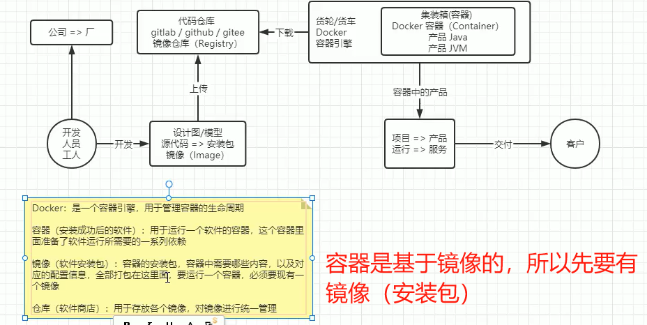
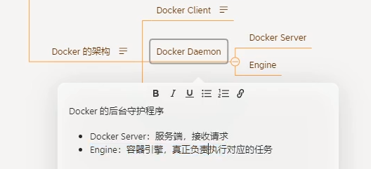

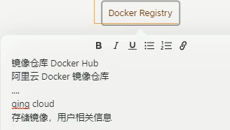

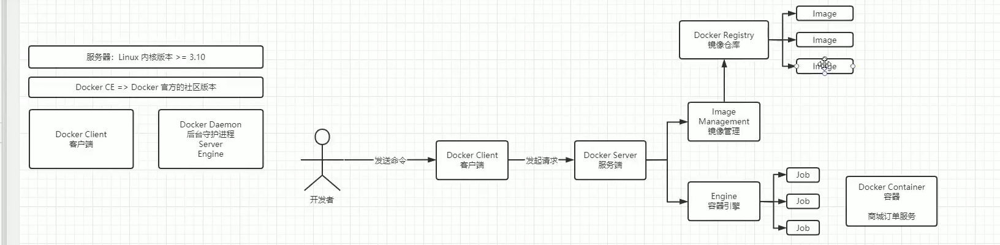

*从仓库里拉取镜像，创建容器，启动服务（用命令）*

## 命令

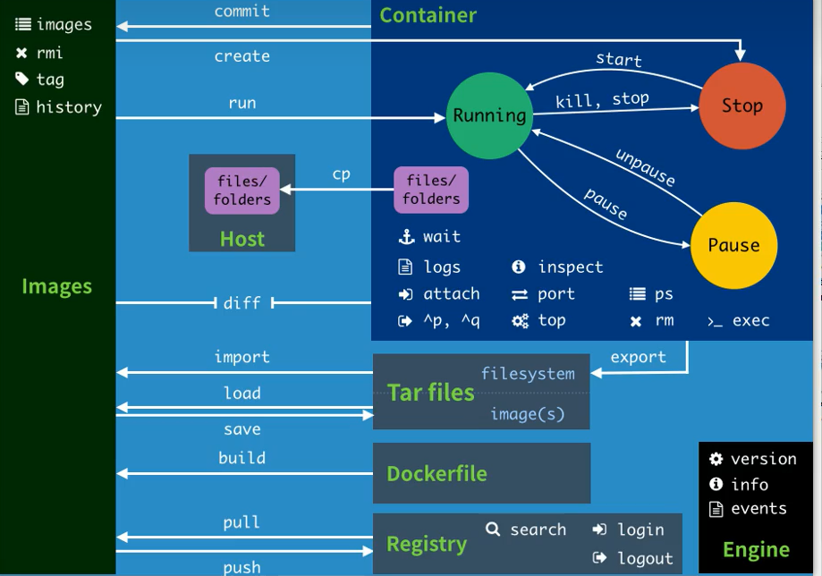

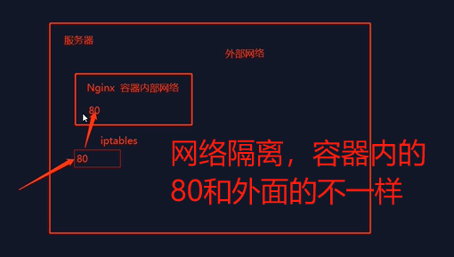

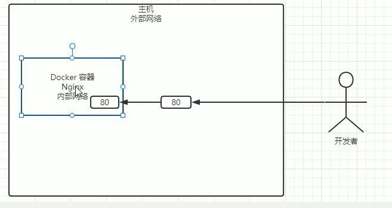

```dockerfile
systemctl start docker  启动docker

systemctl enable docker  设置开机自启动
 
systemctl status docker  查看docker状态

service docker start  启动docker server

docker run -d  -p 80:80 nginx  (docker run -d -P nginx) 
// -d 后台运行，-p内外网络链接  左边80是主机，右边80是容器   **每次run都是一个新的容器** -P随机映射

docker ps  查看正在运行的容器

docker ps -a  查看所有的容器

docker images  查看已有镜像

docker search   xxx 在仓库里查找镜像

docker  pull   xxx  从仓库中拉取镜像

docker rm  容器id   删除容器（不能删除正在运行的容器，或者强制删除 -f  ）

docker stop  容器id   停止容器

docker start  容器id   运行容器

docker run -d  --name nginx01 nginx  指定容器名字

docker run --rm supermanito/helloworld  退出时删除容器（测试容器可以用）

docker run -d  --name nginx01 -P --restart on-failure:3 nginx  重启策略（意外关闭重启）

docker run -d  --name nginx01 -P --restart always nginx  容器停止 docker重启它重启

docker run -d -P --name nginx_env -e  JAVA_ENV -e JAVA-VM=G1 nginx  （-e指定环境变量）

docker imspect 容器di/名字    查看容器信息
或者
docker exec  -it nginx_env   env    (exec 指定一个容器执行命令 -it基于容器的内的一个终端去执行 env显示环境变量)
或者
docker exec  -it nginx_env echo $JAVA_ENV
```


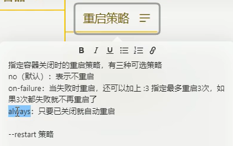

## 镜像加速器

阿里云："registry-mirrors": ["https://p7y78ivm.mirror.aliyuncs.com"]

中科大："registry-mirrors": ["https://docker.mirrors.ustc.edu.cn"]

网易："registry-mirrors": ["https://hub-mirror.c.163.com"]


## 多容器运行

### 场景假设

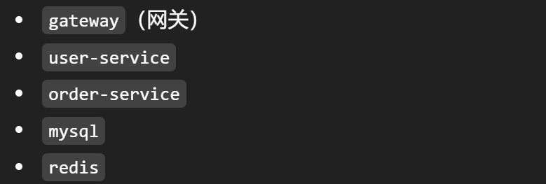

### 整体架构关系

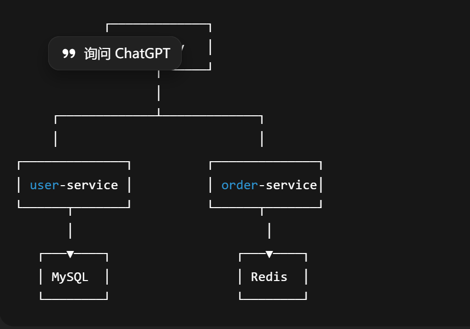

### 步骤总览

1. 每个微服务打包成 jar

   - 在每个服务目录执行：

     ```java
     mvn clean package -DskipTests     
     ```

     | 部分          | 含义                                                         |
     | ------------- | ------------------------------------------------------------ |
     | `mvn`         | Maven 命令行工具                                             |
     | `clean`       | 清理生命周期阶段，删除 `target/` 目录（之前编译的类文件、jar包等） |
     | `package`     | 打包生命周期阶段，编译代码并打包成 jar/war 等格式            |
     | `-DskipTests` | 系统属性，跳过**测试代码的执行**，但会编译测试代码           |

     - 执行该命令时，Maven 按顺序执行：

   ```
   clean → validate → compile → test-compile → package
        ↑___________________________|
                 (跳过 test 阶段)
   ```

   - 常见变体

   ```
   # 标准用法（最常用）
   mvn clean package -DskipTests
   
   # 极速打包（连测试代码都不编译）
   mvn clean package -Dmaven.test.skip=true
   
   # 指定环境打包
   mvn clean package -DskipTests -Pprod
   
   # 强制更新依赖后打包
   mvn clean package -DskipTests -U
   ```

   - 使用建议

     - **开发调试**：用 `-DskipTests` 快速验证打包流程
     - **CI/CD 流水线**：通常**不建议**跳过测试，除非有单独的测试阶段
     - **测试代码损坏**：用 `-Dmaven.test.skip=true` 临时绕过
     - 命令就是：**"删了重来，打包成 jar，但别跑测试"** 🚀

   - 执行结果

     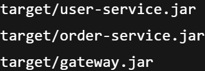

- 为每个服务编写 Dockerfile

  - 以user-service/Dockerfile为例

    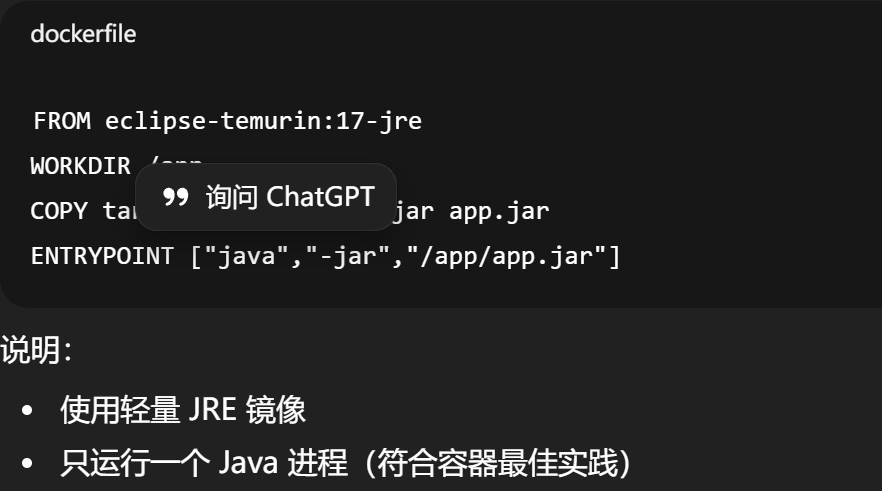

- 修改 application.yml（关键）

  - 重要：容器之间不能用 localhost！

  - 必须使用服务名通信

    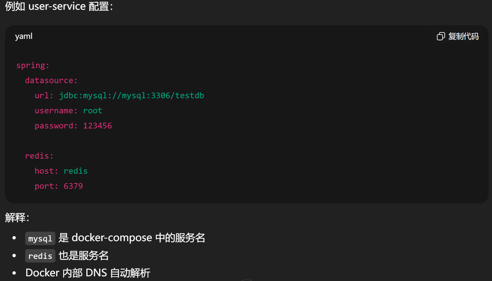

- 编写 docker-compose.yml

  - 在项目根目录创建：

  ```yml
  version: '3.8'
  
  services:
  
    mysql:
      image: mysql:8.0
      container_name: mysql
      environment:
        MYSQL_ROOT_PASSWORD: 123456
        MYSQL_DATABASE: testdb
      ports:
        - "3306:3306"
      volumes:
        - mysql-data:/var/lib/mysql
  
    redis:
      image: redis:7
      container_name: redis
      ports:
        - "6379:6379"
  
    user-service:
      build: ./user-service
      container_name: user-service
      ports:
        - "8081:8081"
      depends_on:
        - mysql
        - redis
  
    order-service:
      build: ./order-service
      container_name: order-service
      ports:
        - "8082:8082"
      depends_on:
        - mysql
        - redis
  
    gateway:
      build: ./gateway
      container_name: gateway
      ports:
        - "8080:8080"
      depends_on:
        - user-service
        - order-service
  
  volumes:
    mysql-data:
  
  ```

  

- 构建镜像并启动所有容器

  - 在 docker-compose.yml 所在目录执行：

  ​     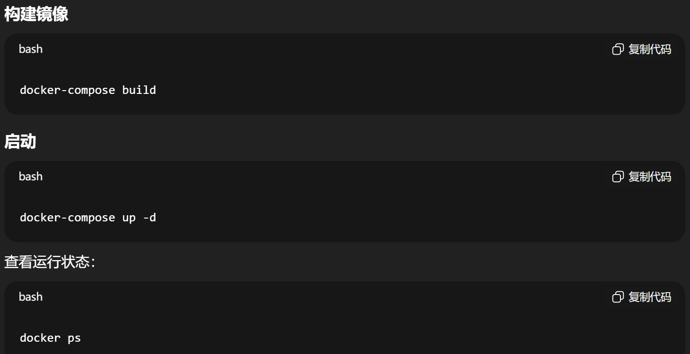

- 验证服务

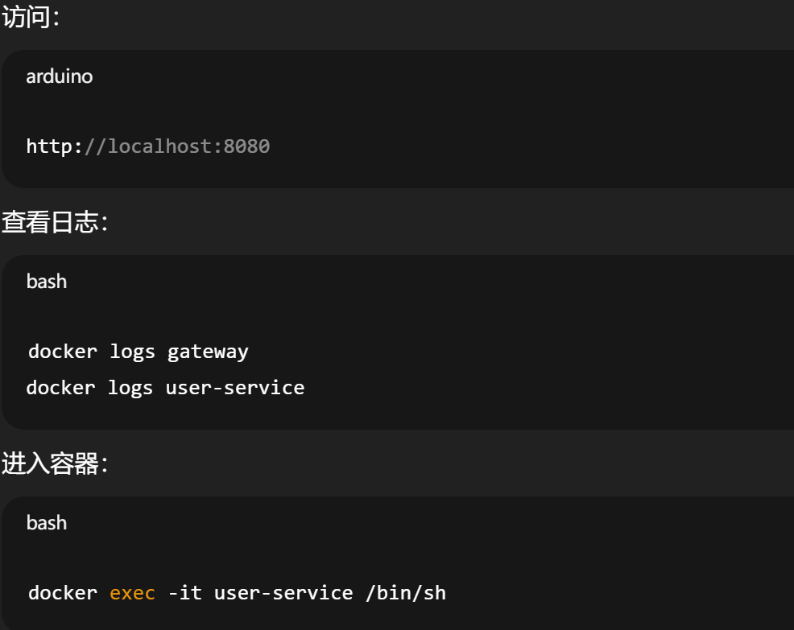

- 容器间通信原理（核心）

  - docker-compose 自动创建一个 bridge 网络：

    ```java
    gateway -> user-service:8081
    user-service -> mysql:3306
    解析原理：
    
    每个 service 自动注册为 DNS
    
    服务名 = 主机名
    ```

### 实际开发

#### 修改某一服务的代码

- 开发环境：方法一（本地安装有docker，本地容器测试）：

  - 重新打包  mvn clean package -DskipTests  生成新的 jar

  - 重新构建该服务镜像  docker-compose build user-service

  - 重启该服务容器  docker-compose up -d user-service   
    - 注意：docker-compose restart user-service `restart` → 只是重启旧镜像 
    - `build + up` → 使用新代码生成新镜像

- 开发环境：方法二（开发环境推荐）

  - 开发时不要频繁容器 build
  - 用本地运行提高效率（有启动类，使用启动类重新启动，否则本地运行 + devtools）

- 测试或者生产环境：
  - 代码提交
  - CI 构建（Jenkins / GitLab CI）
  - 构建新镜像
  - 打 tag（版本号）
  - 推送到镜像仓库
  - 部署新版本
  - 滚动更新

### 企业级 CI/CD + Docker 发布流程图

#### 一、整体架构流程图

```
开发提交代码
      │
      ▼
Git 仓库 (main / dev)
      │
      ▼
CI 服务器（Jenkins / GitLab CI）
      │
      ├─ ① 编译打包 (mvn package)
      ├─ ② 单元测试
      ├─ ③ 构建 Docker 镜像
      ├─ ④ 打版本 Tag
      ├─ ⑤ 推送到镜像仓库
      │
      ▼
镜像仓库（Harbor / DockerHub）
      │
      ▼
CD 部署阶段
      │
      ├─ 更新 K8s Deployment 镜像版本
      ├─ 滚动发布
      ├─ 健康检查
      │
      ▼
生产环境 Kubernetes 集群
```

------

#### 二、核心组件说明

##### 代码管理

- GitLab
- GitHub

------

##### CI 工具

- Jenkins
- GitLab CI

------

##### 镜像仓库

- Harbor
- Docker Hub

------

##### 容器编排

- Kubernetes

------

#### 三、CI 阶段详细步骤

假设你修改了 `user-service`。

------

##### ① 代码提交

```
git add .
git commit -m "fix: 修改用户查询逻辑"
git push origin dev
```

触发 CI Pipeline。

------

##### ② 编译 + 测试

```
mvn clean package -DskipTests=false
```

如果测试失败 → Pipeline 终止。

------

##### ③ 构建 Docker 镜像

```
docker build -t myrepo/user-service:1.0.3 .
```

------

##### ④ 自动生成版本号（推荐规范）

版本号示例：

```
1.0.3
2026.02.27.001
commit-short-hash
```

------

##### ⑤ 推送镜像

```
docker push myrepo/user-service:1.0.3
```

镜像进入仓库。

------

#### 四、CD 阶段（部署到 Kubernetes）

------

##### 方式一：手动更新（小团队常用）

```java
kubectl set image deployment/user-service \
user-service=myrepo/user-service:1.0.3
/**
在 Kubernetes 中更新某个 Deployment 的容器镜像版本，从而触发一次滚动发布

kubectl : Kubernetes 命令行工具，用来操作集群资源。
set image : 修改某个资源中的容器镜像  它不会删除 Deployment，而是修改配置。
deployment/user-service ： 表示要操作的资源： 资源类型：Deployment 资源名称：user-service
等价写法： kubectl set image deployment user-service ...
user-service=myrepo/user-service:1.0.3 ：
容器名 = 新镜像
Deployment 中有一个容器名字叫 user-service，把它的镜像改成：myrepo/user-service:1.0.3
到底做了什么：
假设你原来 Deployment 是：
spec:
  template:
    spec:
      containers:
        - name: user-service
          image: myrepo/user-service:1.0.2
执行命令后变成：
image: myrepo/user-service:1.0.3

为什么执行后会“自动发布”？

因为：

Kubernetes 发现 Deployment 的 Pod 模板发生变化（镜像变了）。

于是它会：

创建新的 ReplicaSet

启动新的 Pod（使用 1.0.3）

等待健康检查通过

再逐步删除旧 Pod（1.0.2）

这叫：

Rolling Update（滚动更新）

由 Kubernetes 自动完成。

五、执行后如何查看状态？
查看滚动状态
kubectl rollout status deployment/user-service

查看历史版本
kubectl rollout history deployment/user-service

回滚
kubectl rollout undo deployment/user-service

六、常见错误点
❌ 容器名写错

Deployment 里容器名必须匹配：

containers:
  - name: user-service   ← 必须一致


否则报错：

error: unable to find container named "xxx"

❌ 镜像 tag 不存在

如果仓库没有 1.0.3：

Pod 会进入：

ImagePullBackOff

七、总结一句话

这条命令的含义是：

把 Deployment 中名为 user-service 的容器镜像升级为 1.0.3，并触发一次滚动发布。

八、如果你是 Java 微服务开发

它在企业中通常出现在：

CI/CD 自动发布阶段

Jenkins Pipeline 最后一步

或 GitLab CI deploy 阶段
/
```

------

##### 方式二：自动更新（企业推荐）

CI 执行：

```
kubectl apply -f k8s/deployment.yaml
```

或使用 Helm：

```
helm upgrade user-service ./chart \
--set image.tag=1.0.3
```

------

#### 五、Kubernetes 滚动发布原理

Deployment 配置：

```
strategy:
  type: RollingUpdate
  rollingUpdate:
    maxUnavailable: 0
    maxSurge: 1
```

效果：

1. 先启动新 Pod
2. 健康检查通过
3. 再关闭旧 Pod
4. 全程无停机

------

#### 六、生产级增强能力

##### 1️⃣ 健康检查（必须）

```
livenessProbe:
  httpGet:
    path: /actuator/health
    port: 8080
  initialDelaySeconds: 30
```

------

##### 2️⃣ 灰度发布（Canary）

流程：

```
v1: 100%
↓
部署 v2
v1: 90%
v2: 10%
观察
↓
逐步切流
```

可以配合：

- Istio

------

##### 3️⃣ 快速回滚

```
kubectl rollout undo deployment/user-service
```

秒级回滚。

------

#### 七、完整企业级流水线结构

```
Stage 1: Checkout
Stage 2: Compile
Stage 3: Test
Stage 4: Code Scan (Sonar)
Stage 5: Build Image
Stage 6: Push Image
Stage 7: Deploy to Dev
Stage 8: Deploy to Test
Stage 9: Deploy to Prod (人工审批)
```

可结合：

- SonarQube

------

#### 八、实际企业架构分层

```
开发环境
  ↓
测试环境
  ↓
预生产环境
  ↓
生产环境
```

每个环境：

- 独立 namespace
- 独立数据库
- 独立配置

------

#### 九、企业最佳实践

✅ 镜像必须带版本号（禁止 latest）
 ✅ 禁止在生产服务器手动 build
 ✅ 所有部署必须可回滚
 ✅ 使用镜像不可变原则
 ✅ 配置与代码分离

------

#### 十、完整一句话总结

> 提交代码 → CI 构建镜像 → 推送仓库 → CD 更新 Deployment → K8s 滚动发布 → 健康检查 → 完成上线