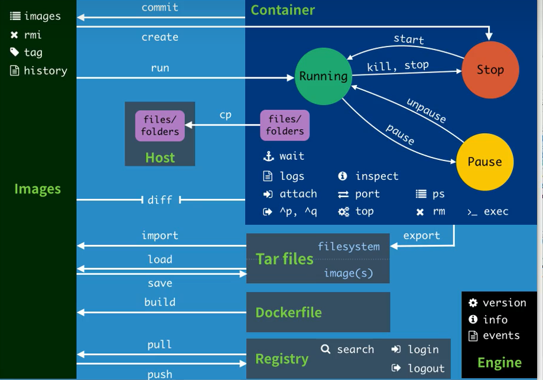
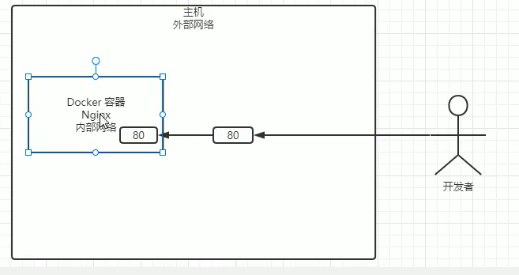

## 概念


*从仓库里拉取镜像，创建容器，启动服务（用命令）*

## 命令






```dockerfile
systemctl start docker  启动docker

systemctl enable docker  设置开机自启动
 
systemctl status docker  查看docker状态

service docker start  启动docker server

docker run -d  -p 80:80 nginx  (docker run -d -P nginx) 
// -d 后台运行，-p内外网络链接  左边80是主机，右边80是容器   **每次run都是一个新的容器** -P随机映射

docker ps  查看正在运行的容器

docker ps -a  查看所有的容器

docker images  查看已有镜像

docker search   xxx 在仓库里查找镜像

docker  pull   xxx  从仓库中拉取镜像

docker rm  容器id   删除容器（不能删除正在运行的容器，或者强制删除 -f  ）

docker stop  容器id   停止容器

docker start  容器id   运行容器

docker run -d -p 80:80  --name nginx01 nginx  指定容器名字

docker run --rm supermanito/helloworld  退出时删除容器（测试容器可以用）

docker run -d  --name nginx01 -P --restart on-failure:3 nginx  重启策略（意外关闭重启）

docker run -d  --name nginx01 -P --restart always nginx  容器停止 docker重启它重启

docker run -d -P --name nginx_env -e  JAVA_ENV -e JAVA-VM=G1 nginx  （-e指定环境变量）

docker imspect 容器di/名字    查看容器信息
或者
docker exec  -it nginx_env   env    (exec 指定一个容器执行命令 -it基于容器的内的一个终端去执行 env显示环境变量)
或者
docker exec  -it nginx_env echo $JAVA_ENV
```


