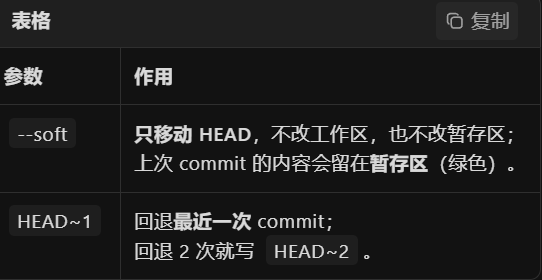
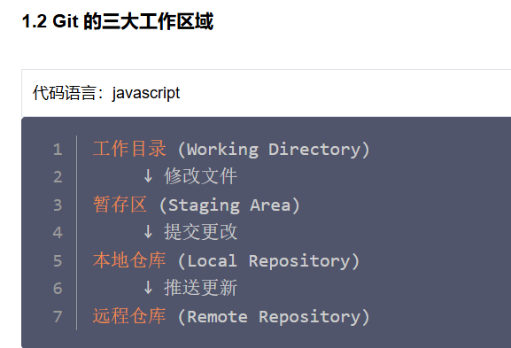
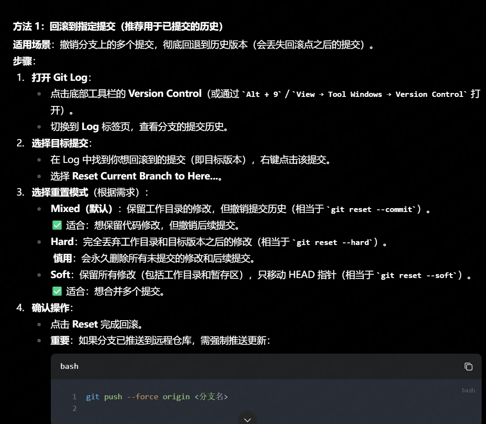
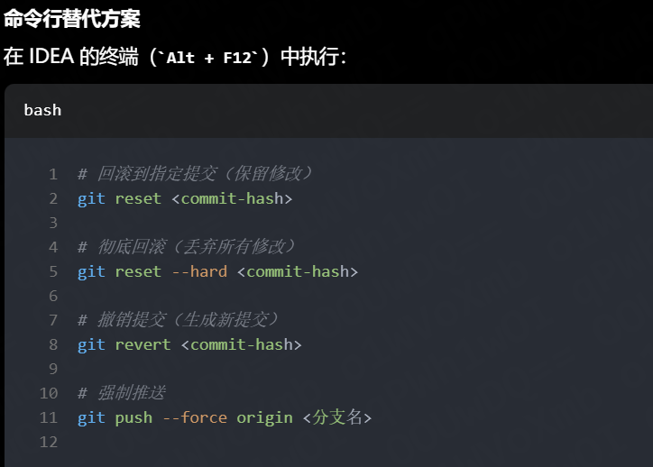
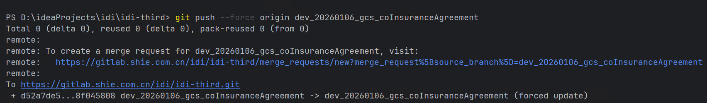
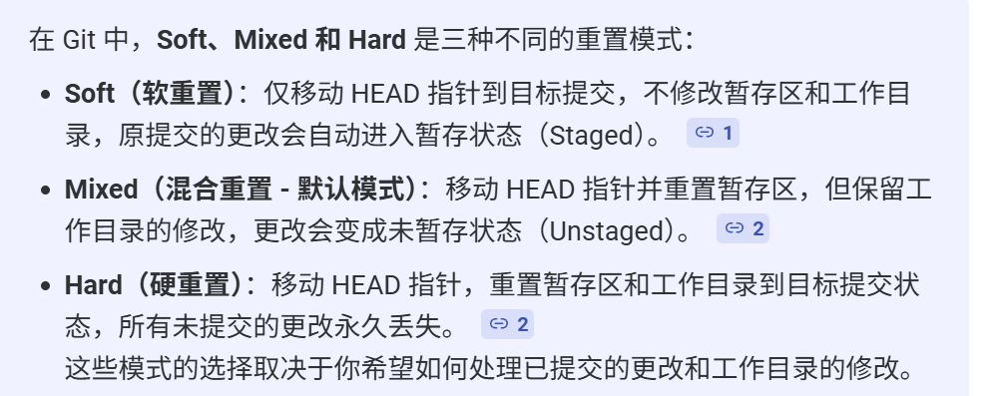

## 常用命令

### 查看与配置用户信息

- **查看当前 Git 用户名**（提交时显示的用户名）
  ```bash
  git config user.name
  ```

- **修改全局用户名**
  ```bash
  git config --global user.name "新的用户名"
  ```

- **查看当前邮箱配置**
  ```bash
  git config user.email
  ```

- **修改全局邮箱**
  ```bash
  git config --global user.email "新的邮箱@example.com"
  ```

### 分支与历史操作

- **查看分支创建历史**
  ```bash
  git reflog show 分支名
  ```
  此命令可以查看指定分支是基于哪个提交或分支创建的。

### 提交回退操作

#### 本地提交回退（未推送）

当文件已经 commit 但还未 push 时，可以使用 `git reset` 命令回退：

- **软回退**（保留工作区和暂存区的更改）
  ```bash
  git reset --soft HEAD~1
  ```
  
  

#### 已推送提交的回退（IDEA 中操作）

在 IntelliJ IDEA 中处理已推送的提交回退：

- **Soft 模式回退特点**：
  - 不改变工作区和暂存区的代码
  - 强制推送更新后，撤销的代码会保留在暂存区中
  - 远程代码仓库中被撤销的提交记录会被移除






## 补充说明

### Git Reset 选项对比

| 选项 | 工作区 | 暂存区 | 提交历史 |
|------|--------|--------|----------|
| `--soft` | 保留 | 保留 | 回退 |
| `--mixed` (默认) | 保留 | 重置 | 回退 |
| `--hard` | 重置 | 重置 | 回退 |

### 安全提示

- 在执行回退操作前，建议先创建备份分支
- 对于已推送的提交，回退后需要强制推送 (`git push --force`)，这会影响其他协作者
- 在团队协作中，尽量避免对已共享的提交进行回退操作