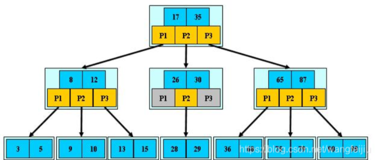
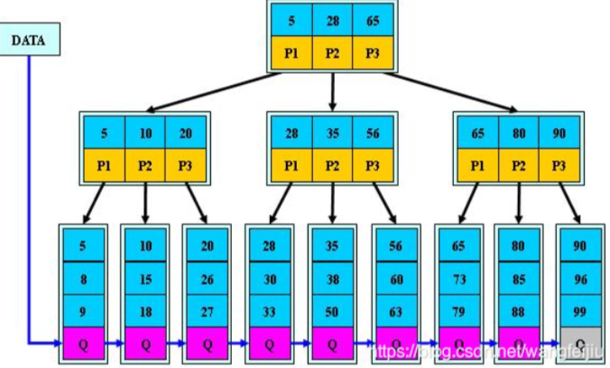
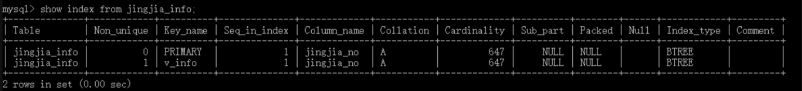
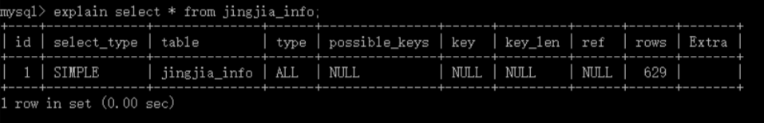

# MySql相关

> MySQL数据库默认使用的存储引擎为InnoDB


# 索引

## 简介

1. 索引是一个能够加快mysql查询效率的一种数据结构；但是索引只是提高效率的一个因素，如果你的MySQL有大数据量的表，就需要花时间研究建立最优秀的索引，或优化查询语句。
2. 可理解为：数据库如同书籍，索引如同书籍目录，假如我们需要从书籍查找与 xx 相关的内容，我们可以直接  从目录中查找，定位到 xx 内容所在页面；
3. 索引的底层结构就是B+树

## 优点

1. 减小了服务器需要扫描的数据量，从而大大加快数据的检索速度
2. 帮助服务器避免排序和创建临时表
3. 通过创建唯一性索引，可以保证数据库表中每一行数据的唯一性
4. 在使用分组和排序子句进行数据检索时，同样可以显著减少查询中分组和排序的时间

## 缺点

1. 创建索引和维护索引要耗费时间
2. 索引需要占物理空间，除了数据表占用数据空间之外，每一个索引还要占用一定的物理空间，如果需要建立聚簇索引，那么需要占用的空间会更大
3. 对表中的数据进行增、删、改的时候，索引也要动态的维护
4. 如果某个数据列包含许多重复的内容，为它建立索引就没有太大的实际效果
5. 对于非常小的表，大部分情况下简单的全表扫描更高效

## 应该创建索引的列

1. 在经常需要搜索的列上，可以加快搜索的速度
2. 在作为主键的列上，强制该列的唯一性和组织表中数据的排列结构
3. 在经常用在连接（JOIN）的列上，这些列主要是一外键，可以加快连接的速度
4. 在经常需要根据范围（<，<=，=，>，>=，BETWEEN，IN）进行搜索的列上创建索引，因为索引已经排序，其指定的范围是连续的
5. 在经常需要排序（order by）的列上创建索引，因为索引已经排序，这样查询可以利用索引的排序，加快排序查询时间；
6. 在经常使用在WHERE子句中的列上面创建索引，加快条件的判断速度

## 索引的数据结构

- MySQL中常用的索引结构（索引底层的数据结构）有：B-TREE ，B+TREE ，HASH 等

- B-TREE（B树）

  ​    B-树就是B树，多路搜索树，树高一层意味着多一次的磁盘I/O，下图是3阶B树：



​          B-树（B树）的特征：

​               1. 关键字集合分布在整颗树中；

​               2.任何一个关键字出现且只出现在一个结点中；

​               3.搜索有可能在非叶子结点结束；

​               4.其搜索性能等价于在关键字全集内做一次二分查找；

- B+TREE

​           B+树是B-树的变体，也是一种多路搜索树：

​         

​            B+树的特征：

​                 1.所有关键字都出现在叶子结点的链表中（稠密索引），且链表中的关键字恰好是有序的；

​                 2.不可能在非叶子结点命中；

​                 3.非叶子结点相当于是叶子结点的索引（稀疏索引），叶子结点相当于是存储（关键字）数据的数据 

​                    层； 

​                 4.每一个叶子节点都包含指向下一个叶子节点的指针，从而方便叶子节点的范围遍历。

​                 5.更适合文件索引系统；

## 索引分类

### 主键索引：

一张表只能有一个主键索引，不允许重复、不允许为 NULL；

```mysql
ALTER TABLE TableName ADD PRIMARY KEY(column_list); 
```

### 唯一索引：

数据列不允许重复，允许为 NULL 值。一张表可有多个唯一索引，索引列的值必须唯一，但允许有空值。如果是组合索引，则列值的组合必须唯一。

```mysql
CREATE UNIQUE INDEX IndexName ON `TableName`(`字段名`(length)); 
#或者
ALTER TABLE TableName ADD UNIQUE (column_list); 
```

### 普通索引：

一张表可以创建多个普通索引，一个普通索引可以包含多个字段，允许数据重复，允许 NULL 值  

 插 入。

```mysql
CREATE INDEX IndexName ON `TableName`(`字段名`(length)); 
#或者 
ALTER TABLE TableName ADD INDEX IndexName(`字段名`(length));
```

### 复合索引:

 一个索引可以包含多个列，多个列共同构成一个复合索引。需要满足最左前缀原则，否则不生效

```mysql
create index name_age_index on user(name,age);
```

### 聚簇索引：

一种数据存储方式。又叫一级索引；这种存储方式是依靠B+树来实现的，根据**表的主键（作为key）**构造一棵B+树且B+树叶子节点存放的都是表的行记录数据时，方可称该**主键索引**为**聚簇索引**。聚簇索引也可理解为将数据存储与索引放到了一块，找到索引也就找到了数据。

当表有了聚簇索引的时候，表的数据行都存放在索引树的叶子页中。无法把数据行放到两个不同的地方，所以**一张表只允许有一个聚簇索引（不用自己创建）**。InnoDB的聚簇索引实际上是将索引和数据保存中同一个B+Tree中。InnoDB通过主键聚集数据，如果没有定义主键，InnoDB会选择一个唯一的的非空索引代替。如果没有这样的索引，InnoDB会隐式定义一个主键来作为聚簇索引

**MyisAM引擎没有聚簇索引**


### 非聚簇索引：

数据和索引是分开的，B+树叶子节点存放的不是数据表的行记录。

又叫二级索引。二级索引的叶子节点中保存的不是指向行的物理指针，而是**行的主键值**。当通过二级索引查找行。存储引擎需要在二级索引中找到相应的叶子节点，获得行的主键值，然后使用主键去**聚簇索引**中查找数据行，这需要两次B+Tree查找

**除了构成聚簇索引的索引项之外的其他每一个索引都会构成一颗非聚簇索引树**；树的key就是这些索引对应的列；树的非叶子节点与聚簇索引一样，只记录“行”里的这个索引值，作为目录存在；而树最底层的叶子节点，记录该“行”中聚簇索引的key，并不记录其他内容；如果主键（key）太长的话，非聚簇索引就会使用更多的空间，所以使用较短的主键（key）；

## 查看索引

-  查询表中使用的索引

  ```mysql
    show index from 表名；
    eg: 
    show index from jingjia_info;
  ```

  

- 查看查询语句中是否使用了索引(是否生效)

   *EXPLAIN + 查询语句*

  ```mysql
    EXPLAIN SELECT * FROM jingjia_info;
  ```

  

## 索引失效的情况

- 要尽量满足全值匹配

*如果创建组合索引，查询条件字段有age and classId and name时，创建(age,classId,name)索引比(age,classId)索引快。*

- 要满足最佳左前缀法则

*在MySQL建立联合索引时会遵守最佳左前缀原则，即最左优先，在检索数据时从联合索引的最左边开始匹配。*

*例如索引(a,b,c)，只有查询(a),(a,b),(a,b,c)会走索引，而(b),(b,c),(c)都不会走索引,（a,c）只会走索引a,c失效*

- 主键插入顺序尽量自增

- 计算、函数导致索引失效

- 类型转换导致索引失效

- 范围条件右边的列索引失效

-  没覆盖索引时，“不等于”导致索引失效

-  没覆盖索引时，is not null、not like导致索引失效

-  没覆盖索引时，**左模糊**查询导致索引失效

-  “OR”前后存在非索引列，导致索引失效

-  不同字符集导致索引失败，建议utf8mb4

  

  MySQL高级篇——索引失效的11种情况_mysql索引失效-CSDN博客](https://blog.csdn.net/qq_40991313/article/details/130779528)

# MySQL中的锁

*一：按照对数据操作的锁粒度来分：行级锁、表级锁、页级锁、间隙锁*

*MyISAM和MEMORY采用表级锁(table-level locking)*

*InnoDB支持行级锁(row-level locking)和表级锁,默认为行级锁*

*二：按照锁的共享策略来分：共享锁、排他锁、意向共享锁、意向排他锁*

*共享锁和排他锁在MySQL中具体的实现就是读锁和写锁*


## 行级锁

*行级锁是mysql中锁定粒度最细的一种锁。表示只针对当前操作的行进行加锁。行级锁能大大减少数据库操作的冲突，其加锁粒度最小，但加锁的开销也最大。**行级锁分为共享锁和排他锁***

### 特点

开销大，加锁慢，会出现死锁。发生锁冲突的概率最低，并发度也最高。


## 表级锁

*表级锁是mysql中锁定粒度最大的一种锁，表示对当前操作的整张表加锁，它实现简单，资源消耗较少，被大部分mysql引擎支持。最常使用的MyISAM与InnoDB都支持表级锁。表级锁分为**意向共享锁（IS锁）与意向排他锁（IX锁）***

### 特点

开销小，加锁快，不会出现死锁。发生锁冲突的概率最高，并发度也最低。

- LOCK TABLE my_table_name READ; 用读锁锁表，会阻塞其他事务修改表数据。

- LOCK TABLE my_table_name WRITE; 用写锁锁表，会阻塞其他事务读和写。

  

## 页级锁

*页级锁是 MySQL 中锁定粒度介于行级锁和表级锁中间的一种锁。表级锁速度快，但冲突多，行级冲突少，但速度慢。因此，采取了折中的页级锁，**一次锁定相邻的一组记录**。BDB 支持页级锁*

### 特点

开销和加锁时间界于表锁和行锁之间；会出现死锁；锁定粒度界于表锁和行锁之间，并发度一般


## 读锁（共享锁）

*Shared Locks（S锁），针对同一份数据，多个读操作可以同时进行而不会互相影响*

**若事务T对数据对象A加上S锁，则事务T可以读A但不能修改A，其他事务只能再对A加S锁，而不能加X锁，直到T释放S锁**

### 方法：

```mysql
select … lock in share mode
```

对读取的记录加共享锁


## 写锁（排它锁）

*Exclusive Locks（X锁），当前写操作没有完成前，它会阻断其他写锁和读锁*

**若事务T对数据对象A加上X锁，则只允许T读取和修改A，其他事务不能再对A加作何类型的锁，直到T释放A上的X锁**

### 方法：

```mysql
select … for update
```

对读取的记录加独占（排他）锁；

此外：

​       使用delete， update 自动加独占锁

### 注意：


## 意向共享锁

*IS锁、Intention Shared Lock。当事务准备在某条记录上加S锁时，需要先在表级别加一个IS锁*

比如：

```mysql
SELECT ... FROM T1  LOCK IN SHARE MODE
```

语句首先会对表T1加IS锁，成功加上IS锁后才会对数据加S锁。


## 意向排他锁

*IX锁、Intention Exclusive Lock。当事务准备在某条记录上加X锁时，需要先在表级别加一个IX锁*

比如：

```mysql
SELECT ... FROM T1  FOR UPDATE
```

语句首先会对表T1加IX锁，成功加上IX锁后才会对数据加X锁


## 注意：

- 共享锁（S锁）满足读读共享，读写互斥。独占锁（X锁）满足写写互斥、读写互斥

- IS、IX锁是表级锁，它们的提出仅仅为了在之后加表级别的S锁和X锁时可以快速判断表中的记录是否被上锁，以避免用遍历的方式来查看表中有没有上锁的记录。

  就是说当对一个行加锁之后，如果有打算给行所在的表加一个表锁，必须先看看该表的行有没有被加锁，否则就会出现冲突。

  IS锁和IX锁就避免了判断表中行有没有加锁时对每一行的遍历。直接查看表有没有意向锁就可以知道表中有没有行锁。

