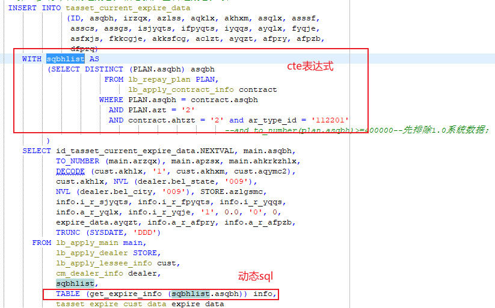

## 目录
- [基本查询与编辑](#基本查询与编辑)
- [常用函数](#常用函数)
- [高级查询技巧](#高级查询技巧)
- [索引管理](#索引管理)
- [性能优化](#性能优化)
- [数据更新](#数据更新)

## 基本查询与编辑

### 编辑修改数据
```sql
-- 编辑指定记录
edit bm_product_plan where id = 'ZJMCCPCGY210916C'
```

## 常用函数

### CASE WHEN 条件判断
用于条件分支逻辑，替代简单的 IF-ELSE 结构。
```sql
-- 示例：根据客户类型显示不同字段
CASE WHEN cust.akhlx = '1' THEN cust.akhxm ELSE cust.aqymc2 END AS ss
```

### DECODE 函数
DECODE 函数是 Oracle 特有的条件判断函数，语法简洁。
```sql
-- 语法：DECODE(表达式, 值1, 返回值1, 值2, 返回值2, ..., 默认值)
DECODE(字段或字段的运算, 值1, 值2, 值3)
-- 功能：当字段或字段的运算的值等于值1时，返回值2，否则返回值3
-- 注意：值1、值2、值3也可以是表达式
```

### NVL 函数
用于处理 NULL 值，实现空值转换。
```sql
-- 语法：NVL(string1, replace_with)
-- 功能：如果 string1 为 NULL，则返回 replace_with；否则返回 string1
NVL(字段名, 替代值)
```
参考：[SQL中NVL()函数的用法](https://blog.csdn.net/weixin_42312310/article/details/113116345)

### LISTAGG 函数
用于字符串聚合，将多行数据合并为一行。
```sql
-- 示例：将同一分组的多个值连接成一个字符串
LISTAGG(列名, 分隔符) WITHIN GROUP (ORDER BY 排序列)
```
参考：[oracle函数listagg的使用说明](https://blog.csdn.net/lovelichao12/article/details/51098105)

### 字符串处理函数

#### REGEXP_SUBSTR
正则表达式子字符串提取函数。

#### SUBSTR 和 INSTR 组合使用
用于字符串截取和定位。
```sql
-- 示例：从日期范围字符串中截取开始和结束日期
-- 原始数据格式：2016.03.04-2026.03.04
SUBSTR(date_range, 1, INSTR(date_range, '-') - 1) AS start_date,
SUBSTR(date_range, INSTR(date_range, '-') + 1) AS end_date
```

### 数值和日期函数

#### SIGN 函数
返回数值的符号：正数返回1，负数返回-1，零返回0。

#### TRUNC 函数
截断数字或日期到指定精度。

#### NUMTODSINTERVAL 函数
将数值转换为 INTERVAL DAY TO SECOND 类型，常用于日期计算。
```sql
-- 示例：用于判断日期范围
NUMTODSINTERVAL(数值, '单位')
```

## 高级查询技巧

### 排序后取最新的一条记录
```sql
-- 方法1：使用 FETCH FIRST 子句（Oracle 12c+）
SELECT ASPCZRY
FROM CIFCAR.LB_APPROVE_RECORD lar 
WHERE ASPJDBH = 'TaskNode_7s6sv'
ORDER BY DSPCASJ DESC 
FETCH FIRST 1 ROWS ONLY;

-- 方法2：使用 ROWNUM（适用于早期版本）
SELECT * FROM (
    SELECT ASPCZRY
    FROM CIFCAR.LB_APPROVE_RECORD lar 
    WHERE ASPJDBH = 'TaskNode_7s6sv'
    ORDER BY DSPCASJ DESC
) WHERE ROWNUM = 1;
```

### 公用表表达式（CTE）与动态SQL
```sql
-- 使用 WITH 子句定义公用表表达式
WITH sqbhlist AS (
    -- 从相关表中选择满足条件的asqbh值
    SELECT DISTINCT asqbh 
    FROM lb_repay_plan 
    WHERE 条件...
    UNION
    SELECT DISTINCT asqbh 
    FROM lb_apply_contract_info 
    WHERE 条件...
)
-- 使用动态SQL调用函数
SELECT * 
FROM sqbhlist, 
     TABLE(get_expire_info(sqbhlist.asqbh)) info;
```



### LEFT JOIN 添加条件

在左连接时可以添加额外的连接条件：
```sql
LEFT JOIN IFS_DATA_DIC idd 
    ON idd.DATA_TYPE_NO = '2024061101' 
    AND addr.TAR_ADDKEY = tpur3.sf
```

## 索引管理

### 查看执行计划
```sql
-- 步骤1：生成执行计划
EXPLAIN PLAN FOR 
你的SQL语句;

-- 步骤2：查看执行计划详情
SELECT * FROM TABLE(DBMS_XPLAN.DISPLAY);
```

### 查看索引状态
```sql
-- 查询特定索引的状态
SELECT status 
FROM user_indexes 
WHERE index_name = 'IDX_COORDINATION_APPLICATION_AZJHM';

-- 查看所有索引信息
SELECT index_name, table_name, status, uniqueness 
FROM user_indexes 
ORDER BY table_name;
```

### 删除索引
```sql
-- 删除指定索引
DROP INDEX index_name;
```

参考：[oracle怎么查看索引失效](https://www.cnblogs.com/Chary/p/17118842.html)

## 性能优化

### 禁用结果缓存
在需要获取实时数据时，可以禁用Oracle的结果缓存：
```sql
SELECT /*+ NO_RESULT_CACHE */ 
    coord.BASIC_NUMBER,
    coord.AJASQBH,
    coord.AJAHTHM,
    coord.AKHXM,
    coord.AZJHM,
    coord.CREATE_TIME,
    coord.SALE_TYPE,
    coord.SALE_TIME,
    coord.SALE_DECIDE,
    coord.CO_SELLERS_DEPT,
    ...
FROM your_table coord;
```

### 执行计划分析步骤
1. 在SQL语句前加上 `EXPLAIN PLAN FOR` 关键字，然后执行SQL语句
2. 执行后，使用 `SELECT * FROM TABLE(DBMS_XPLAN.DISPLAY)` 来显示执行计划的详细信息

## 数据更新

### 基于关联表的字段更新
```sql
-- 更新字段来源于另一张关联表的数据
UPDATE ONLINE_DISPATCH_PROCESS odp
SET odp.AHTBH = (
    SELECT laci.AHTHM    
    FROM LB_APPLY_CONTRACT_INFO laci
    WHERE laci.ASQBH = odp.ASQBH
)
WHERE EXISTS (
    SELECT 1              
    FROM LB_APPLY_CONTRACT_INFO laci
    WHERE laci.ASQBH = odp.ASQBH
);
```